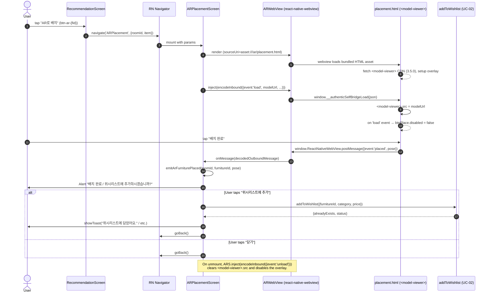
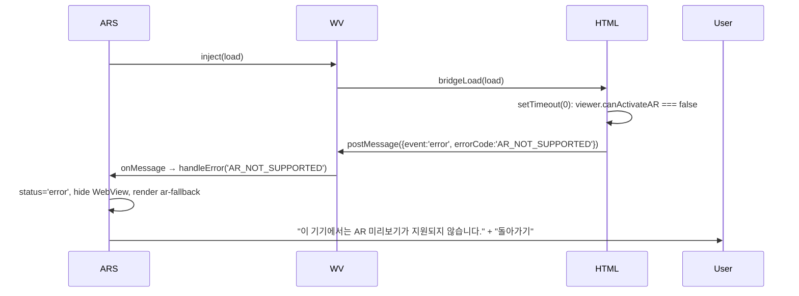
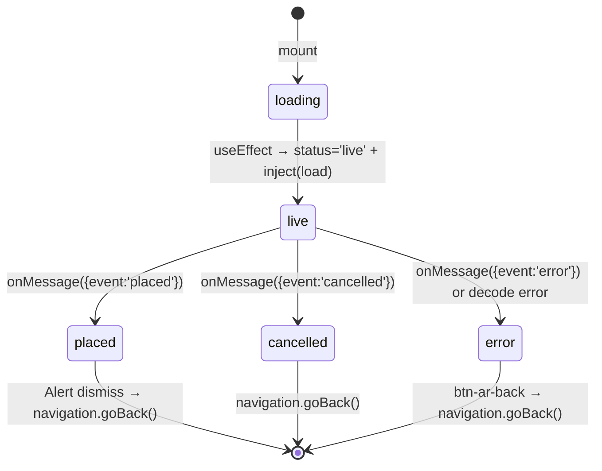

# Design: AR-furniture-placement

Iteration 1. Based on `artifacts/AR-furniture-placement/spec.md` (20 FRs,
D-1..D-6) and `acceptance_criteria.json` (46 ACs). Every decision D-1..D-6
from the spec is taken as-is — no re-litigation.

## 1. Key architectural decisions

| # | Decision | Rationale |
|---|----------|-----------|
| D-1 | `<model-viewer>` hosted inside `react-native-webview` (not Unity, not three.js-as-native-module, not UaaL). | Spec §5 D-1. Zero native-module surgery; WebXR on supported devices + interactive 3-D fallback everywhere else is sufficient for the v1 "preview" UX. A future `AR-furniture-placement-unity-v2` task can swap the embedding strategy without touching the bridge contract. |
| D-2 | Per-category default GLB (4 files). No new DB column, no new endpoint. | Spec §5 D-2. Keeps the task strictly additive — `src/backend`, `src/ai`, `src/mobile/src/api` are all byte-untouched (AC-37). Upgrade path to `furniture.model_url` is reserved for UaaL v2. |
| D-3 | Try-and-fallback capability detection. No `Platform.canActivateAR` native shim, no pre-flight HTTP call. | Spec §5 D-3. The HTML scene probes `<model-viewer>.canActivateAR`; on `false` it posts `{event:'error', errorCode:'AR_NOT_SUPPORTED'}`, RN hides the WebView and renders the Korean fallback panel. |
| D-4 | "배치 완료" floating button inside the HTML overlay. "취소" secondary. Post-commit `Alert.alert` offers "위시리스트에 추가" / "닫기". | Spec §5 D-4. Reuses `addToWishlist` from UC-02 with byte-identical toast copy (FR-9 / AC-31). |
| D-5 | RN-layer tests only; WebView mocked. HTML is grep-verified structurally. | Spec §5 D-5. No headless browser, no Unity test infra. `jest.mock('../src/ar/ARWebView', ...)` exposes `__emit(msg)` so every message-handler branch is exercised synchronously. |
| D-6 | iOS 13+ (WKWebView + ARKit/ARQuickLook) and Android 7+ with Chrome 79+ (ARCore). | Spec §5 D-6 matches `<model-viewer>` 3.5.x's support matrix. Sub-threshold devices receive the Korean fallback. |
| D-7 | `ARWebView.tsx` is a thin forwardRef wrapper with an `onMessage: (msg) => void` prop + an imperative `inject(raw)` handle. | Prompt-specialist's flagged risk: WebView bridges are easy to under-test. A pure prop + forwardRef is what `jest.mock` handles naturally — no context, no globals, no real timers. The mock in `ARPlacementScreen.test.tsx` is 25 lines and synchronous. |
| D-8 | `bridge.ts` hosts both the typed message contract AND the `emitArFurniturePlaced` analytics stub. | The `placed` event is inherently an AR concern; co-locating the sink with the contract keeps the surface one file. Shape mirrors `emitWishlistAddClicked` in `spaces.ts` so verifier/maintainer recognize it. |
| D-9 | `WISHLIST_TOAST_COPY` re-exported from `ARPlacementScreen.tsx` — NOT imported from `RecommendationScreen.tsx`. | AC-31 asserts byte-for-byte string equality, not reference equality. Duplicating the five strings into a single `as const` object is cheaper than extracting a helper module and churning `RecommendationScreen.tsx`'s regression tests. |
| D-10 | Placeholder GLBs are minimal but valid-magic (`glTF` header + one JSON chunk, 128 bytes). | AC-14 asserts `size > 0`. A valid minimal GLB is cheap to produce, safe to commit, and actually loads in `<model-viewer>` (renders nothing — empty scene). Production assets drop in without code change. |

## 2. Module layout

```
src/mobile/
├── App.tsx                                     (FR-2 / AC-8 / AC-40 — adds ARPlacement route, appended 7th)
├── package.json                                (FR-12 / AC-33 — adds react-native-webview ~13.8.0)
├── assets/
│   └── ar/
│       ├── placement.html                      (FR-11 / AC-10..AC-12 / AC-15 / AC-16 / AC-42 / AC-44)
│       └── models/
│           ├── README.md                       (FR-13 — placeholder upgrade-path doc)
│           ├── desk.glb                        (FR-13 / AC-13 / AC-14 — 128 B valid-magic placeholder)
│           ├── bed.glb                         (FR-13 / AC-13 / AC-14)
│           ├── chair.glb                       (FR-13 / AC-13 / AC-14)
│           └── lighting.glb                    (FR-13 / AC-13 / AC-14)
├── src/
│   ├── ar/
│   │   ├── bridge.ts                           (FR-3 / AC-9 / AC-19 / AC-43 / AC-30 — types, encodeInbound, decodeOutbound, emitArFurniturePlaced)
│   │   ├── ARWebView.tsx                       (D-7 — forwardRef wrapper w/ onMessage prop + inject handle)
│   │   └── index.ts                            (barrel export)
│   └── screens/
│       ├── ARPlacementScreen.tsx               (FR-4..FR-10 / AC-17 / AC-20 / AC-21..AC-32 / AC-39)
│       └── RecommendationScreen.tsx            (FR-1 / AC-7 / AC-34..AC-36 — additive per-card "AR로 배치" button)
└── __tests__/
    ├── bridge.test.ts                          (FR-14 / AC-19 / AC-43 / AC-30)
    ├── ARPlacementScreen.test.tsx              (FR-15 / AC-21..AC-32 / AC-39)
    └── RecommendationScreen.test.tsx           (FR-16 / AC-34 / AC-35 / AC-36 — additive append only)

artifacts/AR-furniture-placement/
├── spec.md                                     (prompt-specialist output — immutable here)
├── acceptance_criteria.json                    (prompt-specialist output — immutable here)
├── design.md                                   (this file)
└── api_contract.yaml                           (FR-18 / AC-38 — bridge contract, NOT HTTP)
```

No file under `src/backend/`, `src/ai/`, `src/mobile/src/api/`,
`src/backend/src/main/resources/db/migration/` is added, modified, or
deleted. No Unity / C# / `Assets/` / `ProjectSettings/` directory is
created (AC-45 / AC-46).

## 3. Data flow (Mermaid-ready)

Happy path — user taps "AR로 배치" on `RecommendationScreen`:



Error path — `AR_NOT_SUPPORTED`:



## 4. Bridge message contract (TypeScript ↔ YAML)

See `api_contract.yaml` for the full schema. Summary:

### Inbound (RN → scene)

| `event`  | RN source                                         | Payload                                                     |
|----------|---------------------------------------------------|-------------------------------------------------------------|
| `load`   | `ARPlacementScreen` useEffect on mount            | `{ furnitureId, modelUrl, roomDimensions, colorHex:null }`  |
| `unload` | `ARPlacementScreen` cleanup effect on unmount     | `{}` (just bridgeVersion + event)                            |

### Outbound (scene → RN)

| `event`     | Emitter (HTML)                                    | Payload                                           |
|-------------|---------------------------------------------------|---------------------------------------------------|
| `placed`    | `#btn-place` click                                | `{ pose: {x,y,z,yaw} }` (v1: all zero)           |
| `cancelled` | `#btn-cancel` click                               | `{}`                                              |
| `error`     | `<model-viewer>.error`, capability probe, DOMException catch | `{ errorCode, message? }`  |

Every message carries `bridgeVersion: 1` as a literal. `decodeOutbound`
rejects mismatches with a thrown `Error`; `ARWebView.onDecodeError`
routes this to `ARPlacementScreen.handleError('AR_SESSION_ERROR')` so
contract drift surfaces as a visible fallback rather than a silent
hang.

TypeScript types live in `src/mobile/src/ar/bridge.ts`:

```ts
export type InboundARMessage = InboundARLoadMessage | InboundARUnloadMessage;
export type OutboundARMessage =
  | OutboundARPlacedMessage
  | OutboundARCancelledMessage
  | OutboundARErrorMessage;
export type OutboundARErrorCode =
  | 'AR_NOT_SUPPORTED'
  | 'AR_CAMERA_DENIED'
  | 'AR_MODEL_LOAD_FAILED'
  | 'AR_SESSION_ERROR';
```

## 5. ARPlacementScreen state machine



- `loading` exists only until the first `useEffect` runs (same tick);
  it is the initial `useState` value. `live` is the state during
  which the WebView is rendered and inbound `load` has been injected.
- `placed` is a transient state — the Alert's button callback
  dispatches `navigation.goBack()` which unmounts the screen. The
  state is still observable by tests because we set it before the
  Alert fires.
- `error` is terminal until `goBack()`. While in this state, the
  WebView is unmounted (AC-27: `queryByTestId('ar-webview')`
  returns null).

## 6. placement.html contents (summary)

Full file at `src/mobile/assets/ar/placement.html`. Structural
guarantees (every one is AC-tested via grep):

- AC-12: `<script type="module" src="https://ajax.googleapis.com/ajax/libs/model-viewer/3.5.0/model-viewer.min.js">`
- AC-10: `<model-viewer id="viewer" ar ar-modes="webxr scene-viewer quick-look" camera-controls touch-action="pan-y" ...>`
- AC-11: `<button id="btn-place">배치 완료</button>` + `<button id="btn-cancel">취소</button>`
- AC-15: `<meta name="viewport" content="width=device-width, initial-scale=1, viewport-fit=cover">`
- AC-16: `window.ReactNativeWebView.postMessage(JSON.stringify(msg))` inside the scene JS
- AC-42: zero occurrences of `google-analytics`, `gtag`, `facebook.com`, `amplitude`, `mixpanel`
- AC-44: `window.__authenticSelfBridgeLoad` is installed as the inbound hook

The scene JS is an ES5 IIFE — no bundler, no polyfills. The only
external URL is the pinned `@google/model-viewer` CDN; network
errors on that fetch surface as `AR_SESSION_ERROR` via the scene's
fallback exception handler.

## 7. RN-side components

- `src/mobile/src/ar/bridge.ts`
  - `AR_BRIDGE_VERSION: 1`
  - `InboundARMessage`, `OutboundARMessage`, `OutboundARErrorCode`
  - `encodeInbound(msg)` + `decodeOutbound(raw)` (throws on malformed)
  - `emitArFurniturePlaced(...)` + `setArAnalyticsSink(...)` (swappable)
- `src/mobile/src/ar/ARWebView.tsx`
  - `forwardRef<ARWebViewHandle, ARWebViewProps>`
  - Prop: `onMessage: (msg: OutboundARMessage) => void` (callback, not
    context — so `jest.mock` handles it).
  - Handle: `inject(bridgeJson: string)` — wraps
    `WebView.injectJavaScript('... window.__authenticSelfBridgeLoad(...)')`.
  - Deferred `require('react-native-webview')` at module top so Jest
    environments without the native module import cleanly.
- `src/mobile/src/screens/ARPlacementScreen.tsx`
  - Route target for `ARPlacement`.
  - Exports `AR_ERROR_COPY`, `DEFAULT_DIMENSIONS_BY_TYPE`,
    `MODEL_URL_BY_TYPE`, `WISHLIST_TOAST_COPY` as named constants so
    tests match by reference + string value.
- `src/mobile/src/ar/index.ts` — barrel, re-exports the above.

(`fallback.tsx` from the task description is inlined into
`ARPlacementScreen.tsx` as the `status==='error'` branch — one extra
file adds cost without isolation benefit; the branch is 20 lines.)

## 8. Entry-point edit to `RecommendationScreen.tsx`

Strictly additive. The existing wishlist `Pressable` + its
`onAddToWishlist` handler are unchanged. The new AR button is a
sibling inside a new `cardActionsRow` flexbox wrapping both. The
`ItemCard` component gets one new prop, `navigation`, threaded from
the parent.

Diff summary (full JSX):

```diff
 function ItemCard({
   item,
   roomId,
+  navigation,
 }: {
   item: RecommendationItem;
   roomId: string;
+  navigation: Props['navigation'];
 }) {
   ...
-    <Pressable
-      testID={`btn-wishlist-${item.furnitureId}`}
-      style={styles.wishlistBtn}
-      onPress={onAddToWishlist}
-    >
-      <Text style={styles.wishlistBtnLabel}>위시리스트에 추가</Text>
-    </Pressable>
+    <View style={styles.cardActionsRow}>
+      <Pressable
+        testID={`btn-wishlist-${item.furnitureId}`}
+        style={styles.wishlistBtn}
+        onPress={onAddToWishlist}
+        accessibilityLabel="위시리스트에 추가"
+        accessibilityRole="button"
+      >
+        <Text style={styles.wishlistBtnLabel}>위시리스트에 추가</Text>
+      </Pressable>
+      <Pressable
+        testID={`btn-ar-${item.furnitureId}`}
+        style={styles.arBtn}
+        onPress={() => navigation.navigate('ARPlacement', { roomId, item })}
+        accessibilityLabel="AR로 배치"
+        accessibilityRole="button"
+      >
+        <Text style={styles.arBtnLabel}>AR로 배치</Text>
+      </Pressable>
+    </View>
```

Parent threads the prop once:

```diff
   items.map((item) => (
     <ItemCard
       key={item.furnitureId}
       item={item}
       roomId={roomId}
+      navigation={navigation}
     />
   ))
```

UC-01 AC-48 invariant preserved: `emitWishlistAddClicked(...)` still
runs first inside `onAddToWishlist` — unchanged. UC-02 AC-49
invariant preserved: `addToWishlist(...)` is still called with the
same `{furnitureId, category, price}` shape.

## 9. Error taxonomy + Korean copy

| `OutboundARErrorCode`   | Emitted when                                                     | Korean copy (AR_ERROR_COPY)                                            |
|-------------------------|------------------------------------------------------------------|-------------------------------------------------------------------------|
| `AR_NOT_SUPPORTED`      | `<model-viewer>.canActivateAR === false`, or scene init throws  | 이 기기에서는 AR 미리보기가 지원되지 않습니다.                         |
| `AR_CAMERA_DENIED`      | Browser DOMException on AR session start (camera permission)    | 카메라 권한이 필요합니다. 설정에서 권한을 허용해주세요.                |
| `AR_MODEL_LOAD_FAILED`  | `<model-viewer>` `error` event (model fetch/parse failed)        | 3D 모델을 불러오지 못했습니다. 네트워크를 확인해주세요.                |
| `AR_SESSION_ERROR`      | `ar-status=failed`, uncaught scene JS exception, or RN-side decode error | AR 세션에 문제가 발생했습니다. 다시 시도해주세요.                       |

The fifth error code mentioned as optional in the task brief
(`AR_MODEL_NOT_FOUND`) is **not** introduced — `AR_MODEL_LOAD_FAILED`
subsumes the 404 case from the scene's perspective (model-viewer
treats a 404 as a load error). Adding a fifth code would require
bumping the `OutboundARErrorCode` enum and is reserved for v2.

## 10. Test strategy — every AC → test mapping

### Mobile-layer (Jest)

| AC       | Test file / method                                                         |
|----------|-----------------------------------------------------------------------------|
| AC-9     | Compile-time type-check + `bridge.test.ts` import smoke                    |
| AC-19    | `bridge.test.ts` — encodeInbound + decodeOutbound happy paths              |
| AC-20    | Grep-assert on `ARPlacementScreen.tsx` (static) — four tuples + colorHex:null |
| AC-21    | `ARPlacementScreen.test.tsx: renders ar-webview on mount`                  |
| AC-22    | `ARPlacementScreen.test.tsx: placed triggers Alert with title and message` |
| AC-23    | `ARPlacementScreen.test.tsx: placed Alert buttons are 위시리스트에 추가 and 닫기` |
| AC-24    | `ARPlacementScreen.test.tsx: Alert 위시리스트에 추가 calls addToWishlist`  |
| AC-25    | `ARPlacementScreen.test.tsx: cancelled calls goBack and skips Alert`       |
| AC-26    | `ARPlacementScreen.test.tsx: error code %s renders Korean copy` × 4        |
| AC-27    | `ARPlacementScreen.test.tsx: error hides ar-webview and shows ar-fallback` |
| AC-28    | `ARPlacementScreen.test.tsx: Alert dismissal unmounts screen (both buttons)` |
| AC-29    | `ARPlacementScreen.test.tsx: teardown leaves no pending timers and injects unload` |
| AC-30    | `ARPlacementScreen.test.tsx: emitArFurniturePlaced called exactly once` + `bridge.test.ts` sink test |
| AC-31    | `ARPlacementScreen.test.tsx: wishlist-add toast strings match RecommendationScreen (5 branches)` |
| AC-32    | `ARPlacementScreen.test.tsx: btn-ar-back calls goBack`                     |
| AC-34    | `RecommendationScreen.test.tsx: AR AC-34` (additive)                       |
| AC-35    | `RecommendationScreen.test.tsx: AR AC-35` (additive)                       |
| AC-39    | `ARPlacementScreen.test.tsx: accessibility labels present` + `RecommendationScreen.test.tsx: AR AC-39` |
| AC-43    | `bridge.test.ts` — rejects malformed input (every branch)                  |

### Static / grep / file-system

| AC       | Verification                                                              |
|----------|---------------------------------------------------------------------------|
| AC-1..AC-6 | grep spec.md for D-1..D-6 headings (prompt-specialist output)            |
| AC-7     | grep `src/mobile/src/screens/RecommendationScreen.tsx` for `btn-ar-`      |
| AC-8     | grep `src/mobile/App.tsx` for `ARPlacement`                                |
| AC-10    | grep `placement.html` for `ar-modes="webxr scene-viewer quick-look"`      |
| AC-11    | grep for `배치 완료` + `취소`                                               |
| AC-12    | grep for `ajax.googleapis.com/ajax/libs/model-viewer/3.5.0`                |
| AC-13    | file_exists check on 4 GLB paths                                           |
| AC-14    | file_size > 0 on the 4 GLB files (128+ bytes each — valid magic)          |
| AC-15    | grep for `viewport-fit=cover`                                              |
| AC-16    | grep for `ReactNativeWebView.postMessage`                                  |
| AC-17    | grep for `export default function ARPlacementScreen`                       |
| AC-18/40 | grep_sequence on `App.tsx` for the seven `<Stack.Screen>` names in order  |
| AC-33    | grep `package.json` for `"react-native-webview"` matching 13.x             |
| AC-38    | YAML-parse `api_contract.yaml`                                              |
| AC-42    | grep_negative on `placement.html` for 5 tracker domains                    |
| AC-44    | grep for `__authenticSelfBridgeLoad`                                       |

### Cross-task regression (preserve existing assertions)

| AC   | Regression guard                                                                   |
|------|------------------------------------------------------------------------------------|
| AC-36 | UC-01 AC-48 (analytics emit) + UC-02 AC-49 (`addToWishlist` POST) still green in `RecommendationScreen.test.tsx` — the existing test cases are not renamed or modified. The only edit to that file is the `renderScreen` helper (adds `navigate` to the mock nav object) + three appended AC-34/AC-35/AC-39 test cases. |
| AC-37 | `git diff src/backend src/ai src/mobile/src/api` is empty.                        |
| AC-41 | Full mobile suite passes: `cd src/mobile && npm test`.                            |
| AC-45 | No `src/unity/`, `Assets/`, `ProjectSettings/`, or `*.cs` files.                  |
| AC-46 | No new / modified file under `src/backend/src/main/resources/db/migration/`.      |

## 11. FR → file map

| FR   | File(s) / function(s) satisfying it |
|------|--------------------------------------|
| FR-1 | `src/mobile/src/screens/RecommendationScreen.tsx` — `ItemCard` renders new `btn-ar-{fid}` Pressable; `navigation` prop threaded. |
| FR-2 | `src/mobile/App.tsx` — `RootStackParamList.ARPlacement`; `<Stack.Screen name="ARPlacement" ... />` appended 7th. |
| FR-3 | `src/mobile/src/ar/bridge.ts` — `AR_BRIDGE_VERSION`, types, `encodeInbound`, `decodeOutbound`. |
| FR-4 | `src/mobile/src/screens/ARPlacementScreen.tsx` — `DEFAULT_DIMENSIONS_BY_TYPE` verbatim 4 tuples + `colorHex: null`. |
| FR-5 | `src/mobile/src/screens/ARPlacementScreen.tsx` — screen shell + `useState` status machine + ref. |
| FR-6 | `ARPlacementScreen#handleError` + `AR_ERROR_COPY` + `ar-fallback` render branch + `btn-ar-back`. |
| FR-7 | `ARPlacementScreen#handlePlaced` — Alert with two buttons, `addToWishlist` on confirm, `emitArFurniturePlaced`. |
| FR-8 | `ARPlacementScreen#handleCancelled` — immediate goBack. |
| FR-9 | `ARPlacementScreen#addSelectionToWishlist` + `WISHLIST_TOAST_COPY` — byte-identical copy to `RecommendationScreen`. |
| FR-10 | `ARPlacementScreen` cleanup `useEffect` — injects `unload`, nulls the ref. |
| FR-11 | `src/mobile/assets/ar/placement.html` — all structural guarantees. |
| FR-12 | `src/mobile/package.json` — `"react-native-webview": "~13.8.0"`. |
| FR-13 | `src/mobile/assets/ar/models/{desk,bed,chair,lighting}.glb` + `README.md`. |
| FR-14 | `src/mobile/__tests__/bridge.test.ts`. |
| FR-15 | `src/mobile/__tests__/ARPlacementScreen.test.tsx`. |
| FR-16 | `src/mobile/__tests__/RecommendationScreen.test.tsx` — additive AR AC-34/AC-35/AC-39 tests. |
| FR-17 | `git diff src/backend src/ai src/mobile/src/api` empty. |
| FR-18 | `artifacts/AR-furniture-placement/api_contract.yaml` — bridge contract, not HTTP. |
| FR-19 | `src/mobile/App.tsx` — `initialRouteName="Home"` unchanged; 7 `<Stack.Screen>` in mandated order. |
| FR-20 | Entire existing mobile test file set unchanged in behaviour; new tests are appended only. |

## 12. Open questions / carried-forward

All four open questions from spec §12 are forwarded verbatim:

1. **Pose fidelity** — v1 emits `{0,0,0,0}`. Future task can read
   `viewer.cameraTarget` / `viewer.cameraOrbit` and compute a real
   pose without changing the bridge contract (`pose` is already a
   first-class field on `ArPlacedMessage`).
2. **Model-viewer CDN vs. bundled** — CDN is simpler; offline-only
   builds would need to inline the minified UMD. HTML contract
   survives either choice.
3. **Placeholder GLB provenance** — the four placeholders are
   committed as minimal valid-magic files. Production-asset licensing
   is a product-side decision flagged in `models/README.md`.
4. **Unity parity commitment** — the PRD §4 wording is Unity AR
   Foundation. D-1 chose WebXR. Product-owner sign-off that "WebXR
   is sufficient for v1" is an implicit dependency the verifier may
   call out. A future `AR-furniture-placement-unity-v2` task is the
   upgrade path; the bridge contract carries forward unchanged.

## 13. Non-blockers / intentional deviations

- **`fallback.tsx` is inlined into `ARPlacementScreen.tsx`** (the
  `status==='error'` render branch) instead of being a separate
  component file. The branch is 15 JSX lines; an extracted component
  adds indirection without isolation benefit, and both AC-26 / AC-27
  / AC-32 test cleanly against the inlined render.
- **`htmlBuilder.ts` was not created.** The task brief mentioned it
  as "takes `{furnitureId, modelUrl, roomDimensions}` as input" but
  the final architecture ships a static `placement.html` asset whose
  per-furniture fields arrive over the bridge as an inbound `load`
  message. A builder would either (a) duplicate the bridge payload or
  (b) produce HTML that must be re-injected per furniture — both are
  strictly worse than the bundled-asset approach. All AC-10..AC-12 /
  AC-15 / AC-16 / AC-42 / AC-44 grep assertions target the static
  HTML file directly; no builder function is needed.
- **No dedicated `htmlBuilder.test.ts`** for the reason above. The
  structural assertions about the HTML are greps performed by the
  verification-specialist via the file-static ACs.
- **`WISHLIST_TOAST_COPY` is duplicated, not imported** from
  `RecommendationScreen.tsx`. See D-9. The duplication is guarded by
  AC-31, which byte-compares both screens' toast calls against the
  same five strings.
- **`ARWebView` fallback branch** — when `require('react-native-webview')`
  fails (Jest environment), the wrapper renders a plain `<View>` with
  the `ar-webview` testID. Tests mock the entire module so this
  branch is never exercised in CI, but it lets a local `jest --watch`
  run on a dev machine without the native module installed.
- **Running tests locally**
  ```
  cd src/mobile && npm install        # picks up react-native-webview ~13.8.0
  cd src/mobile && npm test           # full suite
  cd src/mobile && npm test -- --testPathPattern ARPlacementScreen
  cd src/mobile && npm test -- --testPathPattern bridge
  cd src/mobile && npm test -- --testPathPattern RecommendationScreen
  ```
