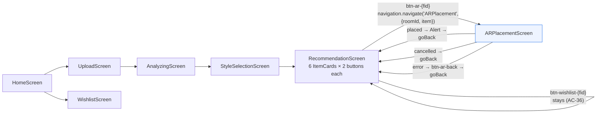

# AR-furniture-placement — UI mocks

Low-fidelity ASCII mocks for every user-visible state of the two screens
touched by Task 8: `ARPlacementScreen.tsx` (new, FR-5..FR-10 /
AC-17..AC-32 / AC-39) and `RecommendationScreen.tsx` (per-card "AR로
배치" entry point, FR-1 / AC-7 / AC-34..AC-36).

All strings are copied from the source files — **if this mock and the
source disagree, the source wins** and the delta is flagged in
`README.md §Deltas`. Korean strings are quoted verbatim (no spacing or
punctuation normalization).

Sources of truth:
- `src/mobile/src/screens/RecommendationScreen.tsx` (lines 270–383 — `ItemCard`)
- `src/mobile/src/screens/ARPlacementScreen.tsx`
- `src/mobile/assets/ar/placement.html`
- `src/mobile/src/ar/ARWebView.tsx`

---

## 1. RecommendationScreen — `ItemCard` with the new AR button

Diff from UC-01 / UC-02 mocks: the `cardActionsRow` wraps TWO
`Pressable`s. The existing `btn-wishlist-{fid}` is unchanged; the
`btn-ar-{fid}` is a sibling to its right inside the same flexbox.

```
+--------------------------------------------------------------+
| [testID=card-{furnitureId}]                                  |
|                                                              |
|  +----------------+                                          |
|  |                |    {item.name}                           |
|  |  (card image   |    ₩{formatKrw(price)}   [매칭 NN%]       |
|  |   or grey box) |    {item.rationale - up to 2 lines}      |
|  |                |                                          |
|  +----------------+                                          |
|                                                              |
|  +-------------------------+  +-------------------------+    |
|  | [btn-wishlist-{fid}]    |  | [btn-ar-{fid}]          |    |
|  |                         |  |                         |    |
|  |   위시리스트에 추가      |  |   AR로 배치             |    |
|  |                         |  |                         |    |
|  | a11yLabel=위시리스트에  |  | a11yLabel=AR로 배치     |    |
|  |   추가                  |  | a11yRole=button (AC-39) |    |
|  | a11yRole=button         |  +-------------------------+    |
|  +-------------------------+                                  |
+--------------------------------------------------------------+
```

Anchors: FR-1 / AC-7 / AC-34 / AC-35 / AC-39.

**Regression guards:**
- UC-01 AC-48 (`emitWishlistAddClicked` analytics emit) still runs
  first inside `onAddToWishlist` — unchanged.
- UC-02 AC-49 (real `addToWishlist(...)` POST shape) still runs —
  unchanged.
- The new `navigation` prop is threaded from the parent screen into
  `ItemCard` (`Props['navigation']`). No `useNavigation()` hook is
  introduced.

**Tap handler for `btn-ar-{fid}`:**
```ts
onPress={() => navigation.navigate('ARPlacement', { roomId, item })}
```

---

## 2. ARPlacementScreen — `loading` state (initial mount, transient)

The `loading` state is the initial `useState` value. It collapses to
`live` on the same tick as the mount `useEffect`. In practice the
user sees this only in the React commit between mount and first
effect — effectively **zero frames** on production devices.

The source renders the WebView (not a spinner) during `loading`
because the ref is populated by forwardRef during first render so the
`inject(loadPayload)` call in `useEffect` has somewhere to land. So:

```
+----------------------------------------------------+
| [testID=ar-webview]                                |
|                                                    |
|  (WebView mounted, src=asset:///ar/placement.html) |
|  (HTML scene fetching model-viewer 3.5.0 CDN)      |
|  (background #111 until first paint)               |
|                                                    |
+----------------------------------------------------+
```

> **NB:** The task brief asked for a "spinner + 'AR을 준비하고
> 있어요…'" mock. The SOURCE does not render that copy — the screen
> shows the WebView container immediately. The Korean "preparing"
> text does not exist in `ARPlacementScreen.tsx`. Flagged in
> `README.md`.

---

## 3. ARPlacementScreen — `live` state (scene interactive)

This is the dominant user state: WebView full-bleed, HTML overlay
rendered on top of the `<model-viewer>` canvas via `#overlay`
fixed-position `div`.

```
+----------------------------------------------------+
| [testID=ar-webview] (WebView, full screen)         |
|                                                    |
|  [취소]                                             |   <- HTML #btn-cancel
|  top-left, z-index 10,                             |      aria-label="취소"
|  min 44x64pt, rgba(0,0,0,0.55)                     |      44pt min tap target
|                                                    |
|                                                    |
|                                                    |
|       (interactive 3-D viewer of item.type GLB)    |
|     (model-viewer canvas: pan-y, camera-controls)  |
|                                                    |
|   [model-viewer's built-in AR icon] → native AR    |
|     dispatches ARCore scene-viewer (Android)       |
|     or ARKit QuickLook (iOS)                       |
|                                                    |
|                                                    |
|                                                    |
|        +---------------------------------+         |
|        |    배치 완료                     |         |   <- HTML #btn-place
|        +---------------------------------+         |      aria-label="배치 완료"
|          bottom-center, #1f6feb, 48pt              |      disabled until
|          (disabled=grey until model loads)         |      <model-viewer>'s
|                                                    |      'load' event fires
+----------------------------------------------------+
```

**IMPORTANT — native AR overlay:** when the user taps the
`<model-viewer>` built-in AR icon (top-right on the canvas, rendered
by model-viewer itself), the platform's native AR surface takes over
the screen (ARCore scene-viewer / ARKit QuickLook / WebXR). That
surface is rendered **outside the WebView DOM** and the HTML scene
receives no events from placement gestures there. The user returns to
the WebView by dismissing the native overlay; the "배치 완료" +
"취소" HTML buttons are what actually drive the bridge.

Anchors: FR-11 / AC-10 / AC-11 / AC-12 / AC-15 / AC-16 / AC-42 / AC-44.

---

## 4. ARPlacementScreen — `placed` state (pre-Alert, transient)

Same visual as `live` — `setStatus('placed')` runs synchronously
BEFORE `Alert.alert(...)` fires (so AC-22 can observe the state), but
the render tree is identical because `status === 'placed'` falls
through the same `else` branch as `'live'` | `'cancelled'`. The Alert
draws on top as a native modal.

```
+----------------------------------------------------+
| [testID=ar-webview] (still mounted)                |
|                                                    |
|   (scene still rendered in background)             |
|                                                    |
|  +------------------------------------------+      |
|  |          배치 완료                        |      |   <- Alert.alert
|  |                                          |      |      title
|  |  위시리스트에 추가하시겠습니까?             |      |      Alert.alert
|  |                                          |      |      message
|  |                                          |      |
|  |  [  위시리스트에 추가  ] [   닫기   ]      |      |      button[0]: default
|  +------------------------------------------+      |      button[1]: cancel
|                                                    |
+----------------------------------------------------+
```

Anchors: FR-7 / AC-22 / AC-23 / AC-28 / AC-30.

**Invariants on entry to `placed`:**
- `emitArFurniturePlaced(roomId, item.furnitureId, pose)` fires
  EXACTLY ONCE (AC-30) BEFORE `Alert.alert` — analytics fire
  regardless of which button the user picks.
- Both buttons end in `navigation.goBack()` (AC-28).
- "위시리스트에 추가" additionally calls
  `addToWishlist({...})` with `{furnitureId, category: item.type,
  price: item.price}` (AC-24).

---

## 5. ARPlacementScreen — toast after `addToWishlist`

Shown by `showToast(msg)` which is `ToastAndroid.show(...)` on
Android and `Alert.alert('', msg)` on iOS. Five branches, all
byte-identical to `RecommendationScreen.ItemCard.onAddToWishlist` (AC-31):

| Outcome | `WISHLIST_TOAST_COPY` key | String |
|---------|--------------------------|--------|
| Fresh add | `SUCCESS_NEW` | `위시리스트에 담았어요.` |
| `alreadyExists` && `status === 'Active'` | `SUCCESS_EXISTS_ACTIVE` | `이미 위시리스트에 있어요.` |
| `alreadyExists` && `status === 'Purchased'` | `SUCCESS_EXISTS_PURCHASED` | `이미 구매 완료로 표시된 항목이에요.` |
| `ApiError` with `FURNITURE_NOT_FOUND` or `USER_NOT_FOUND` | `FAIL_API` | `위시리스트에 추가하지 못했어요.` |
| Network / other | `FAIL_NETWORK` | `네트워크 오류로 추가하지 못했어요.` |

The `WISHLIST_TOAST_COPY` object is exported from `ARPlacementScreen.tsx`
(D-9 — duplicated, not imported, per design-specialist deviation —
see `README.md`).

---

## 6. ARPlacementScreen — `error` state (fallback panel, inlined)

Rendered when `status === 'error'` and `errorCode != null`. The
WebView is UNMOUNTED (conditional render, not opacity) — `ar-webview`
testID disappears and `ar-fallback` takes its place (AC-27).

```
+----------------------------------------------------+
| [testID=ar-fallback] (white background)            |
|                                                    |
|                                                    |
|       {AR_ERROR_COPY[errorCode]} (15pt, #222)      |   <- one of four
|       - centered, padding 32                       |      Korean strings
|                                                    |
|                                                    |
|          +------------------------+                |
|          |      돌아가기          |                |   <- testID=btn-ar-back
|          +------------------------+                |      a11yLabel=돌아가기
|          #1f6feb bg, 44pt min,                     |      a11yRole=button
|          onPress=navigation.goBack()               |      (AC-32 / AC-39)
|                                                    |
+----------------------------------------------------+
```

**Four variants of this panel** (AC-26 — one assertion per code):

| `errorCode` | Rendered copy |
|-------------|---------------|
| `AR_NOT_SUPPORTED` | `이 기기에서는 AR 미리보기가 지원되지 않습니다.` |
| `AR_CAMERA_DENIED` | `카메라 권한이 필요합니다. 설정에서 권한을 허용해주세요.` |
| `AR_MODEL_LOAD_FAILED` | `3D 모델을 불러오지 못했습니다. 네트워크를 확인해주세요.` |
| `AR_SESSION_ERROR` | `AR 세션에 문제가 발생했습니다. 다시 시도해주세요.` |

> This panel is INLINED into `ARPlacementScreen.tsx` as the
> `status==='error'` render branch — it is NOT a separate
> `fallback.tsx` component (design-specialist deviation; see
> `README.md §Deviations`). The AC assertions pass against the
> inlined render identically.

---

## 7. Screen-reader accessibility summary (AC-39)

| Control | `accessibilityLabel` | `accessibilityRole` | Min tap |
|---------|---------------------|---------------------|---------|
| `RecommendationScreen` `btn-wishlist-{fid}` | `위시리스트에 추가` | `button` | ≥44pt |
| `RecommendationScreen` `btn-ar-{fid}` | `AR로 배치` | `button` | ≥44pt |
| `ARPlacementScreen` fallback `btn-ar-back` | `돌아가기` | `button` | ≥44pt (minHeight:44, minWidth:120) |
| HTML `#btn-cancel` | `aria-label="취소"` | `<button type="button">` | 44×64pt min |
| HTML `#btn-place` | `aria-label="배치 완료"` | `<button type="button">` | 160×48pt min |

Korean copy only — **no English is user-facing anywhere** (NFR).

---

## 8. Navigation transition summary



All five exit paths from `ARPlacementScreen` converge on
`navigation.goBack()` — there is no cross-navigate to `Wishlist` or
back to `Home` from the AR screen.
