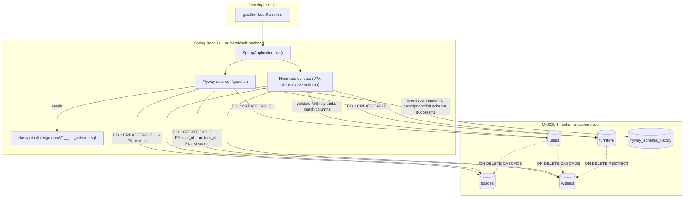

# Design Note — DB-schema-init

## 1. Scope
Bootstrap the AuthenticSelf backend enough to run Flyway V1 against MySQL 8,
and ship the four core business tables (`users`, `spaces`, `furniture`,
`wishlist`) plus stub JPA entities. Every FR and AC in
`spec.md` / `acceptance_criteria.json` is addressed below.

## 2. Key architectural decisions

| # | Decision | Why |
|---|----------|-----|
| D1 | **Flyway, not Liquibase, not Hibernate `ddl-auto`** | PRD §4 mandates Spring + MySQL; Flyway is the de-facto Spring Boot convention and gives idempotent, versioned migrations (FR-5, NFR "idempotency"). `spring.jpa.hibernate.ddl-auto=validate` is set so Hibernate never mutates the schema — Flyway is the sole schema owner. |
| D2 | **Native MySQL `ENUM('Active','Purchased')` for `wishlist.status`** instead of a `VARCHAR + CHECK` or a lookup table | AC-10 requires DB-level rejection of non-enum strings with a data-truncation error (MySQL 1265 under STRICT). Handoff explicitly calls this out. `@Enumerated(EnumType.STRING)` on the JPA side maps cleanly. |
| D3 | **All IDs `VARCHAR(64)`, not `BIGINT AUTO_INCREMENT`** | The example wishlist row in the spec (`u_01HXY...`) implies ULID/KSUID-style string IDs generated at the application layer. VARCHAR(64) accommodates UUIDs (36), ULIDs (26), and prefixed variants with headroom. Also keeps IDs portable across services (backend, AI service). |
| D4 | **FK policies: cascade on user deletes, restrict on furniture deletes** | Handoff is explicit: `users→spaces/wishlist` cascade (a deleted user's data is owned by the user); `furniture→wishlist` restrict (you cannot silently delete catalog rows that real users have wishlisted — UC-03 admin would lose integrity). |
| D5 | **`spaces.user_id` FK even though PRD §3 table listing omits it** | PRD §7 class diagram has `User 1 — 0..* Space` as the authoritative cardinality. The spec explicitly resolves the ambiguity in favor of §7 and the handoff confirms. |
| D6 | **Composite index `idx_furniture_type_style` on `(type, style)`** | UC-01 recommendation cross-validation queries `WHERE type=? AND style=?`. Named indexes `idx_spaces_user_id` / `idx_wishlist_user_id` are spec-mandated (AC-12, AC-13). |
| D7 | **Stub-only entities under `com.authenticself.domain`** | FR-8 restricts this task to `@Entity` + `@Table` + `@Column`. No `@ManyToOne`, no `@OneToMany`, no repositories. That isolates schema semantics in this task and lets later UC tasks evolve the relationship model independently. Path `domain/` follows spec verbatim (agent definition shows `entity/` — task/spec wins, noted as a minor deviation in §7). |
| D8 | **Env-var-driven datasource (`DB_URL`, `DB_USER`, `DB_PASSWORD`)** | No secrets in VCS; agent definition's security rule + standard Spring Boot pattern. |
| D9 | **Testcontainers (real MySQL 8) for the migration test** | H2 silently tolerates non-standard MySQL features (native ENUM, utf8mb4 collations, error code 1452). Authoritative verification of AC-7/AC-8/AC-9/AC-10/AC-16 requires the real engine. Docker is the CI surface area, accepted tradeoff. |

## 3. Data flow (Mermaid)



## 4. FR → file/function mapping

| FR | Requirement | File(s) satisfying it |
|----|-------------|------------------------|
| FR-1 | `users` table with PK/UNIQUE email/timestamps | `src/backend/src/main/resources/db/migration/V1__init_schema.sql` (users block) |
| FR-2 | `spaces` table with FK `fk_spaces_user` + `idx_spaces_user_id` | `V1__init_schema.sql` (spaces block) |
| FR-3 | `furniture` table + `idx_furniture_type_style` | `V1__init_schema.sql` (furniture block) |
| FR-4 | `wishlist` table with ENUM status, dual FK, `idx_wishlist_user_id` | `V1__init_schema.sql` (wishlist block) |
| FR-5 | Flyway migration file naming / encoding | Exact path `src/backend/src/main/resources/db/migration/V1__init_schema.sql`, UTF-8, `;` terminators, no `CREATE DATABASE`/`USE` |
| FR-6 | snake_case identifiers | Enforced in `V1__init_schema.sql`; asserted by test `ac15_snakeCase` |
| FR-7 | `ENGINE=InnoDB DEFAULT CHARSET=utf8mb4 COLLATE=utf8mb4_unicode_ci` | Trailing clause on every `CREATE TABLE`; asserted by `ac16_collation` |
| FR-8 | JPA entity stubs (no relations/services/repos) | `src/backend/src/main/java/com/authenticself/domain/User.java`, `Space.java`, `Furniture.java`, `Wishlist.java` |

Supporting scaffold (bootstrap — FR-5 requires these to exist so the migration can run):
- `src/backend/build.gradle`, `settings.gradle` — Gradle + Spring Boot 3.2 + Flyway + MySQL driver + H2 + Testcontainers.
- `src/backend/src/main/java/com/authenticself/AuthenticSelfApplication.java` — Spring Boot entrypoint.
- `src/backend/src/main/resources/application.yml` — env-var datasource, Flyway enabled, JPA validate-only.
- `.gitignore` — top-level, covers build/, .gradle/, node_modules/, __pycache__/, .env, IDE files.

## 5. Test strategy

Single integration test class: `src/backend/src/test/java/com/authenticself/migration/V1InitSchemaMigrationTest.java`

- Backing engine: **MySQL 8 via Testcontainers** (`mysql:8.0`). No H2 used for AC assertions — H2's MySQL-compat mode does not faithfully emulate native ENUM, utf8mb4 collations, or 1452 error codes.
- Strategy: spin up the container once (`@TestInstance(PER_CLASS)`), run Flyway against `filesystem:src/main/resources/db/migration`, then one `@Test` per acceptance criterion.

| AC | Test method |
|----|-------------|
| AC-1 | `ac1_tablesPresent` |
| AC-2 | `ac2_usersColumns` |
| AC-3 | `ac3_spacesColumns` |
| AC-4 | `ac4_furnitureColumns` |
| AC-5 | `ac5_wishlistColumns` (includes ENUM type + default) |
| AC-6 | `ac6_primaryKeys` |
| AC-7 | `ac7_spacesFkRejectsOrphan` (asserts SQLException + errorCode 1452) |
| AC-8 | `ac8_wishlistFkUser` |
| AC-9 | `ac9_wishlistFkFurniture` |
| AC-10 | `ac10_statusEnumEnforced` (rejects `'Pending'`, accepts `'Active'`/`'Purchased'`) |
| AC-11 | `ac11_defaultStatus` |
| AC-12 | `ac12_idxSpacesUserId` |
| AC-13 | `ac13_idxWishlistUserId` |
| AC-14 | `ac14_flywayVersioning` (filesystem glob + history row) |
| AC-15 | `ac15_snakeCase` |
| AC-16 | `ac16_collation` |
| AC-17 | `Ac17EntityStubs.exactlyFourEntityFiles`, `eachEntityHasEntityAndTableAnnotations` |

## 6. How to run

Local full-stack verification (Docker required for Testcontainers):

```bash
cd C:/AuthenticSelf_Project/AuthenticSelf_v3/src/backend
./gradlew clean test
```

Java-compile-only check (AC-17 compilation half):

```bash
cd C:/AuthenticSelf_Project/AuthenticSelf_v3/src/backend
./gradlew compileJava
```

Runtime boot against a real MySQL (no container):

```bash
export DB_URL="jdbc:mysql://localhost:3306/authenticself?useSSL=false&serverTimezone=UTC&characterEncoding=utf8mb4"
export DB_USER="<user>"
export DB_PASSWORD="<password>"
cd C:/AuthenticSelf_Project/AuthenticSelf_v3/src/backend
./gradlew bootRun
```

Windows PowerShell equivalents:

```powershell
$env:DB_URL      = "jdbc:mysql://localhost:3306/authenticself?useSSL=false&serverTimezone=UTC&characterEncoding=utf8mb4"
$env:DB_USER     = "<user>"
$env:DB_PASSWORD = "<password>"
cd C:/AuthenticSelf_Project/AuthenticSelf_v3/src/backend
./gradlew.bat bootRun
```

## 7. Deviations & blockers
- **None blocking.** One minor structural note: the `design-specialist` agent definition places entities under `entity/`, but the task spec (FR-8) and handoff mandate `domain/`. The spec is authoritative — entities are under `src/backend/src/main/java/com/authenticself/domain/`. When later UC tasks add repositories/services, they will import from `com.authenticself.domain.*`.
- Gradle wrapper (`gradlew`, `gradlew.bat`, `gradle/wrapper/`) is **not** generated here — that requires running `gradle wrapper` with a pre-installed Gradle. The `.gitignore` permits `!gradle/wrapper/gradle-wrapper.jar`. If CI requires wrapper-only builds, run `gradle wrapper --gradle-version 8.7` inside `src/backend/` as a one-time bootstrap step.
