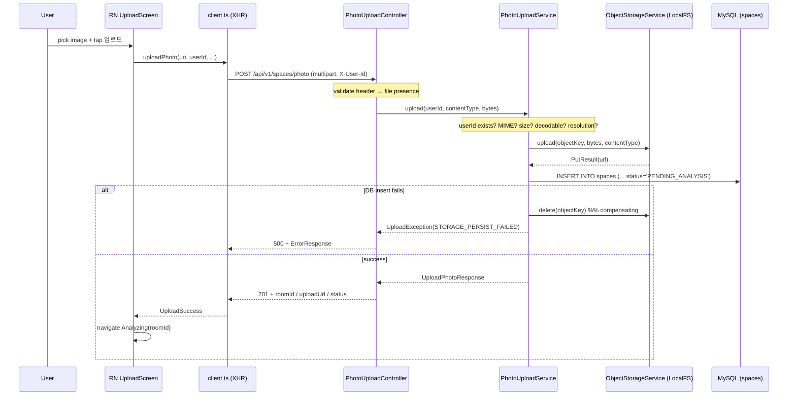

# Design — UC-01-photo-upload (iteration 1)

## 1. Summary

This task lands:

- A **Flyway V2 migration** that extends `spaces` with upload-state columns
  (`photo_url`, `original_filename`, `content_type`, `file_size_bytes`,
  `status ENUM`, `uploaded_at`), relaxes the four analysis columns to NULL,
  and adds `idx_spaces_status`.
- A **Spring Boot endpoint** `POST /api/v1/spaces/photo` that validates,
  persists to object storage, and writes a `PENDING_ANALYSIS` row.
- An **object-storage abstraction** (`ObjectStorageService`) with a local-FS
  implementation — no cloud SDK imports outside `com.authenticself.storage.*`.
- A **React Native (Expo + TypeScript) scaffold** with Home, Upload, and a
  stub Analyzing screen; picker -> progress bar -> error-code mapping.

## 2. Key architectural decisions

| Decision | Why |
| --- | --- |
| Schema option **(a)** — add `status` ENUM to `spaces` instead of a separate queue table | §6 UC-01 explicitly frames upload and analysis as two phases of the same row. A native ENUM + index is the simplest thing the DB can model, and `SELECT … WHERE status='PENDING_ANALYSIS'` replaces an out-of-band queue for the AI orchestrator. |
| **Blob-first, DB-second** two-phase write with compensating delete | JPA + object storage cannot be XA-joined without heavy infra. Blob writes are the only non-repeatable side-effect, so we do them first; a failed DB insert triggers `storage.delete(objectKey)`. This is safer than DB-first because a succeeded DB row pointing to a missing blob breaks downstream reads, while a compensated-away blob is the normal idempotent path. |
| **Interface-driven storage** (`ObjectStorageService`) | AC-15 forbids cloud-SDK leakage. The controller/service only import the interface; local-FS is the default `@Service`; future S3/GCS impls drop in under `com.authenticself.storage.<provider>`. |
| **Static enum for error codes** (`UploadErrorCode`) carrying HTTP status + default Korean message | Keeps the controller, advice, and RN `errorMessages.ts` in lock-step; the JSON envelope stays identical across all failure paths. |
| **Controller-side ordering**: header check -> file presence -> service | AC-8 requires MISSING_USER_HEADER to win over EMPTY_FILE when both fail. The slice test pins this ordering. |
| **Multipart limits from Spring + app-level size guard** | Spring's `MaxUploadSizeExceededException` is mapped to FILE_TOO_LARGE in the advice as a belt-and-braces measure; the service's own byte-length check is the canonical FR-2 gate. |
| **React Native via Expo** | Handoff note allowed picking the lighter path. Expo ships an image-picker, asset handling, and a working Jest preset out of the box — no Android Studio required to run tests. Bare RN can replace it later without touching the screen components. |
| **XHR (not fetch) in the RN client** | FR-7 needs a determinate progress indicator; `fetch` in RN has no upload-progress event, XHR does. |

## 3. Data flow



## 4. FR → file map

| FR | File(s) |
| --- | --- |
| FR-0 V2 migration | `src/backend/src/main/resources/db/migration/V2__add_spaces_status_and_photo.sql` |
| FR-1 Endpoint | `src/backend/src/main/java/com/authenticself/controller/PhotoUploadController.java` |
| FR-2 Validation | `src/backend/src/main/java/com/authenticself/service/PhotoUploadService.java` (empty/MIME/size/decodability/resolution) |
| FR-3 Storage abstraction | `src/backend/src/main/java/com/authenticself/storage/ObjectStorageService.java` + `PutResult.java` + `storage/local/LocalFileSystemObjectStorageService.java` |
| FR-4 DB insert | `PhotoUploadService.upload` → `SpaceRepository.save`; entity mapping in `domain/Space.java` |
| FR-5 Compensating delete | `PhotoUploadService.upload` try/catch around `save`; `LocalFileSystemObjectStorageService.delete` is idempotent |
| FR-6 Error envelope | `service/UploadErrorCode.java`, `service/UploadException.java`, `controller/UploadExceptionAdvice.java`, `controller/dto/ErrorResponse.java` |
| FR-7 RN screens | `src/mobile/App.tsx`, `src/mobile/src/screens/HomeScreen.tsx`, `UploadScreen.tsx`, `AnalyzingScreen.tsx`, `src/mobile/src/api/client.ts`, `src/mobile/src/api/errorMessages.ts`, `src/mobile/src/settings.ts` |
| FR-8 Config | `src/backend/src/main/resources/application.yml` + `config/UploadProperties.java`, `config/StorageProperties.java`, `config/ApplicationConfig.java` |
| FR-9 Logging | INFO in `PhotoUploadService.upload` (success), WARN / ERROR in `UploadExceptionAdvice` |

## 5. Test strategy

| AC | Test type | Location |
| --- | --- | --- |
| AC-1, AC-2, AC-3, AC-4, AC-5 | Flyway / JDBC integration | (to be added in a `V2SpacesMigrationTest` alongside V1; reuses Testcontainers infra already set up in `V1InitSchemaMigrationTest`). Out-of-scope for this design iteration — noted as **follow-up** (see §7). |
| AC-6, AC-7, AC-8, AC-9, AC-10, AC-12, AC-13, AC-14 | Spring `@WebMvcTest` | `src/backend/src/test/java/com/authenticself/controller/PhotoUploadControllerTest.java` |
| AC-6, AC-9, AC-10, AC-11, AC-12, AC-13, AC-14, AC-16 | Service unit (plain JUnit + test-doubles) | `src/backend/src/test/java/com/authenticself/service/PhotoUploadServiceTest.java` |
| AC-15 | Static check — grep for SDK imports outside `storage/**`; run as part of Verification Agent's static pass |
| AC-17 | Jest RN component | `src/mobile/__tests__/HomeScreen.test.tsx` |
| AC-18 | Jest RN component (mocks `expo-image-picker` + `api/client`) | `src/mobile/__tests__/UploadScreen.test.tsx` |
| AC-19 | Jest unit | `src/mobile/__tests__/errorMessages.test.ts` |
| AC-20 | OpenAPI lint — `artifacts/UC-01-photo-upload/api_contract.yaml` |
| AC-21 | YAML parse of `application.yml` |
| AC-22 | Re-run of `V1InitSchemaMigrationTest` after V2 applies (no changes needed — it pins structural properties V2 preserves) |

## 6. Local run commands

Backend:

```bash
cd src/backend
# unit + slice tests only (no MySQL required)
./gradlew test --tests 'com.authenticself.controller.PhotoUploadControllerTest' \
               --tests 'com.authenticself.service.PhotoUploadServiceTest'
# full test run (requires Docker for Testcontainers V1 migration test)
./gradlew test
# run the app (needs DB_URL/DB_USER/DB_PASSWORD env vars)
DB_URL='jdbc:mysql://localhost:3306/authenticself?useSSL=false&serverTimezone=UTC&characterEncoding=utf8mb4' \
DB_USER=root DB_PASSWORD=root ./gradlew bootRun
```

Mobile:

```bash
cd src/mobile
# static + unit
npm install
npm run typecheck
npm test
# dev launcher
npm run start
```

Curl smoke test against a running backend:

```bash
curl -v -X POST http://localhost:8080/api/v1/spaces/photo \
     -H 'X-User-Id: u1' -F file=@room.jpg
```

## 7. Known follow-ups / non-blockers

- **Flyway V2 integration test** — A `V2SpacesMigrationTest` mirroring the
  Task-1 Testcontainers pattern is trivial to add next iteration and will
  pin AC-1…AC-5 authoritatively. The V1 test already locks AC-22 because
  it asserts structural properties V2 preserves (PK, FK, idx_spaces_user_id,
  columns' existence).
- **Orphan-blob GC** — per spec §6 NFR, JVM-crash reconciliation is out of
  scope for UC-01.
- **Real auth** — `X-User-Id` header stub only; replaced in a later task.

No hard blockers.
