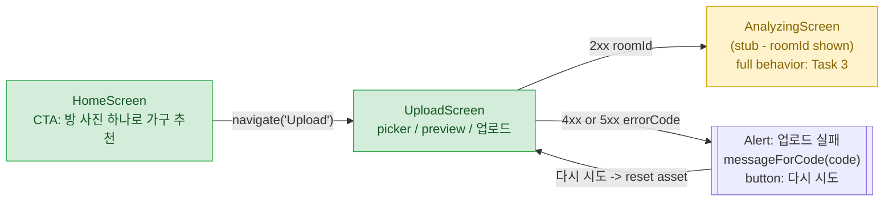

# UC-01-photo-upload — React Native UI flow

**Source of truth:**
- `src/mobile/src/screens/HomeScreen.tsx`
- `src/mobile/src/screens/UploadScreen.tsx`
- `src/mobile/src/screens/AnalyzingScreen.tsx`
- `src/mobile/src/api/errorMessages.ts`

**PRD refs:** PRD section 6 UC-01 basic flow step 1, PRD section 6 UC-01 alt-flow 1-a.

---

## 1. Screen-flow overview



Green = fully implemented in this task. Yellow = scaffolded stub that Task 3 (`UC-01-space-analysis`) fills in.

---

## 2. HomeScreen (FR-7 / AC-17)

```
+------------------------------------------+
|                                          |
|              AuthenticSelf               |
|   나에게 꼭 맞는 가구를 추천받으세요.    |
|                                          |
|  +------------------------------------+  |
|  |      방 사진 하나로 가구 추천       |  |  <-- testID=cta-photo-upload
|  +------------------------------------+  |
|                                          |
+------------------------------------------+
```

- Exact CTA label `방 사진 하나로 가구 추천` (AC-17 verbatim).
- `onPress` -> `navigation.navigate('Upload')`.

---

## 3. UploadScreen (FR-7 / AC-18)

### 3.1 Empty state (no asset picked)

```
+------------------------------------------+
|                                          |
|      +-----------------------+           |
|      |                       |           |
|      |     사진 선택          |   <-- testID=btn-pick
|      |    (tap to open       |           |
|      |     image picker)     |           |
|      +-----------------------+           |
|                                          |
+------------------------------------------+
```

### 3.2 Picked state (preview + upload button)

```
+------------------------------------------+
|                                          |
|      +-----------------------+           |
|      |                       |           |
|      |   [preview thumbnail] |   <-- testID=preview
|      |                       |           |
|      +-----------------------+           |
|           2.34 MB                        |   <-- {fileSize/1MB} rendered only if provided
|                                          |
|      +-----------------------+           |
|      |        업로드          |   <-- testID=btn-upload
|      +-----------------------+           |
|                                          |
+------------------------------------------+
```

### 3.3 Uploading state (progress indicator)

```
+------------------------------------------+
|                                          |
|      +-----------------------+           |
|      |   [preview thumbnail] |           |
|      +-----------------------+           |
|           2.34 MB                        |
|                                          |
|         (o) 47%                          |   <-- testID=upload-progress
|         ActivityIndicator + "{pct}%"     |       driven by XHR upload.onprogress
|                                          |
+------------------------------------------+
```

Note: `업로드` button hides while `uploading === true`.

### 3.4 Error state (Alert overlay)

On `UploadFailedError`, an `Alert.alert('업로드 실패', messageForCode(code), [{ text: '다시 시도', onPress: resetAsset }])` is shown:

```
+------------------------------------------+
|  +------------------------------------+  |
|  |            업로드 실패              |  |
|  |                                    |  |
|  |  {Korean message from              |  |
|  |   errorMessages.ts[errorCode]}     |  |
|  |                                    |  |
|  |             [ 다시 시도 ]           |  |
|  +------------------------------------+  |
+------------------------------------------+
```

---

## 4. AnalyzingScreen (scaffolded for Task 3)

```
+------------------------------------------+
|                                          |
|                 (O)                      |
|                                          |
|          방 분석 준비 중…                 |
|                                          |
|      roomId: <route.params.roomId>       |   <-- testID=room-id
|                                          |
+------------------------------------------+
```

- Today: just displays the roomId received from `UploadScreen.navigation.replace`.
- Task 3 will own the real polling / AI-status behaviour.

---

## 5. Error-code -> Korean message map (FR-6 / AC-19)

Backend `errorCode` values (from `UploadErrorCode.java`) are mapped 1-to-1 by `src/mobile/src/api/errorMessages.ts`:

| HTTP | errorCode              | Trigger (FR-2 / FR-6)                             | Korean message (ui) |
|------|------------------------|--------------------------------------------------|---------------------|
| 400  | `EMPTY_FILE`           | multipart `file` part missing or zero bytes       | 업로드된 파일이 비어 있습니다. 다시 시도해주세요. |
| 401  | `MISSING_USER_HEADER`  | `X-User-Id` header absent                        | 사용자 인증 정보가 없습니다. 앱을 다시 시작해주세요. |
| 401  | `UNKNOWN_USER`         | `X-User-Id` not found in `users` table           | 등록되지 않은 사용자입니다. 관리자에게 문의해주세요. |
| 413  | `FILE_TOO_LARGE`       | payload > 10 MB                                  | 파일 용량이 너무 큽니다. 10MB 이하의 사진을 업로드해주세요. |
| 415  | `UNSUPPORTED_MEDIA_TYPE` | MIME not in {jpeg, png, webp}                 | 지원하지 않는 이미지 형식입니다. JPG, PNG, WEBP만 업로드할 수 있습니다. |
| 422  | `IMAGE_UNREADABLE`     | `ImageIO.read` returns null / throws              | 이미지를 읽을 수 없습니다. 다른 사진으로 다시 시도해주세요. |
| 422  | `RESOLUTION_TOO_LOW`   | width < 640 or height < 480 (UC-01 alt-flow 1-a) | 업로드한 사진의 해상도가 너무 낮습니다. 640x480 이상 이미지를 올려주세요. |
| 500  | `STORAGE_PERSIST_FAILED` | storage or DB failure (FR-5 compensating delete) | 일시적인 오류로 사진 저장에 실패했습니다. 잠시 후 다시 시도해주세요. |

**Fallback** (unknown / missing code): `DEFAULT_ERROR_MESSAGE` = `알 수 없는 오류가 발생했습니다. 잠시 후 다시 시도해주세요.`

---

## 6. Legend (FR / AC traceability)

- HomeScreen ................. FR-7, AC-17 (exact CTA label)
- UploadScreen picker + preview ...... FR-7
- UploadScreen progress indicator .... FR-7 (XHR `upload.onprogress` - see `api/client.ts`)
- UploadScreen success navigation .... FR-7, AC-18
- UploadScreen error mapping + retry . FR-7, AC-19
- AnalyzingScreen scaffold ........... FR-7 (Task 3 finishes it)
- errorMessages.ts module path ....... AC-19 (exact path `src/mobile/src/api/errorMessages.ts`)

**Drift flag:** the `UNKNOWN_USER` Korean copy differs between the backend (`존재하지 않는 사용자입니다.`) and the RN mapping (`등록되지 않은 사용자입니다. 관리자에게 문의해주세요.`). Both are surfaced in different contexts (backend default message vs. RN user-facing), but AC-19 only requires non-empty Korean strings per key — not textual equality with the backend. Noted here, not blocking.
