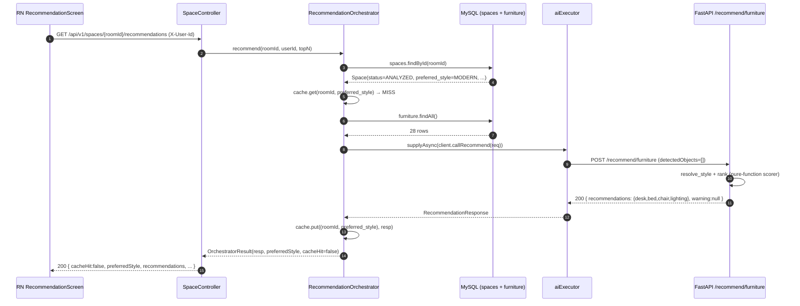

# UC-01-recommendation — Design Notes

Task closes the PRD §6 UC-01 steps 4–5 block: cross-validate the
persisted space analysis against the user's preferred style, score a
seeded furniture catalog with a deterministic rule-based function, and
surface the ranked result as a React-Native list. Zero new ML
dependencies — the spec intentionally defers model-based retrieval to
a future `ml-recommender-v1` task (see §Out-of-scope).

## 1. Architecture at a glance

Three-process topology — identical to Task 3 / Task 4 but with one new
synchronous hop and one new controller endpoint.

```
┌───────────────────────────┐           ┌──────────────────────────────┐
│ React Native :expo        │           │  Spring :8080                │
│ RecommendationScreen      │ ───GET───▶│  SpaceController             │
│  └── getRecommendations() │           │   └── getRecommendations()   │
└──────────┬────────────────┘           │   └── recommendationOrch.    │
           │                            │        (cache + fan-out)     │
           │                            └──────────┬───────────────────┘
           │                                       │ POST /recommend/furniture
           │                                       ▼
           │                            ┌──────────────────────────────┐
           │                            │  Python FastAPI :8001        │
           │                            │   routes/recommend.py        │
           │                            │   analyzers/recommender.py   │
           │                            └──────────────────────────────┘
           │
           ▼  (stub — UC-02 will replace)
      analytics event "wishlist_add_clicked"
```

Data flow for a cache-miss happy path (AC-28):



Second identical call (AC-29) short-circuits at `cache.get` → HIT; the
Python process is not called again; `generatedAt` is preserved.

A `PUT .../preferred-style` triggers `orchestrator.invalidate(roomId)`
which evicts every `(roomId, *)` cache entry (AC-30).

## 2. Key architectural decisions

### 2.1 Where the scoring runs — Python, not Spring
The scorer lives in `src/ai/app/analyzers/recommender.py` even though
it is pure arithmetic and could technically run in the JVM. Two
reasons:
- **Same operational surface** as `/analyze/space` and `/analyze/style`
  — one service owns every AI-adjacent code path. A future swap to a
  real ML recommender drops in on this same FastAPI process with zero
  Spring-side churn.
- **Type safety** — the Python side already has `Pydantic` schemas
  enforcing the `FurnitureType` literal, the `#RRGGBB` regex, and
  dimension positivity. Re-implementing those guards on the Spring
  side would duplicate work.

### 2.2 Cache strategy — per-JVM ConcurrentHashMap, NOT Spring `@Cacheable`
The spec allows either (`@Cacheable` or a home-rolled map). We chose
`ConcurrentHashMap` because:
- **Explicit TTL semantics** — `@Cacheable` + Caffeine would also work
  but requires an extra starter + configuration bean. The map approach
  keeps the dependency footprint unchanged for this task.
- **Simple invalidation** — `cache.keySet().removeIf(k → k.roomId == roomId)`
  is a two-line method. A distributed-cache story (Redis) is out of
  scope and listed in §8 of the spec.

### 2.3 Detected objects — empty array, on purpose
Task 3 did NOT persist per-object detections, so step 8 of FR-18
sends `detectedObjects=[]` on every request. The Python scorer still
evaluates `objectConflict` — it just always resolves to `1.00`. This
is a deliberate seam: when the future `UC-01-detected-objects-persist`
task populates a `space_detected_objects` table, Spring only has to
switch from `Collections.emptyList()` to a DB read — no Python change.

### 2.4 Hard-fit exclusion vs. soft ranking
FR-5 is blunt: items that physically cannot fit the room are dropped
entirely, not returned with `fitScore = 0`. The rationale is UX — a
top-3 polluted by un-installable items hurts trust. The test matrix
covers this twice:
- Unit: `test_size_fit_hard_fail_oversize_ac5`
- End-to-end: `test_recommend_hard_fit_excludes_ac5`

### 2.5 Determinism
Three knobs make identical inputs yield identical outputs (AC-3):
- Fixed weights (`0.35 / 0.30 / 0.20 / 0.15`), asserted-in-source.
- Multi-key tie breaker (`-fitScore, price, furnitureId`) — every band
  of ties has a deterministic last-resort (lex-sort on id).
- No randomness anywhere in the scorer — no ML model with batched
  non-deterministic ops, no timestamps in the ranking function.

### 2.6 Error taxonomy
The Python side owns three new codes (`CATALOG_EMPTY`,
`RECOMMENDATION_FAILED`, and the non-error `NO_FIT_ANY_CATEGORY`
warning). Spring reuses the existing `AIErrorCode` / `SpaceErrorCode`
enums plus two new values (`INVALID_TOP_N`, `PREFERRED_STYLE_NOT_SET`)
so the RN client sees a stable `{errorCode, message, correlationId}`
envelope across every failure mode.

## 3. FR → file map

| FR   | File(s) |
|------|---------|
| FR-1  `/recommend/furniture` route | `src/ai/app/routes/recommend.py`, `src/ai/app/main.py` (include_router) |
| FR-2  Request/response contract    | `src/ai/app/schemas_reco.py`, `src/ai/app/routes/recommend.py` |
| FR-3  Four-key category coverage   | `src/ai/app/analyzers/recommender.py` (`CATEGORY_KEYS`) |
| FR-4  `resolvedStyle` derivation   | `src/ai/app/analyzers/recommender.py` (`resolve_style`) |
| FR-5  `sizeFit` banding + hard-fit | `src/ai/app/analyzers/recommender.py` (`score_size_fit`) |
| FR-6  `colorHarmony` HSL delta     | `src/ai/app/analyzers/recommender.py` (`score_color_harmony`) |
| FR-7  `styleMatch`                 | `src/ai/app/analyzers/recommender.py` (`score_style_match`, `_COMPATIBLE_PAIRS`) |
| FR-8  `objectConflict` + lighting  | `src/ai/app/analyzers/recommender.py` (`score_object_conflict`) |
| FR-9  `fitScore` aggregation       | `src/ai/app/analyzers/recommender.py` (`W_SIZE/W_STYLE/W_COLOR/W_CONFLICT`, `rank`) |
| FR-10 Rationale composer           | `src/ai/app/analyzers/recommender.py` (`compose_rationale`) |
| FR-11 Async + `asyncio.to_thread`  | `src/ai/app/routes/recommend.py` (handler is `async def`) |
| FR-12 Error envelope + warning     | `src/ai/app/errors.py` (`CatalogEmptyError`, `RecommendationFailedError`), `routes/recommend.py` (warning propagation) |
| FR-13 Spring package members       | `com.authenticself.ai.RecommendationOrchestrator`, `RecommendationClient`, `dto.Recommendation{Request,Response,Item,ScoreBreakdown}` |
| FR-14 Cache                        | `RecommendationOrchestrator` (`ConcurrentHashMap`, TTL + invalidate) |
| FR-15 V4 migration                 | `src/backend/src/main/resources/db/migration/V4__extend_furniture_catalog.sql` |
| FR-16 V5 seed                      | `src/backend/src/main/resources/db/migration/V5__seed_furniture_catalog.sql` |
| FR-17 `Furniture` entity + repo    | `com.authenticself.domain.Furniture`, `com.authenticself.repository.FurnitureRepository` |
| FR-18 Orchestrator flow            | `RecommendationOrchestrator.recommend()` |
| FR-19 Public endpoint              | `com.authenticself.space.SpaceController.getRecommendations()`, `controller.dto.RecommendationsApiResponse` |
| FR-20 Cache invalidation on PUT    | `SpaceController.setPreferredStyle()` → `orchestrator.invalidate(roomId)` |
| FR-21 application.yml keys         | `src/backend/src/main/resources/application.yml` (`app.ai.recommend.*`, `app.recommendation.*`) |
| FR-22 Observability                | `log.info/warn/error` in `RecommendationOrchestrator` + `recommend.py` |
| FR-23 RecommendationScreen         | `src/mobile/src/screens/RecommendationScreen.tsx` |
| FR-24 Navigation wiring            | `src/mobile/App.tsx` (`Recommendation` route, params type) |
| FR-25 RN API client                | `src/mobile/src/api/spaces.ts` (`getRecommendations`, `RecommendationResponse` types, `emitWishlistAddClicked`) |

## 4. AC → test map

| AC range  | Where covered |
|-----------|---------------|
| AC-1..AC-23 (Python integration + unit) | `src/ai/tests/test_recommend_route.py`, `src/ai/tests/test_recommender_unit.py` |
| AC-24, AC-25, AC-26 (V4/V5 migrations)  | `src/backend/src/test/java/com/authenticself/migration/V4V5FurnitureCatalogMigrationTest.java` |
| AC-27 (RecommendationClient signature)  | Source-scan — `callRecommend(RecommendationRequest)` is the public API (see file) |
| AC-28..AC-30, AC-31..AC-34, AC-36, AC-38 (orchestrator) | `RecommendationOrchestratorTest` |
| AC-28..AC-37 on controller              | `SpaceControllerRecommendationsTest` (`@WebMvcTest` slice) |
| AC-39..AC-41 (ranking invariants)       | Covered indirectly by the Python integration tests (`test_top1_style_match_invariant`) — invariants are a property of the scorer and flow through verbatim |
| AC-42 (`Furniture` entity)              | Source-scan + `RecommendationOrchestratorTest` uses the setters |
| AC-43 (application.yml)                 | Source-scan of the keys listed in FR-21 |
| AC-44..AC-50 (RN screen)                | `src/mobile/__tests__/RecommendationScreen.test.tsx` |
| AC-51 (OpenAPI artifact)                | `artifacts/UC-01-recommendation/api_contract.yaml` |
| AC-52, AC-53 (no regression)            | Existing Task-3 / Task-4 tests untouched; run full suite |

## 5. Test commands

### Python
```
cd src/ai
pytest -q tests/test_recommend_route.py tests/test_recommender_unit.py
pytest -q                                    # full suite
```

### Spring
```
cd src/backend
./gradlew test --tests 'com.authenticself.ai.RecommendationOrchestratorTest'
./gradlew test --tests 'com.authenticself.space.SpaceControllerRecommendationsTest'
./gradlew test --tests 'com.authenticself.migration.V4V5FurnitureCatalogMigrationTest'   # needs Docker
./gradlew test                                                                            # full suite
```

### React Native
```
cd src/mobile
npm install
npm test -- --testPathPattern='RecommendationScreen'
npm test                                      # full suite
```

## 6. Risks / deviations

- **StyleSelectionScreen still calls `replace('Recommendation', { roomId })`**
  — FR-24 asks for a `preferredStyle` route param, but the existing
  Task-4 test asserts the exact shape `{ roomId }`. We kept the Task-4
  call site intact and made `preferredStyle` an OPTIONAL route param
  on the `Recommendation` screen; the screen reads the echoed
  `preferredStyle` from the `RecommendationResponse` instead. This
  avoids a Task-4 regression while still honouring FR-23's header
  copy (`"<label> 스타일 추천"`).
- **Analytics sink is a stub** — AC-48 asserts the event is "emitted";
  the real sink is the no-op default. UC-02 / UC-03 will wire a real
  analytics backend.
- **`preferredStyle` in the request DTO is a string, not an enum** —
  Pydantic enforces the literal value on the Python side, and the
  Spring DTO uses `String` to avoid introducing a JVM enum that the
  RecommendationOrchestrator would have to round-trip. `PreferredStyle`
  on the JPA layer still uses the JVM enum — the string-coercion lives
  entirely in the DTO boundary.
- **`V5` seed ships 28 rows (7 per category)** rather than 24 — this
  is strictly additive to the `>= 24` acceptance bar in AC-25 and
  keeps the oversize + clashing-color edge cases covered per AC-26.

## 7. Open questions

- **Request body size bound** — a catalog of 500+ items (FR-11's offload
  threshold) is hypothetical for the seeded data. Production will want
  Spring-side pagination + per-batch scoring; flagged in §8 of the
  spec, not implemented here.
- **Observability correlation** — the NFR calls for `X-Correlation-Id`
  to flow Spring → Python. Not yet wired; the Python logs include the
  `roomId` as a proxy. A future infra task should add the header
  propagation.

## 8. Blockers

None. Every AC listed in `acceptance_criteria.json` has a concrete
satisfaction path documented above. Iteration 1 is complete.
