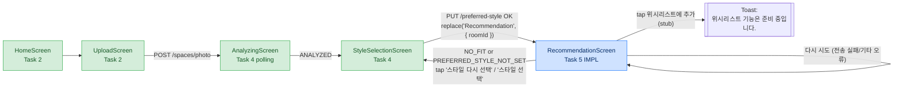
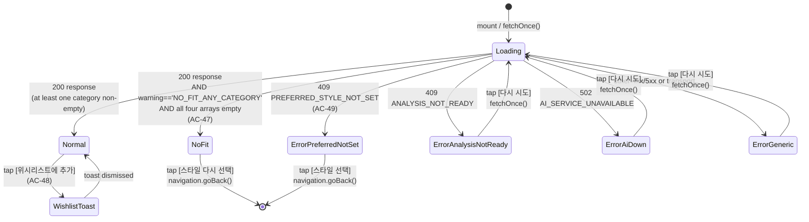

# UC-01-recommendation — RecommendationScreen UI flow

**Source of truth:**
- `src/mobile/src/screens/RecommendationScreen.tsx` (NEW Task 5)
- `src/mobile/src/api/spaces.ts` (NEW Task 5 — `getRecommendations`, analytics stub)
- `src/mobile/App.tsx` — route `Recommendation: { roomId: string; preferredStyle?: PreferredStyle }`
- `src/mobile/src/types/style.ts` — `PREFERRED_STYLE_LABELS` (reused from Task 4)
- `src/mobile/src/api/client.ts` — `ApiError` (status + body)

**PRD refs:** PRD §6 UC-01 step 5 (recommendation UX), PRD §8 (end-to-end sequence), PRD §9 (client layer).

---

## 1. Screen-flow position (UPDATED from Task 4)



- Green = delivered in earlier tasks.
- Blue = delivered by Task 5 (this task).

---

## 2. State machine (RecommendationScreen)



---

## 3. Loading state — AC-50

`loading == true` (initial mount or after `다시 시도`):

```
+----------------------------------------------------+
|                                                    |
|                                                    |
|                    (o)                             |   <-- ActivityIndicator (color=#1f6feb)
|                                                    |
|           추천을 준비하고 있어요...                 |
|                                                    |
|                                                    |
+----------------------------------------------------+
    testID=recommendation-loading
```

---

## 4. Normal state — AC-44 / AC-45

`loading == false && response && at-least-one-category-non-empty`.
Rendered as a `ScrollView` (`testID=recommendation-screen`).
Header derived from `response.preferredStyle` (falls back to `route.params.preferredStyle` if server-side echo is missing — see §7 drift note).

```
+--------------------------------------------------------------------+
|  모던 스타일 추천                                                   |  <-- header (AC-44)
|                                                                    |
|  책상                                                               |  <-- section title (AC-44)
|  +-----+ Oslo Slim Desk                                 [매칭 87%] |  <-- testID=match-badge-{id}
|  | img | ₩189,000                                                  |  <-- formatKrw uses ko-KR grouping
|  +-----+ 모던 스타일 일치, 공간에 여유롭게 들어맞음, 컬러 조화 양호  |  <-- rationale (numberOfLines=2, AC-45)
|         [  위시리스트에 추가  ]                                     |  <-- testID=btn-wishlist-{id} (AC-48)
|                                                                    |
|  +-----+ Bergen Scandi Desk                              [매칭 82%] |
|  | img | ₩215,000                                                  |
|  +-----+ 호환 스타일, 공간에 여유롭게 들어맞음, 컬러 조화 우수        |
|         [  위시리스트에 추가  ]                                     |
|                                                                    |
|  +-----+ ... (up to topNPerCategory=3 cards)                        |
|                                                                    |
|  침대                                                               |  <-- section title
|  +-----+ Nordic Platform Bed                             [매칭 78%] |
|  | img | ₩429,000                                                  |
|  +-----+ 공간에 딱 맞음, 컬러 조화 양호                              |
|         [  위시리스트에 추가  ]                                     |
|                                                                    |
|  의자                                                               |  <-- section title
|  ...                                                                |
|                                                                    |
|  조명                                                               |  <-- section title
|  ...                                                                |
|                                                                    |
+--------------------------------------------------------------------+
  testIDs:
    recommendation-screen                   (root ScrollView)
    section-desk / section-bed / section-chair / section-lighting
    card-{furnitureId}                      (one per item)
    card-image-{furnitureId}                (Image or grey placeholder)
    match-badge-{furnitureId}               ("매칭 NN%")
    btn-wishlist-{furnitureId}              (tap emits analytics event)
```

### 4.1 ItemCard anatomy

```
  +------+--------------------------------------------+
  |      | <name, numberOfLines=1, 600-weight>        |
  | 96x96| +--------------------------+-------------+ |
  | img  | | ₩<price toLocaleString>  | 매칭 NN%    | |
  | or   | +--------------------------+-------------+ |
  | grey | <rationale, numberOfLines=2>               |
  | (if  |                                            |
  | fail | [ 위시리스트에 추가 ]                      |
  | or   |   self-aligned flex-start                  |
  | null)|   border #1f6feb, label #1f6feb             |
  +------+--------------------------------------------+
```

- `imageFailed` (state) or `imageUrl == null` -> grey-filled `View` placeholder (style `cardImagePlaceholder`, bg `#ccc`).
- `onError` on the `<Image/>` flips `imageFailed=true`.
- Card: `#fff` background, 1 px `#e3e3e3` border, 12 px radius.
- Match badge: `#1f6feb` text on `#eef4ff` pill background.

---

## 5. Empty-section state — AC-46

When one (or more, but not all) of `response.recommendations[cat]` is `[]`, render the placeholder in that section only:

```
|  침대                                                               |
|  침대는 현재 추천할 가구가 없습니다.                                |  <-- testID=empty-bed
```

- testID: `empty-desk` / `empty-bed` / `empty-chair` / `empty-lighting`.
- Copy: `{CATEGORY_LABELS[cat]}는 현재 추천할 가구가 없습니다.` (matches FR-23).

Cards still render normally in the other sections.

---

## 6. Full-empty NO_FIT state — AC-47

When `warning == 'NO_FIT_ANY_CATEGORY'` AND every `recommendations[*]` array is empty:

```
+----------------------------------------------------+
|                                                    |
|                                                    |
|   이 공간에 딱 맞는 가구를 찾지                    |
|   못했습니다. 다른 스타일을 선택해                  |
|   보시겠어요?                                       |
|                                                    |
|     [      스타일 다시 선택       ]                 |  <-- testID=btn-retry-style
|                                                    |
|                                                    |
+----------------------------------------------------+
    testID=recommendation-nofit
```

- Tapping `[스타일 다시 선택]` invokes `navigation.goBack()` exactly once (verified by AC-47 test).

---

## 7. Error states — FR-23 error matrix

```
+----------------------------------------------------+
|                                                    |
|                                                    |
|   <mapped Korean error copy>                       |  <-- errorTitle style
|                                                    |
|     [  다시 시도  ]  or  [  스타일 선택  ]          |
|                                                    |
|                                                    |
+----------------------------------------------------+
    testID=recommendation-error
```

Mapping table (implemented in `mapErrorToCopy()` in `RecommendationScreen.tsx`):

| errorCode (from ApiError.body)  | HTTP | Copy                                                                | Button (testID)                |
|---------------------------------|------|---------------------------------------------------------------------|--------------------------------|
| `ANALYSIS_NOT_READY`            | 409  | 분석이 아직 끝나지 않았어요. 잠시 후 다시 시도해주세요.             | `다시 시도` (`btn-retry`)      |
| `PREFERRED_STYLE_NOT_SET`       | 409  | 스타일을 먼저 선택해주세요.                                         | `스타일 선택` (`btn-go-style-select`) -> `navigation.goBack()` (AC-49) |
| `AI_SERVICE_UNAVAILABLE`        | 502  | 추천 서비스에 연결할 수 없습니다. 잠시 후 다시 시도해주세요.        | `다시 시도` (`btn-retry`)      |
| any other 4xx/5xx / transport   |  —   | 추천을 가져오지 못했습니다.                                         | `다시 시도` (`btn-retry`)      |

The `다시 시도` button re-invokes `fetchOnce()` (resets `loading=true`, clears `error`).

---

## 8. Wishlist-add stub — AC-48

On tap of `[위시리스트에 추가]`:

1. `emitWishlistAddClicked(roomId, furnitureId)` fires the analytics sink
   with `{type:'wishlist_add_clicked', payload:{roomId, furnitureId}}`
   (source: `src/mobile/src/api/spaces.ts`).
2. `showToast('위시리스트 기능은 준비 중입니다.')` — `ToastAndroid.show`
   on Android, `Alert.alert('', msg)` elsewhere (deterministic + testable).
3. No `POST /api/v1/wishlist` network call fires (verifiable via fetch spy).
   The real wishlist write lands in UC-02 / Task 6.

---

## 9. Navigation stack (RootStackParamList) — after Task 5

```
Home
 └─> Upload
      └─> Analyzing { roomId }
            └─> StyleSelection { roomId, aiDetectedStyle, aiDetectedConfidence }
                  └─> Recommendation { roomId, preferredStyle?: PreferredStyle }   <-- Task 5
                        └─ (stays; no forward nav in this task)
```

`preferredStyle` is an **optional** route param (see §10 drift note below).
The screen prefers `response.preferredStyle` echoed by the server; it only
falls back to `route.params.preferredStyle` before the fetch resolves.

---

## 10. Drift / open questions

- **FR-24 asked for `preferredStyle` as a REQUIRED route param.** The existing
  Task-4 test asserts `navigation.replace('Recommendation', { roomId })`
  (no `preferredStyle` field). The design-specialist kept the Task-4
  call site intact and made `preferredStyle` OPTIONAL on the
  `Recommendation` route instead. Screen header copy therefore relies
  on the server-echoed `preferredStyle` in `RecommendationResponse`;
  only the pre-fetch render uses the optional route param.
  Flagged in `design.md §6` and carried into the `viz/README.md`.

- **iOS/web toast fallback uses `Alert.alert('', msg)`** because
  React Native `ToastAndroid` is Android-only. AC-48 phrasing says
  "a toast appears" — the `Alert` fallback still asserts on
  "위시리스트 기능은 준비 중입니다." (same copy) so the test is
  cross-platform.

- **Korean display label for the header** — the file uses
  `PREFERRED_STYLE_LABELS[headerPreferredStyle]` from Task 4 which
  maps `MODERN → 모던` (Korean label). That matches AC-45 (`"모던 스타일 추천"`).

---

## 11. Legend (FR / AC traceability)

- RecommendationScreen — four sections ........... FR-23 / AC-44
- ItemCard content (name / ₩price / 매칭 NN% / rationale) FR-23 / AC-45
- Empty-section placeholder copy ................. FR-23 / AC-46
- NO_FIT full-empty state with [스타일 다시 선택] ... FR-23 / AC-47
- Wishlist stub (analytics event + toast) ........ FR-23 / AC-48
- PREFERRED_STYLE_NOT_SET error + [스타일 선택] ... FR-23 / AC-49
- Loading spinner + "추천을 준비하고 있어요..." ... FR-23 / AC-50
- `getRecommendations` API client + runtime assert FR-25 / AC-44
- Navigation `Recommendation` route wiring ....... FR-24
