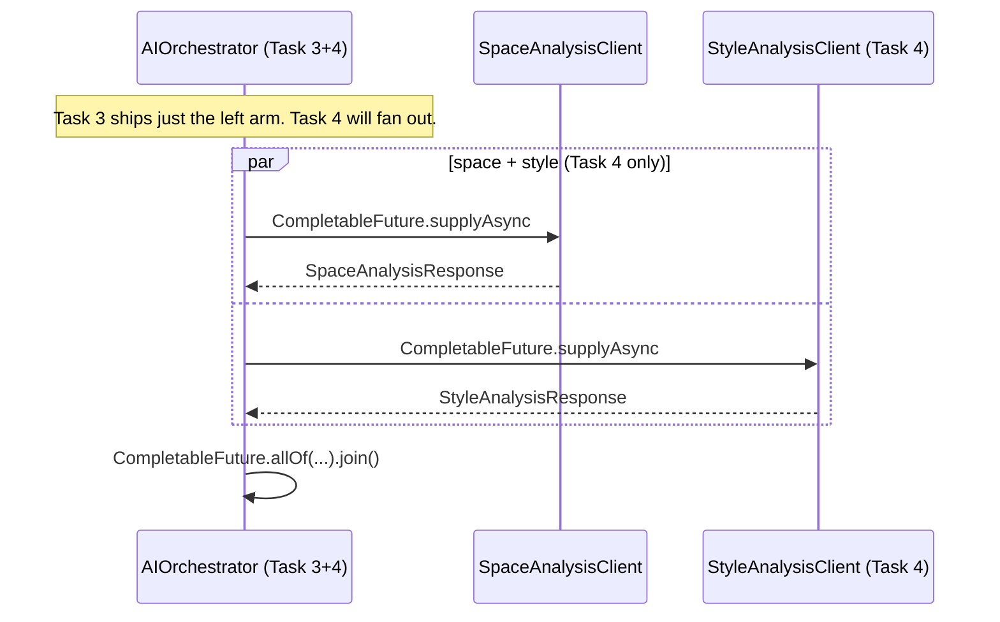

# UC-01-space-analysis — Design Notes

## 1. Architecture at a glance

Two processes, one synchronous HTTP hop:

```
┌────────────────────────────┐       POST /analyze/space     ┌──────────────────────────────┐
│  Spring Backend :8080      │ ─────────────────────────────▶│  Python FastAPI :8001        │
│  com.authenticself.ai.*    │                               │  src/ai/app/*                │
│                            │   JSON { roomId, photoUrl }   │                              │
│  AIOrchestrator            │ ◀───────────────────────────── │  analyzers: dimensions,      │
│   ├── SpaceAnalysisClient  │  JSON { status, dimensions,   │   color (real cv2), style    │
│   ├── AnalysisPoller       │         mainColor, ... }      │   (placeholder, not wired)   │
│   └── Controller           │                               │                              │
└──────────┬─────────────────┘                               └──────────────────────────────┘
           │
           │  @Transactional UPDATE spaces SET status=..., dimensions=..., main_color=...
           ▼
      MySQL 8 (spaces table — V2 schema, no migration this task)
```

- The `file://` URL stored in `spaces.photo_url` is handed to the Python
  service by reference — no bytes cross the wire.
- No ultralytics / mediapipe / torch / tensorflow at runtime (AC-2). Real
  ML moves in via `[project.optional-dependencies].ml` in a future task.

## 2. Key decisions

### 2.1 Where does the transaction live?
FR-12 step 6 is emphatic: **the HTTP call MUST be outside the DB
transaction**. We therefore extracted persistence into a **separate bean**,
`SpaceAnalysisPersistence`, whose methods are all
`@Transactional(REQUIRES_NEW)`. The orchestrator's `analyze(roomId)` calls
them sequentially with the HTTP call sandwiched in the middle:

1. `persistence.loadForAnalysis(roomId)` — read-only tx, returns a
   `Snapshot(status, photoUrl)`.
2. *out-of-tx* call to `SpaceAnalysisClient.callSpaceAnalysis(...)`.
3. Either `persistence.markAnalyzed(...)` or `persistence.markFailed(...)`,
   each its own short transaction.

**Why a separate bean?** Spring's `@Transactional` is proxy-based. If the
helpers lived on `AIOrchestrator` and were called via `this.method(...)`,
the proxy would be bypassed and no transaction would open — violating the
declarative-tx contract. Routing through a second bean means every call
goes through the Spring AOP proxy, which is the whole point.

Neither phase holds a DB connection during the network round-trip.
Consequence: the row could race another writer between phases (1) and
(3), but the worst case is a double-write of identical values (because
Task 4's style writer mutates a disjoint column set).

### 2.2 Status-machine boundaries
| Trigger                               | Status transition                    |
| ------------------------------------- | ------------------------------------ |
| Happy path (HTTP 200 from Python)     | `PENDING_ANALYSIS → ANALYZED`        |
| Analyzer error (HTTP 422 from Python) | `PENDING_ANALYSIS → FAILED`          |
| Transport error / unreachable         | `PENDING_ANALYSIS → PENDING_ANALYSIS` (no DB write; AC-19) |
| Already analyzed                      | Short-circuit, no HTTP, no DB write (AC-17) |
| Already failed                        | Short-circuit (treated same as analyzed for idempotency) |

`style` is **never** written by this task (AC-16 — `style IS NULL` after
analysis). Task 4 owns it.

### 2.3 Task-4 readiness — parallel call note (FR-17, AC-24)



`SpaceAnalysisClient.callSpaceAnalysis(String roomId, String photoUrl)`
takes exactly those two parameters and returns a plain DTO — no
`ResponseEntity`, no thread-local, no DB writes. That's what makes the
future `CompletableFuture.supplyAsync(() -> client.callSpaceAnalysis(...))`
invocation trivial for Task 4.

### 2.4 Python: why `asyncio.to_thread` not `loop.run_in_executor`?
Both satisfy AC-10. `asyncio.to_thread` reads more cleanly next to
`asyncio.gather`, and the two analyzers run in parallel even today — so
the scaffolding that Task 4 will extend (three analyzers in parallel) is
already in place.

### 2.5 Why `base.py` not `protocol.py`?
AC-11 explicitly pins the filename `src/ai/app/analyzers/base.py`. The
handoff mentioned `protocol.py`; we honour the AC over the handoff to
keep the verification agent green.

## 3. FR → file map

| FR     | File(s) / Component                                                              |
| ------ | -------------------------------------------------------------------------------- |
| FR-1   | `src/ai/pyproject.toml`, `src/ai/app/__init__.py`, `src/ai/app/main.py`          |
| FR-2   | `src/ai/app/main.py` → `health()`                                                |
| FR-3   | `src/ai/app/schemas.py`, `src/ai/app/main.py` → `analyze_space()`                |
| FR-4   | `src/ai/app/analyzers/base.py`, `src/ai/app/analyzers/__init__.py`               |
| FR-5   | `src/ai/app/analyzers/dimensions.py`, `src/ai/app/analyzers/style.py`            |
| FR-6   | `src/ai/app/analyzers/color.py`                                                  |
| FR-7   | `src/ai/app/errors.py`, `src/ai/app/main.py` (exception handlers)                |
| FR-8   | `src/ai/app/main.py` (`asyncio.to_thread` inside `asyncio.gather`)               |
| FR-9   | `src/ai/app/main.py` (aggregate confidence computation)                          |
| FR-10  | `src/ai/app/main.py` (top-level `TODO(task-4)` comment)                          |
| FR-11  | `src/backend/.../ai/AIOrchestrator.java`, `SpaceAnalysisClient.java`, `dto/*`    |
| FR-12  | `AIOrchestrator.analyze` + `SpaceAnalysisPersistence.{loadForAnalysis,markAnalyzed,markFailed}` |
| FR-13  | `AIOrchestratorController.java`, `AIOrchestratorExceptionAdvice.java`            |
| FR-14  | `AnalysisPoller.java` (+ `@EnableScheduling` on `AuthenticSelfApplication`)      |
| FR-15  | `AIErrorCode.java` (`fromPythonCode` mapping), `SpaceAnalysisClient` error path  |
| FR-16  | `application.yml` (`app.ai.*` keys)                                              |
| FR-17  | `SpaceAnalysisClient.callSpaceAnalysis(String, String)` signature (AC-24)        |
| FR-18  | `log.info/warn/error` calls in the Python main and `AIOrchestrator`              |

## 4. Test strategy

| AC     | Test                                                                                                            |
| ------ | --------------------------------------------------------------------------------------------------------------- |
| AC-1   | File presence check (trivial after `src/ai/` created)                                                           |
| AC-2   | Static scan of `pyproject.toml` + `requirements.txt` — keywords must not appear                                 |
| AC-3   | `src/ai/tests/test_analyze_space.py::test_health_ok`                                                            |
| AC-4   | `src/ai/tests/test_analyze_space.py::test_analyze_happy_path`                                                   |
| AC-5   | `src/ai/tests/test_analyze_space.py::test_analyze_is_deterministic`                                             |
| AC-6   | `src/ai/tests/test_analyze_space.py::test_image_not_found`                                                      |
| AC-7   | `src/ai/tests/test_analyze_space.py::test_image_read_failed`                                                    |
| AC-8   | `src/ai/tests/test_analyze_space.py::test_invalid_request_*`                                                    |
| AC-9   | `src/ai/tests/test_analyze_space.py::test_path_escape_is_image_not_found`                                       |
| AC-10  | `grep` assertion on `src/ai/app/main.py` (`async def` + `asyncio.to_thread`)                                    |
| AC-11  | File-presence + docstring grep on `src/ai/app/analyzers/*.py`                                                   |
| AC-12  | `grep` on `src/ai/app/analyzers/color.py` for `cv2.kmeans(`                                                     |
| AC-13  | `grep` on `src/ai/app/main.py` for `TODO(task-4)` AND `/analyze/style`                                          |
| AC-14  | `src/ai/tests/test_analyze_space.py::test_openapi_does_not_expose_style_route`                                  |
| AC-15  | File-presence check on `src/backend/.../ai/*.java` and `dto/*.java`                                             |
| AC-16  | `AIOrchestratorTest::happyPath`                                                                                 |
| AC-17  | `AIOrchestratorTest::shortCircuitOnAnalyzed` + `shortCircuitOnFailed`                                           |
| AC-18  | `AIOrchestratorTest::analyzerFailureFlipsToFailed`                                                              |
| AC-19  | `AIOrchestratorTest::transportFailureLeavesPending`                                                             |
| AC-20  | `AIOrchestratorTest::unknownRoomIdThrows` + `AIOrchestratorControllerTest::not_found_404`                       |
| AC-21  | Static scan of `application.yml`                                                                                |
| AC-22  | Source-scan — `AnalysisPoller` is annotated `@ConditionalOnProperty(app.ai.poller.enabled, "true")`; `application-test.yml` also sets `enabled: false` |
| AC-23  | `grep` on backend java sources                                                                                  |
| AC-24  | Source-scan of `SpaceAnalysisClient::callSpaceAnalysis` signature                                               |
| AC-25  | This file + `api_contract.yaml`                                                                                 |
| AC-26  | Directory listing of `src/backend/src/main/resources/db/migration/`                                             |
| AC-27  | UC-01-photo-upload tests unchanged; re-run as part of the verification suite                                    |

## 5. Test commands

### Python (`src/ai/`)
```
cd src/ai
python -m venv .venv
# Windows:
.\.venv\Scripts\activate
# *nix:
# source .venv/bin/activate
pip install -e .[dev]
pytest -q
```

### Spring (`src/backend/`)
```
cd src/backend
./gradlew test
```

The Spring tests above cover:
- `AIOrchestratorTest` — unit (no Spring context, hand-rolled fakes).
- `AIOrchestratorControllerTest` — `@WebMvcTest` slice (controller + advice).
- `PhotoUploadControllerTest` + `PhotoUploadServiceTest` (Task 2) — untouched,
  regression coverage for AC-27.
- `V1InitSchemaMigrationTest` (Task 1) — untouched.

### Manual end-to-end sanity
```
# terminal 1 — start Python
cd src/ai && uvicorn app.main:app --port 8001

# terminal 2 — start Spring
cd src/backend && ./gradlew bootRun

# terminal 3 — upload a photo (gets you a PENDING_ANALYSIS row)
curl -H "X-User-Id: u1" -F "file=@sample.jpg" \
     http://localhost:8080/api/v1/spaces/photo

# trigger analysis
curl -X POST http://localhost:8080/internal/v1/spaces/{roomId}/analyze
```

## 6. Out-of-scope reminders (for Task 4 / 5)
- `/analyze/style` route registration → Task 4 (`TODO(task-4)` anchor in `main.py`).
- Parallel fan-out of space + style analysis → Task 4 (FR-17 + AC-24 guarantee compatibility).
- Retry budget / circuit breaker → future infra task (current behaviour: infinite poller retries for transport failures).
- Real ML weights → future task once `[project.optional-dependencies].ml` is populated.

## 7. Blockers
None. All 27 ACs have a concrete satisfaction path.
