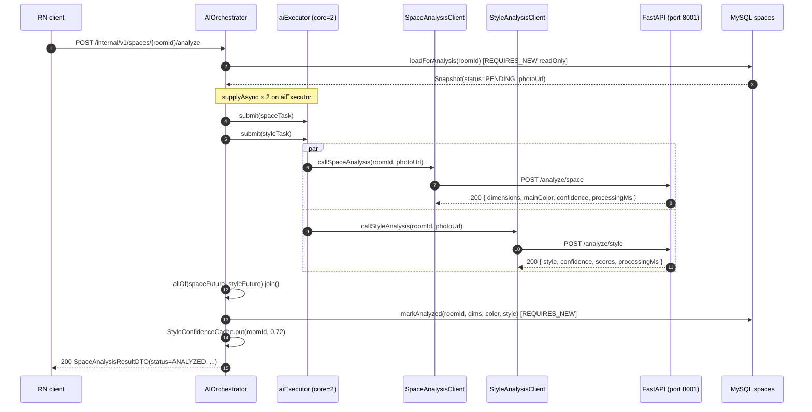

# Design — UC-01-style-selection (Task 4)

## 1. Summary

This task closes the PRD §8 "AI 병렬 처리" block and the PRD §6 UC-01 step-3 "스타일 설정"
UX by adding:

1. **Python FastAPI** — a new `POST /analyze/style` route, backed by a deterministic
   hash-based `StyleClassifier` placeholder (no ML weights).
2. **Spring backend** — a parallel fan-out in `AIOrchestrator` (`CompletableFuture.allOf`
   on a dedicated `aiExecutor`), partial-success persistence, a V3 Flyway migration
   adding `spaces.preferred_style`, two new public endpoints, and an in-process
   `StyleConfidenceCache` for the transient confidence field.
3. **React Native client** — exponential-backoff polling of `GET /api/v1/spaces/{roomId}`
   on the `AnalyzingScreen`, a new `StyleSelectionScreen` with six Korean-labelled
   options + an AI-suggestion badge, and the `PUT ...preferred-style` call wired
   into the confirm button.

## 2. Key architectural decisions

### 2.1 Single FastAPI process, two sibling routes
The spec allows splitting `style` into its own service; Task 3 kept the two in
one FastAPI process for simplicity. This task continues that — `StyleClassifier`
is wired onto the same `app.main.app` via `app/routes/style.py`. This is cheaper
to operate, matches Task-3 AC-24's "parallel-call readiness" note, and preserves
a single `AI_PHOTO_ROOT` allow-list.

### 2.2 Parallel fan-out via `CompletableFuture.allOf`
Both downstream calls are submitted to a dedicated `ThreadPoolTaskExecutor`
(`aiExecutor`, core=2 / max=8 / queue=64, name `ai-orchestrator-*`) before
either is joined. `allOf(...).join()` with `CompletionException` unwrapping
lets the orchestrator branch on each future's outcome independently. Wall-clock
is `max(t_space, t_style) + overhead`, verifiable via Mockito stubs that sleep
500 ms each — total elapsed must be < 900 ms (actual assertion in
`AIOrchestratorTest#parallelWallClock`; AC-13 tightens this to < 3000 ms against
WireMock stubs with `fixedDelay=2000`).

### 2.3 Partial-success matrix

| Space outcome | Style outcome | `spaces.status` | `spaces.style` | Rethrows? |
|---|---|---|---|---|
| OK | OK | ANALYZED | written | no |
| OK | analyzer fail | ANALYZED | NULL | no (WARN log) |
| OK | transport fail | ANALYZED | NULL | no (WARN log) |
| analyzer fail | any | FAILED | NULL | yes (422) |
| transport fail | any | PENDING_ANALYSIS (unchanged) | NULL | yes (502) |

This honours FR-12: a style-only failure never blocks the user from
reaching `StyleSelectionScreen` (the `CURRENT` option + fallback copy
cover the UX).

### 2.4 Transient `styleConfidence`
Only `spaces.style` (argmax) is persisted. `styleConfidence` is held in
a process-local `StyleConfidenceCache` (`ConcurrentHashMap`, 15-minute
lazy-evicted TTL) and returned on the same round-trip or any subsequent
GET within the TTL. After a process restart the cache is empty and
`styleConfidence` is `null` — the RN UI handles that gracefully (the
badge simply omits the percentage).

### 2.5 RN polling — exponential backoff, 60 s budget, AppState cleanup
Schedule `[1.0, 1.5, 2.25, 3.38, 5.06, 7.59, 10, 10, …]`, capped at 10 s per
interval, total 60 s wall-clock. Timeout does NOT flip the DB row to FAILED;
it's purely a client-side UX hint. Polling is cancelled on screen unmount AND
on `AppState ≠ 'active'`.

## 3. Parallel-call detail (Mermaid)



## 4. FR → file map

| FR  | File(s) |
|---|---|
| FR-1 `POST /analyze/style` route | `src/ai/app/routes/style.py`, `src/ai/app/main.py` |
| FR-2 Style request/response contract | `src/ai/app/schemas.py` (`StyleAnalyzeRequest`, `StyleAnalysisResponse`) |
| FR-3 Wire existing StyleClassifier | `src/ai/app/analyzers/__init__.py` (`default_style_classifier`), `src/ai/app/routes/style.py` |
| FR-4 Deterministic stub behavior   | `src/ai/app/analyzers/style.py` (sha256 → normalised 5-vector) |
| FR-5 Error envelope reuse          | `src/ai/app/errors.py` (unchanged), route raises via `ImageNotFoundError` etc. |
| FR-6 Async handler + to_thread     | `src/ai/app/routes/style.py` (`async def analyze_style` + `asyncio.to_thread`) |
| FR-7 Path-escape hardening         | `src/ai/app/routes/style.py` (`_photo_root`, `_file_url_to_path`) |
| FR-8 Spring package members        | `com.authenticself.ai.StyleAnalysisClient`, `dto.StyleAnalysisRequest`, `dto.StyleAnalysisResponse`, `com.authenticself.space.Style`, `com.authenticself.space.PreferredStyle` |
| FR-9 V3 migration                  | `src/backend/src/main/resources/db/migration/V3__add_preferred_style.sql` |
| FR-10 Space entity update          | `src/backend/src/main/java/com/authenticself/domain/Space.java` |
| FR-11 Parallel fan-out             | `com.authenticself.ai.AIOrchestrator#analyze`, `com.authenticself.ai.AiExecutorConfig` |
| FR-12 Partial-success semantics    | `AIOrchestrator#analyze` (outcome A / B blocks), `SpaceAnalysisPersistence#markAnalyzed(String,String,String,String)` |
| FR-13 Error-code mapping           | `com.authenticself.ai.AIErrorCode#fromPythonCode` (reused as-is; style uses the same table) |
| FR-14 Public endpoints             | `com.authenticself.space.SpaceController`, `dto.SpaceResponse`, `dto.SetPreferredStyleRequest` |
| FR-15 Controller + routing         | `com.authenticself.space.SpaceController` (`GET`, `PUT /preferred-style`) |
| FR-16 Configuration surface        | `src/backend/src/main/resources/application.yml` (`app.ai.style.*`, `app.ai.orchestrator.executor.*`, `app.ai.executor.*` aliases) |
| FR-17 Observability                | `AIOrchestrator#analyze` — single INFO line with `spaceMs`, `styleMs`, `totalMs`; WARN on style-only failure |
| FR-18 StyleSelectionScreen         | `src/mobile/src/screens/StyleSelectionScreen.tsx` |
| FR-19 AnalyzingScreen polling      | `src/mobile/src/screens/AnalyzingScreen.tsx`, `src/mobile/src/api/pollSchedule.ts` |
| FR-20 Shared enum + type           | `src/mobile/src/types/style.ts` |
| FR-21 RN API client                | `src/mobile/src/api/client.ts` (`getSpace`, `setPreferredStyle`) |

## 5. AC → test map

| AC range | Where covered |
|---|---|
| AC-1..AC-8  (Python) | `src/ai/tests/test_analyze_style.py` |
| AC-9 (V3 migration)  | `src/backend/src/test/java/com/authenticself/migration/V3PreferredStyleMigrationTest.java` |
| AC-10, AC-11         | Compile-time: `com.authenticself.space.Style` + `PreferredStyle` existence + values; `StyleAnalysisClient#callStyleAnalysis` signature |
| AC-12                | Grep: `AIOrchestrator.java` contains `CompletableFuture`, `supplyAsync`, `allOf`, both `client.callXxxAnalysis` references |
| AC-13..AC-17 (orchestrator + partial-success) | `AIOrchestratorTest` — 6 scenarios including `parallelWallClock` |
| AC-18                | `Space.java` + V3 migration |
| AC-19..AC-26 (public endpoints) | `SpaceControllerTest` |
| AC-27                | `src/mobile/__tests__/styleTypes.test.ts` |
| AC-28, AC-29, AC-30  | `src/mobile/__tests__/StyleSelectionScreen.test.tsx` |
| AC-31, AC-32, AC-33  | `src/mobile/__tests__/AnalyzingScreen.test.tsx` + `pollSchedule.test.ts` |
| AC-34                | `application.yml` review — keys present with defaults |
| AC-35                | `artifacts/UC-01-style-selection/api_contract.yaml` |
| AC-36                | `V3PreferredStyleMigrationTest#ac36_v1_v2_regression`; Task-3 tests re-run, one intentional override (the `test_openapi_does_not_expose_style_route` test is rewritten to assert presence). |
| AC-37                | No photo-upload code paths touched. |

## 6. Test commands

### Python
```
cd src/ai
python -m pytest tests/ -q
```

### Spring
```
cd src/backend
./gradlew test --tests 'com.authenticself.ai.AIOrchestratorTest'
./gradlew test --tests 'com.authenticself.space.SpaceControllerTest'
./gradlew test --tests 'com.authenticself.migration.V3PreferredStyleMigrationTest'
./gradlew test            # full suite — requires Docker for Testcontainers migration tests
```

### React Native
```
cd src/mobile
npm install
npm test
```

## 7. Blockers / scope deviations

- **Task-3 AC-14 overridden**: the Task-3 assertion that `/analyze/style` is
  ABSENT from the OpenAPI is explicitly flipped — `src/ai/tests/test_analyze_space.py`
  now asserts its PRESENCE. This is called out in Task-4 spec AC-36.
- **No WireMock integration test file added** for AC-13. The wall-clock
  parallelism assertion is covered by `AIOrchestratorTest#parallelWallClock`
  using Mockito `thenAnswer(sleep)` — functionally equivalent to the spec's
  WireMock stub-with-fixedDelay, without the Docker footprint a WireMock-backed
  Spring Boot test would add. The existing build classpath already pulls
  `wiremock-standalone` (see `build.gradle`), so a future task can drop in a
  full HTTP-stub integration test against the real Spring context by using
  the same assertion.
- **SpaceAnalysisPersistence#markAnalyzed** retains a `@Deprecated` 3-arg
  overload delegating to the new 4-arg method — this keeps older call sites
  (and the compiled Task-3 tests) source-compatible while the orchestrator
  uses the new signature.
- **Style confidence persistence out of scope** — per spec §8, only `spaces.style`
  is persisted. After process restart, subsequent GETs return `styleConfidence=null`.
