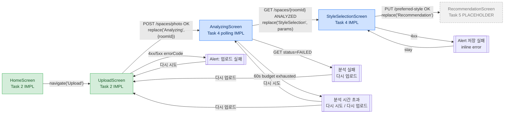

# UC-01-style-selection — React Native UI flow

**Source of truth:**
- `src/mobile/src/screens/HomeScreen.tsx` (Task 2)
- `src/mobile/src/screens/UploadScreen.tsx` (Task 2)
- `src/mobile/src/screens/AnalyzingScreen.tsx` (Task 2 stub → Task 4 polling)
- `src/mobile/src/screens/StyleSelectionScreen.tsx` (NEW Task 4)
- `src/mobile/src/api/pollSchedule.ts` (NEW Task 4)
- `src/mobile/src/types/style.ts` (NEW Task 4)
- `src/mobile/src/api/client.ts` (extended with `getSpace` / `setPreferredStyle`)

**PRD refs:** PRD §6 UC-01 steps 1–3, PRD §8 parallel AI flow, PRD §6 alt-flow 1-a.

---

## 1. Screen-flow overview (UPDATED from Task 2)



- Green = delivered in earlier tasks.
- Blue = delivered or finished by Task 4.
- Grey dashed = future (Task 5 `RecommendationScreen`).

---

## 2. HomeScreen (unchanged from Task 2)

```
+------------------------------------------+
|                                          |
|              AuthenticSelf               |
|   나에게 꼭 맞는 가구를 추천받으세요.    |
|                                          |
|  +------------------------------------+  |
|  |      방 사진 하나로 가구 추천       |  |  <-- testID=cta-photo-upload
|  +------------------------------------+  |
|                                          |
+------------------------------------------+
```

---

## 3. UploadScreen (unchanged from Task 2)

See `artifacts/UC-01-photo-upload/viz/ui.md` §3 — picker → preview → progress → Alert.
On 2xx it calls `navigation.replace('Analyzing', {roomId})`.

---

## 4. AnalyzingScreen — NOW with polling (Task 4 FR-19 / AC-31 / AC-32 / AC-33)

### 4.1 Polling state (default)

```
+------------------------------------------+
|                                          |
|                  (o)                     |     <-- ActivityIndicator
|                                          |
|         방을 분석하고 있습니다…           |
|                                          |
|     roomId: 01HXYB2K9VQWM4P3ZT6N5C8DAE    |     <-- testID=room-id
|             시도 4                        |     <-- testID=attempt-count
|                                          |
+------------------------------------------+
```

### 4.2 Exponential-backoff polling loop

```
t=0      first poll fires (delay 0 on mount, testID=analyzing-polling)
t=1.0s   +1000 ms  poll #2
t=2.5s   +1500 ms  poll #3
t=4.75s  +2250 ms  poll #4
t=8.13s  +3375 ms  poll #5
t=13.19s +5062 ms  poll #6
t=20.78s +7594 ms  poll #7
t=30.78s +10000 ms poll #8     <-- cap reached (POLL_MAX_INTERVAL_MS)
t=40.78s +10000 ms poll #9
t=50.78s +10000 ms poll #10
t=60.00s budget exceeded  -->  phase='timeout'

Schedule (pollSchedule.ts):
  POLL_INITIAL_MS    = 1000
  POLL_MULTIPLIER    = 1.5
  POLL_MAX_INTERVAL_MS = 10_000
  POLL_BUDGET_MS     = 60_000
  delayForAttempt(n) = min(round(1000 * 1.5^(n-1)), 10_000)

Cleanup:
  - useEffect cleanup -> cancelPolling()  (AC-33 unmount)
  - AppState listener -> 'active'!= -> cancelPolling()  (NFR battery-aware)
  - Network errors swallowed; poll retries silently until budget
```

### 4.3 Timeout UI (after 60 s still PENDING_ANALYSIS)

```
+------------------------------------------+
|                                          |
|             분석 시간 초과                |   <-- testID=analyzing-timeout
|                                          |
|   분석이 예상보다 오래 걸리고 있습니다.    |
|   다시 시도하거나 사진을 다시              |
|   업로드해주세요.                         |
|                                          |
|     [       다시 시도       ]             |   <-- testID=btn-retry
|     [       다시 업로드      ]             |   <-- testID=btn-reupload
|                                          |
+------------------------------------------+
```

`다시 시도` resets `startedAtRef`/`attemptsRef` and restarts the polling loop
(no server write — AC-32 requires the client-side timeout NOT to flip the row to FAILED).

### 4.4 Failed UI (server responded status=FAILED)

```
+------------------------------------------+
|                                          |
|              분석 실패                    |   <-- testID=analyzing-failed
|                                          |
|  분석에 실패했습니다. 다른 사진으로        |
|  다시 시도해주세요.                        |
|                                          |
|     [       다시 업로드      ]             |   <-- testID=btn-reupload
|                                          |
+------------------------------------------+
```

### 4.5 Happy-path transition

When a poll returns `{status:'ANALYZED', style:'MODERN', styleConfidence:0.72, ...}`:

```
navigation.replace('StyleSelection', {
  roomId,
  aiDetectedStyle:      'MODERN',   // may be null if degraded-success (FR-12 style-only failure)
  aiDetectedConfidence: 0.72,       // may be null
});
```

---

## 5. StyleSelectionScreen (NEW Task 4 — FR-18 / AC-28 / AC-29 / AC-30)

### 5.1 With AI detection (common case)

```
+----------------------------------------------------+
|  원하는 스타일을 선택하세요                          |
|                                                    |
|  (o) 현재 디자인 그대로 (CURRENT)                    |   <-- testID=style-option-CURRENT
|                                                    |
|  (O) 모던 (Modern)                                  |   <-- testID=style-option-MODERN
|      AI가 감지한 스타일: Modern (72%)                |   <-- testID=ai-badge-MODERN
|                                                    |
|  (o) 심플 (Simple)                                  |   <-- testID=style-option-SIMPLE
|                                                    |
|  (o) 클래식 (Classic)                               |   <-- testID=style-option-CLASSIC
|                                                    |
|  (o) 스칸디나비안 (Scandinavian)                     |   <-- testID=style-option-SCANDINAVIAN
|                                                    |
|  (o) 인더스트리얼 (Industrial)                       |   <-- testID=style-option-INDUSTRIAL
|                                                    |
|  +-------------------------------------------+     |
|  |                   다음                    |     |   <-- testID=btn-next
|  +-------------------------------------------+     |
|                                                    |
+----------------------------------------------------+
```

- Selected row highlighted (`rowSelected` style — blue border + tint).
- AI-detected row pre-selected on mount (`initialSelection = aiDetectedStyle ?? 'CURRENT'`).
- Badge format: `AI가 감지한 스타일: {STYLE_DISPLAY_NAMES[style]} ({confidencePct}%)` (AC-28).
- When `aiDetectedConfidence == null` (cache miss after restart): badge omits the `(X%)` suffix.

### 5.2 Degraded fallback (`aiDetectedStyle == null`, AC-29)

```
+----------------------------------------------------+
|  원하는 스타일을 선택하세요                          |
|                                                    |
|  AI 스타일 감지에 실패했습니다. 직접 선택해주세요.   |   <-- testID=ai-fallback
|                                                    |
|  (O) 현재 디자인 그대로 (CURRENT)                    |   <-- pre-selected
|  (o) 모던 (Modern)                                  |
|  (o) 심플 (Simple)                                  |
|  (o) 클래식 (Classic)                               |
|  (o) 스칸디나비안 (Scandinavian)                     |
|  (o) 인더스트리얼 (Industrial)                       |
|                                                    |
|  +-------------------------------------------+     |
|  |                   다음                    |     |
|  +-------------------------------------------+     |
|                                                    |
+----------------------------------------------------+
```

No AI badge anywhere on the screen in this state.

### 5.3 Submit / error UX (AC-30)

On tap of `[다음]`:
```
setPreferredStyle({
  baseUrl, userId, roomId,
  preferredStyle: selected,        // one of PREFERRED_STYLES
});
```

- 2xx → `navigation.replace('Recommendation', {roomId})`.
- `INVALID_PREFERRED_STYLE` → inline error + Alert `지원하지 않는 스타일 값입니다.`
- `ANALYSIS_NOT_READY` → `사진 분석이 아직 완료되지 않았습니다.`
- `SPACE_ACCESS_DENIED` → `해당 공간에 접근 권한이 없습니다.`
- any other error → `스타일 저장에 실패했습니다. 잠시 후 다시 시도해주세요.`

### 5.4 Style options — canonical source (`src/mobile/src/types/style.ts`)

| enum value     | Korean label            | English display (badge) |
|----------------|-------------------------|-------------------------|
| `CURRENT`      | 현재 디자인 그대로      | — (user-only)           |
| `MODERN`       | 모던                    | Modern                  |
| `SIMPLE`       | 심플                    | Simple                  |
| `CLASSIC`      | 클래식                  | Classic                 |
| `SCANDINAVIAN` | 스칸디나비안            | Scandinavian            |
| `INDUSTRIAL`   | 인더스트리얼            | Industrial              |

`PREFERRED_STYLES` is the display-ordered `readonly` array (six values, `CURRENT` first).

---

## 6. Navigation stack (RootStackParamList)

```
Home
 └─> Upload
      └─> Analyzing { roomId }                    (Task 2 stub → Task 4 polling)
            ├─> StyleSelection { roomId,         (NEW Task 4)
            │                    aiDetectedStyle: Style | null,
            │                    aiDetectedConfidence: number | null }
            │     └─> Recommendation { roomId }   (Task 5 placeholder)
            ├─> Upload       (via 다시 업로드)
            └─> stays on Analyzing (다시 시도)
```

Both `AnalyzingScreen` and `StyleSelectionScreen` use `navigation.replace(...)` (not `push`)
so the user cannot hardware-back into a screen that's no longer meaningful.

---

## 7. Error-code → Korean message (additions in Task 4)

Existing Task 2 upload-error mapping (see `artifacts/UC-01-photo-upload/viz/ui.md` §5) is
unchanged. Task 4 adds handling for new Spring public-endpoint error codes (client-side,
in `StyleSelectionScreen.submit`):

| errorCode                 | HTTP | Korean message |
|---------------------------|------|----------------|
| `INVALID_PREFERRED_STYLE` | 400  | 지원하지 않는 스타일 값입니다. |
| `ANALYSIS_NOT_READY`      | 409  | 사진 분석이 아직 완료되지 않았습니다. |
| `SPACE_ACCESS_DENIED`     | 403  | 해당 공간에 접근 권한이 없습니다. |
| `MISSING_USER_HEADER`     | 400  | (should not occur — settings.userId always set) |
| `SPACE_NOT_FOUND`         | 404  | (should not occur — navigation carries a valid roomId) |
| any other / network       |  —   | 스타일 저장에 실패합니다. 잠시 후 다시 시도해주세요. |

`AnalyzingScreen` swallows transient network errors silently during polling
(NFR "network failures during polling are retried silently until budget").

---

## 8. Legend (FR / AC traceability)

- AnalyzingScreen polling loop ......... FR-19 / AC-31
- AnalyzingScreen 60s timeout UI ....... FR-19 / AC-32
- AnalyzingScreen unmount cleanup ...... FR-19 / AC-33
- StyleSelectionScreen six options ..... FR-18 / AC-28
- StyleSelectionScreen AI badge ........ FR-18 / AC-28
- StyleSelectionScreen fallback copy ... FR-18 / AC-29
- StyleSelectionScreen submit/PUT ...... FR-18 / AC-30
- Shared style types + labels .......... FR-20 / AC-27
- RN API client getSpace / PUT ......... FR-21
- Navigation chain Home → Upload → Analyzing → StyleSelection → Recommendation
  …… PRD §6 UC-01 steps 1-3 (step 3 newly wired in Task 4)

**Drift flags:**
- `AnalysisScreen` uses `navigation.replace('Upload')` (not `goBack()`) in the failed/timeout
  paths. Matches the scaffold behaviour and is consistent with Task 2 design. Non-blocking.
- The AI badge in `StyleSelectionScreen` displays `Modern` (English display name) rather than
  `모던` (Korean label) when `STYLE_DISPLAY_NAMES[style]` resolves. AC-28 permits either
  `"Modern"` or `"모던"` — current code chooses English. Noted, non-blocking.
