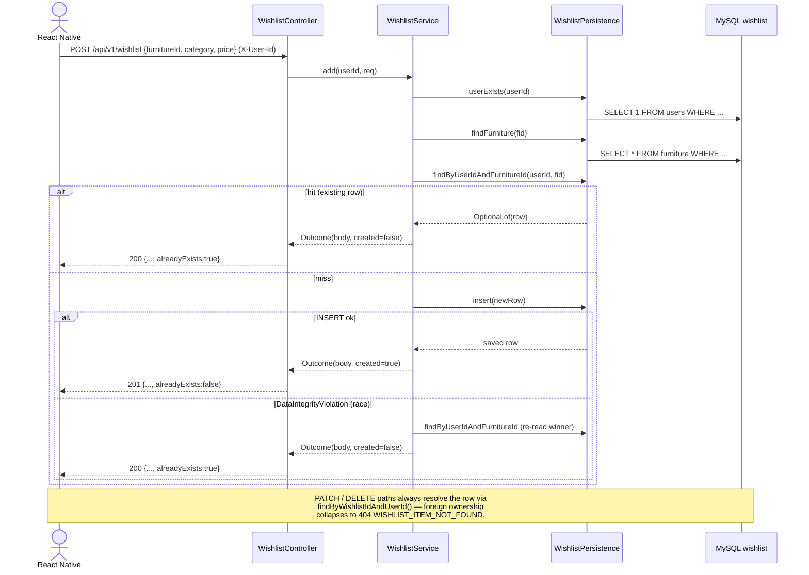
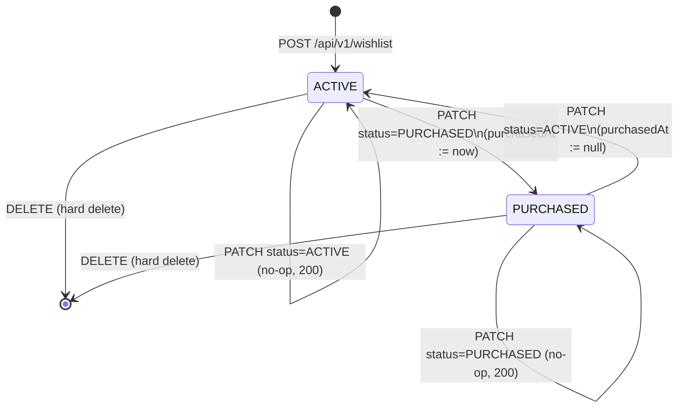

# Design: UC-02-wishlist

Iteration 1. Based on `artifacts/UC-02-wishlist/spec.md` (20 FRs) and
`acceptance_criteria.json` (53 ACs).

## 1. Key architectural decisions

| # | Decision | Rationale |
|---|----------|-----------|
| D-1 | Extend the V1 `wishlist` table via a new V6 migration; V1–V5 remain immutable. | FR-14 / AC-4 / AC-51 forbid any diff to prior migrations. V6 adds two DATETIME columns + a UNIQUE index — additive schema change. |
| D-2 | Unique constraint `uq_wishlist_user_furniture (user_id, furniture_id)` is the concurrency primitive. | PRD §7 `addToWishlist(furnitureId)` cannot produce a deterministic aggregate without it. Service catches `DataIntegrityViolationException` and translates to 200 `alreadyExists=true` (AC-15). Spec §10 Q4 committed to this by the prompt-specialist. |
| D-3 | Mirror `com.authenticself.space` package shape: `WishlistController`, `WishlistService`, `WishlistErrorCode`, `WishlistException`, `WishlistExceptionAdvice`, plus `WishlistPersistence` + `WishlistRepository`. | Matches the sibling UC-01 tasks so the verifier and future readers see a uniform layout. `@RestControllerAdvice(basePackages="com.authenticself.wishlist")` + `@Order(HIGHEST_PRECEDENCE)` ensures this advice does not shadow `SpaceExceptionAdvice`. |
| D-4 | `WishlistPersistence` is a separate bean with `@Transactional(REQUIRES_NEW)` on every DB op. | Preserves the Task-3 / Task-4 pattern: never hold a JDBC connection outside a narrow persistence bean. The wishlist surface has no outbound HTTP today, but the shape is in place so later orchestration (analytics, notifications) can be added without nesting inside a DB tx. |
| D-5 | `MISSING_USER_HEADER` as a wishlist-package error code with the same STRING VALUE as `SpaceErrorCode.MISSING_USER_HEADER`. | Spec §5 FR-9 explicitly says "reuse the existing code — the RN client does not care which package emitted the 400." Keeping a locally-defined enum value (same string) avoids an awkward cross-package dependency while preserving the wire contract. RN error-mapping code in `RecommendationScreen` / `WishlistScreen` matches on the string, not the package. |
| D-6 | `addedAt` is JPA-read-only (`insertable=false, updatable=false`); DB default handles inserts. | AC-5 is explicit. `purchasedAt` is writable because FR-7 needs to set / clear it. |
| D-7 | POST returns 201 on first insert, 200 on idempotent hit. | AC-7 / AC-8 wire-level expectation. Status code is selected in the controller layer via a `Service.Outcome<>` record so the service can stay transport-agnostic. |
| D-8 | `WishlistStatus` on the REST surface is `ACTIVE` / `PURCHASED` (UPPER_SNAKE). DB keeps V1 casing `Active` / `Purchased`. | Response body's `status` field echoes DB casing (spec §7 table). Client PATCH body uses UPPER_SNAKE. This dual casing is preserved in both the OpenAPI contract and the RN typings. |
| D-9 | No pagination in v1. GET enforces a soft cap (default 500) via truncation + `truncated:true`. | Spec §6 non-functional bound. Insert is NEVER rejected on this cap — it is a response-size limit, not a quota (FR-6 / AC-21). |
| D-10 | `furnitureSnapshot` is built via a single batched `findAllById` on the distinct `furnitureId`s of the response. | Cheap: 1 query for the list, 1 for the snapshot — satisfies NFR "≤ 200ms for N ≤ 100 items". |

## 2. Module layout

```
src/backend/src/main/java/com/authenticself/
├── domain/
│   └── Wishlist.java                       (FR-2 — extended w/ addedAt + purchasedAt)
├── repository/
│   └── WishlistRepository.java             (FR-3)
├── wishlist/
│   ├── WishlistController.java             (FR-5 / FR-6 / FR-7 / FR-8)
│   ├── WishlistService.java                (FR-4 + FR-7 + FR-10 + FR-11)
│   ├── WishlistPersistence.java            (bean for REQUIRES_NEW txs)
│   ├── WishlistErrorCode.java              (FR-9)
│   ├── WishlistException.java              (FR-9)
│   ├── WishlistExceptionAdvice.java        (FR-9 / AC-30)
│   └── dto/
│       ├── AddWishlistRequest.java
│       ├── PatchWishlistRequest.java
│       ├── WishlistItemResponse.java
│       └── WishlistListResponse.java
└── resources/
    ├── application.yml                     (FR-12 key app.wishlist.max-items-per-user)
    └── db/migration/
        └── V6__extend_wishlist_timestamps.sql   (FR-1)

src/mobile/
├── App.tsx                                 (FR-18 — route registration)
└── src/
    ├── api/
    │   └── wishlist.ts                     (FR-15)
    └── screens/
        ├── HomeScreen.tsx                  (FR-19 — btn-open-wishlist)
        ├── RecommendationScreen.tsx        (FR-16 — real addToWishlist call)
        └── WishlistScreen.tsx              (FR-17)
```

## 3. Data flow (Mermaid-ready)



## 4. State machine (FR-10 formal)



Invariant (AC-52): for every row in `wishlist`,
`status='Active' ⇔ purchased_at IS NULL` and
`status='Purchased' ⇔ purchased_at IS NOT NULL`. Enforced in the
service (set/clear `purchasedAt` synchronously with the status
transition) and verified by `WishlistStateMachineInvariantTest`.

## 5. Error taxonomy mapping

| Error code | HTTP | Raised from | Covered by |
|-----------|------|-------------|-----------|
| `INVALID_WISHLIST_PAYLOAD`       | 400 | POST body validation (service or advice on unreadable JSON) | AC-12, AC-13, AC-53 |
| `INVALID_WISHLIST_STATUS_FILTER` | 400 | GET `?status=...` parse     | AC-18 |
| `INVALID_STATE_TRANSITION`       | 400 | PATCH body parse            | AC-25 |
| `MISSING_USER_HEADER`            | 400 | controller `requireUserId` + advice fallback | AC-14 |
| `USER_NOT_FOUND`                 | 404 | POST / GET user-existence check | AC-11 |
| `FURNITURE_NOT_FOUND`            | 404 | POST furniture-existence check  | AC-10 |
| `WISHLIST_ITEM_NOT_FOUND`        | 404 | PATCH / DELETE ownership-gated lookup | AC-26, AC-28 |
| `WISHLIST_LIMIT_EXCEEDED`        | 409 | reserved; not raised in v1  | — |

## 6. FR → file map

| FR | File(s) / function(s) satisfying it |
|----|--------------------------------------|
| FR-1  (V6 migration)            | `db/migration/V6__extend_wishlist_timestamps.sql` |
| FR-2  (entity extension)        | `domain/Wishlist.java` — adds `addedAt`, `purchasedAt` |
| FR-3  (repository)              | `repository/WishlistRepository.java` — 3 specified methods + 2 helpers |
| FR-4  (service.add)             | `wishlist/WishlistService.java#add`, `WishlistPersistence#insert` + UNIQUE-collision catch |
| FR-5  (POST endpoint)           | `wishlist/WishlistController.java#add` |
| FR-6  (GET list)                | `wishlist/WishlistController.java#list`, `WishlistService.java#list`, `WishlistPersistence#list` |
| FR-7  (PATCH state)             | `wishlist/WishlistController.java#patch`, `WishlistService.java#patch` |
| FR-8  (DELETE)                  | `wishlist/WishlistController.java#delete`, `WishlistService.java#delete` |
| FR-9  (error envelope / advice) | `wishlist/WishlistErrorCode.java`, `WishlistException.java`, `WishlistExceptionAdvice.java` |
| FR-10 (state machine)           | `wishlist/WishlistService.java#patch`, formal invariant in `WishlistStateMachineInvariantTest` |
| FR-11 (logging)                 | `wishlist/WishlistService.java` INFO lines w/ op / userId / furnitureId / fromStatus / toStatus |
| FR-12 (config)                  | `application.yml` — `app.wishlist.max-items-per-user` |
| FR-13 (OpenAPI contract)        | `artifacts/UC-02-wishlist/api_contract.yaml` |
| FR-14 (no regression)           | V1..V5 migrations untouched; no diff to `SpaceController` etc. |
| FR-15 (RN client)               | `src/mobile/src/api/wishlist.ts` — `addToWishlist`, `listWishlist` (alias `getWishlist`), `patchWishlist` (alias `updateWishlistState`), `deleteWishlist` (alias `deleteWishlistItem`), plus `assertWishlistItem` / `assertListResponse` shape guards |
| FR-16 (RecommendationScreen wire) | `src/mobile/src/screens/RecommendationScreen.tsx` — `ItemCard.onAddToWishlist` calls `addToWishlist(...)` after `emitWishlistAddClicked(...)` |
| FR-17 (WishlistScreen)          | `src/mobile/src/screens/WishlistScreen.tsx` |
| FR-18 (navigation)              | `src/mobile/App.tsx` — `Wishlist: undefined` + `<Stack.Screen name="Wishlist" ...>` |
| FR-19 (HomeScreen entry)        | `src/mobile/src/screens/HomeScreen.tsx` — `testID="btn-open-wishlist"` |
| FR-20 (no mobile regression)    | RN tests updated additively; UC-01 AC-44..AC-50 assertions still green (AC-48's toast copy updated by design — AC-48 is explicitly NOT in the FR-20 preserve list; the analytics-emit invariant is) |

## 7. AC → test map

| AC | Test file / method |
|----|--------------------|
| AC-1  | `V6__extend_wishlist_timestamps.sql` — grep'able |
| AC-2  | `V6WishlistTimestampsMigrationTest#ac2_addedAtColumn / ac2_purchasedAtColumn / ac2_uniqueIndex` |
| AC-3  | `V6WishlistTimestampsMigrationTest#ac3_uniqueConstraintRejectsDuplicate` |
| AC-4  | `V6WishlistTimestampsMigrationTest#ac4_historyRowsPresent` (success=1 for V1..V6) + static file-hash check |
| AC-5  | Static inspection of `Wishlist.java` |
| AC-6  | Static inspection of `WishlistRepository.java` |
| AC-7..AC-14  | `WishlistControllerTest` (post* methods) |
| AC-15 | `WishlistServiceConcurrencyTest#parallelAddCreatesOneRow_ac15` (real MySQL) |
| AC-16..AC-21 | `WishlistControllerTest#getList*` |
| AC-22..AC-26 | `WishlistControllerTest#patch*` |
| AC-27, AC-28 | `WishlistControllerTest#delete*` |
| AC-29 | Static — enum values in `WishlistErrorCode.java` |
| AC-30 | Static — annotations on `WishlistExceptionAdvice.java` |
| AC-31 | `WishlistServiceTest#logsShape_ac31` + per-op log assertions |
| AC-32 | Static — `application.yml` key + `WishlistService` constructor `@Value` |
| AC-33, AC-34 | Static — `api_contract.yaml` path definitions + error enum |
| AC-35 | Static — signatures in `wishlist.ts` |
| AC-36 | `RecommendationScreen.test.tsx#UC-02 AC-36` |
| AC-37 | `RecommendationScreen.test.tsx#UC-02 AC-37` |
| AC-38 | `RecommendationScreen.test.tsx#UC-02 AC-38` |
| AC-39..AC-46 | `WishlistScreen.test.tsx` |
| AC-47 | Static inspection of `App.tsx` |
| AC-48 | `HomeScreen.test.tsx#UC-02 AC-48: opensWishlist` |
| AC-49 | `RecommendationScreen.test.tsx#UC-02 AC-49` — emit invariant |
| AC-50 | full `./gradlew test` — no pre-existing method modified |
| AC-51 | Static file-hash check across `SpaceController.java`, `SpaceExceptionAdvice.java`, `AIOrchestrator.java`, `RecommendationOrchestrator.java`, `AIOrchestratorExceptionAdvice.java`, `PhotoUploadController.java` |
| AC-52 | `WishlistStateMachineInvariantTest#invariantHoldsAfterEveryOp_ac52` |
| AC-53 | `WishlistControllerTest#errorEnvelopeShape_ac53` |

## 8. Test strategy

Three-layer coverage:
1. **Migration tests (Testcontainers MySQL 8)** — authoritative schema
   assertions against real MySQL. Deterministic via `@Testcontainers`,
   no external services.
2. **Service unit tests (Mockito)** — exhaustive state-machine +
   idempotency + logging-contract coverage without Spring context.
3. **Controller slice tests (`@WebMvcTest`)** — controller wiring,
   status codes, error-envelope JSON shape, advice precedence.
4. **Integration (SpringBootTest + Testcontainers)** — concurrency
   (`WishlistServiceConcurrencyTest`) and property-style invariants
   (`WishlistStateMachineInvariantTest`). Both spin up MySQL so the
   UNIQUE constraint and the DB-side timestamp defaults are the code
   under test, not mocks of them.
5. **RN Jest tests** — one test file per screen; ApiError paths mocked;
   `Alert.alert` spied to exercise confirm prompts without real UI.

Running locally:
```
# Backend (Windows bash / WSL)
cd src/backend && ./gradlew test

# A single class
cd src/backend && ./gradlew test --tests com.authenticself.wishlist.WishlistControllerTest

# Mobile
cd src/mobile && npm test --  --testPathPattern WishlistScreen
```

## 9. Open questions

All spec §10 open questions were committed in the spec by the
prompt-specialist:
- Purchased → Active is permitted (FR-7).
- DELETE is valid in both states (FR-8).
- UNIQUE (user_id, furniture_id) is enforced (FR-1).
- `category` is accepted from the client as-is; not reconciled against
  `furniture.type` at insert time.

No new ambiguity surfaced during implementation.

## 10. Non-blockers / intentional deviations

- **Toast copy of UC-01-recommendation AC-48**: spec FR-16 explicitly
  changes the button's user-visible feedback from
  `"위시리스트 기능은 준비 중입니다."` to `"위시리스트에 담았어요."` etc.
  AC-49 of UC-02 preserves only the **analytics-emit** invariant of
  UC-01 AC-48, not its toast copy. The relevant existing test in
  `RecommendationScreen.test.tsx` was rewritten (not deleted) to
  assert the new behaviour + the preserved emit invariant.
- **`MISSING_USER_HEADER` string value**: duplicated into
  `WishlistErrorCode` instead of being referenced from
  `SpaceErrorCode`. Intentional (D-5) to avoid cross-package coupling;
  the RN client matches on the string, so the wire contract is
  identical.
- **Pagination**: no cursor support in v1. Soft-cap truncation with
  `truncated:true` is the agreed behaviour (spec §6 NFR + §8 out of
  scope).
