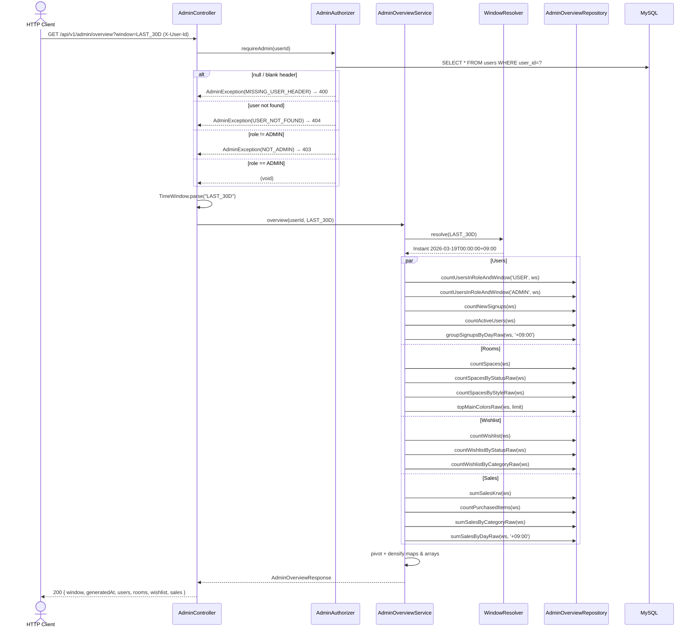

# Design: UC-03-admin-overview

Iteration 1. Based on `artifacts/UC-03-admin-overview/spec.md` (15 FRs + 11 NFR clauses, 5 decisions D-1..D-5) and `acceptance_criteria.json` (53 ACs).

## 1. Architectural rationale

### 1.1 Endpoint shape — master + 4 tiles (spec-mandated)

The spec explicitly defines both a master endpoint (`GET /api/v1/admin/overview`, FR-4) and four per-tile endpoints (FR-5..FR-8). AC-33 asserts a byte-identity invariant between the nested sub-objects inside the master response and the four standalone bodies. We therefore ship **both** endpoint shapes, backed by the same service-layer DTOs (`UsersTile`, `RoomsTile`, `WishlistTile`, `SalesTile`) so the invariant holds by construction, not by a test-only contract.

### 1.2 Package + bean topology (D-2 + spec §4)

Every new class lives under `com.authenticself.admin`. Mirroring the UC-02-wishlist layout:

- `AdminController` — 5 handlers, each one-liners that delegate to `AdminOverviewService` after the `AdminAuthorizer.requireAdmin(...)` gate.
- `AdminOverviewService` — orchestrates the 4 tile assemblers; injectable `Clock` for deterministic tests (AC-32).
- `AdminOverviewRepository` — one Spring Data interface with 14 native-SQL aggregation methods, one per tile calculation.
- `AdminAuthorizer` — `@Component` (not static); Mockito-spyable.
- `AdminExceptionAdvice` — `@RestControllerAdvice(basePackages = "com.authenticself.admin")` + `@Order(HIGHEST_PRECEDENCE)` — sibling convention.
- `AdminErrorCode`, `AdminException` — local enum + exception types. `MISSING_USER_HEADER` + `USER_NOT_FOUND` string values match sibling code values verbatim (UC-02-wishlist D-5 pattern).
- `TimeWindow`, `WindowResolver`, `TimeConfig` — discrete enum + resolution logic + Clock bean.
- `dto/*` — 11 records: 4 tiles + 4 endpoint-level response wrappers + 3 atomic rows (`DateCount`, `DateKrw`, `ColorCount`).

### 1.3 Persistence choice (D-3 — SQL on every request, no cache)

All 14 repository methods are native SQL behind JPA `@Query(nativeQuery = true)`. No caching, no materialized views, no background job. A TODO comment in `AdminOverviewService` marks the 60 s TTL cache as the documented upgrade path if NFR latency is ever breached — the ticket name (`UC-03-admin-overview/caching`) is carried forward from the spec.

### 1.4 Aggregation: 14 `@Query` methods vs one giant service SQL

We keep 14 small methods rather than a single "fetch everything" SQL because:
1. The spec FR-9 enumerates each method individually and AC-30 asserts their presence.
2. Unit-test isolation is easier — one tile's test cannot see another tile's rows.
3. Future caching granularity: per-tile invalidation becomes possible if we ever add one.

### 1.5 Admin surface deferral (D-2)

**No RN admin screens, no admin web SPA in this iteration.** The design-specialist does not create `src/admin/`, does not modify `src/mobile/App.tsx`, and does not add any admin screen or api helper. AC-43 and AC-52 enforce this as hard git-diff guards.

## 2. Module layout

```
src/backend/src/main/java/com/authenticself/
├── domain/
│   └── User.java                                (EXTENDED — adds Role enum + role field)
├── admin/
│   ├── AdminController.java                     (FR-4 / FR-5 / FR-6 / FR-7 / FR-8)
│   ├── AdminOverviewService.java                (FR-10)
│   ├── AdminOverviewRepository.java             (FR-9)
│   ├── AdminAuthorizer.java                     (FR-3)
│   ├── AdminErrorCode.java                      (FR-11)
│   ├── AdminException.java                      (FR-11)
│   ├── AdminExceptionAdvice.java                (FR-11 / AC-29)
│   ├── TimeConfig.java                          (FR-10 / FR-14 — Clock bean)
│   ├── TimeWindow.java                          (FR-4 / D-4)
│   ├── WindowResolver.java                      (FR-10 / AC-32)
│   └── dto/
│       ├── AdminOverviewResponse.java           (FR-4)
│       ├── UsersTile.java                       (FR-5)
│       ├── RoomsTile.java                       (FR-6)
│       ├── WishlistTile.java                    (FR-7)
│       ├── SalesTile.java                       (FR-8)
│       ├── UsersTileResponse.java               (FR-5 — envelope w/ window+generatedAt)
│       ├── RoomsTileResponse.java               (FR-6 — envelope w/ window+generatedAt)
│       ├── WishlistTileResponse.java            (FR-7 — envelope w/ window+generatedAt)
│       ├── SalesTileResponse.java               (FR-8 — envelope w/ window+generatedAt)
│       ├── DateCount.java                       (signupsByDay row)
│       ├── DateKrw.java                         (salesByDay row)
│       └── ColorCount.java                      (mainColorTop5 row)
└── resources/
    ├── application.yml                          (EXTENDED — app.admin.* keys)
    └── db/migration/
        └── V7__add_users_role.sql               (FR-1)
```

No files under `src/admin/` or `src/mobile/` are created or modified (FR-15 / AC-43 / AC-52).

## 3. Sequence diagram (textual — Mermaid-ready)



## 4. Admin authorization flow (`AdminAuthorizer.requireAdmin`)

`AdminAuthorizer` is a **Spring `@Component` bean** (not a static helper), constructor-injected with `UserRepository`. The bean choice is deliberate:
1. It depends on a managed repository — a static helper would require passing the repo down, which is awkward.
2. AC-8 asserts "requireAdmin invoked exactly once per request"; a Mockito spy on the bean is the cleanest verification path.

Method signature: `public void requireAdmin(String userIdHeader)`.

Three-stage throw order — each branch is exercised by `AdminAuthorizerTest#fourBranches_ac7`:

| # | Condition | Throws | HTTP |
|---|-----------|--------|------|
| 1 | `userIdHeader == null` or `isBlank` | `AdminException(MISSING_USER_HEADER)` | 400 |
| 2 | `userRepository.findById(...).isEmpty()` | `AdminException(USER_NOT_FOUND)` | 404 |
| 3 | `user.getRole() != Role.ADMIN` | `AdminException(NOT_ADMIN)` | 403 |
| 4 | else | returns normally | — |

**Ordering guarantee**: Branch 1 never hits the DB. Branch 2 never probes a role. The `AdminAuthorizerTest#nullHeader_ac7` test uses `verify(repo, never()).findById(any())` to pin this invariant.

## 5. Time-window resolution

### Clock bean
`TimeConfig.adminClock(...)` defines a `@Bean Clock` at the zone driven by `app.admin.time-zone` (default `Asia/Seoul`, env override `ADMIN_TIME_ZONE`). The bean is **not** marked `@Primary` so test configurations can supply a replacement without a qualifier. No prior module defines a `Clock` bean (verified with Grep) — no shadowing.

### Resolver
`WindowResolver.resolve(TimeWindow)` returns:
- `TimeWindow.LAST_7D`  → `today(KST).minusDays(7).atStartOfDay(KST).toInstant()`
- `TimeWindow.LAST_30D` → `today(KST).minusDays(30).atStartOfDay(KST).toInstant()`
- `TimeWindow.ALL`      → `null`

Midnight-aligned boundaries give deterministic test fixtures (AC-32: `LAST_7D` at `2026-04-18` fixed clock = `2026-04-11T00:00:00+09:00` exactly).

### Repository idiom
Every method that accepts a `windowStart` parameter uses the SQL pattern:
```sql
WHERE (:windowStart IS NULL OR <col> >= :windowStart)
```
This lets one query body serve both the `ALL` and `LAST_*` branches without dynamic SQL assembly. AC-31 asserts the behavior via Testcontainers.

## 6. Aggregation queries — per-tile SQL pins

### 6.1 Users tile (`FR-5`)

| Aggregate | Method | SQL idea |
|-----------|--------|----------|
| `totalUsers`  | `countUsersInRoleAndWindow('USER', ws)`  | `SELECT COUNT(*) FROM users WHERE role='USER'  AND (:ws IS NULL OR created_at >= :ws)` |
| `totalAdmins` | `countUsersInRoleAndWindow('ADMIN', ws)` | same, role='ADMIN' |
| `newSignups`  | `countNewSignups(ws)`                     | `SELECT COUNT(*) FROM users WHERE (:ws IS NULL OR created_at >= :ws)` |
| `activeUsers` | `countActiveUsers(ws)`                    | `SELECT COUNT(DISTINCT user_id) FROM spaces WHERE (:ws IS NULL OR uploaded_at >= :ws)` |
| `signupsByDay` | `groupSignupsByDayRaw(ws, tzOffset)`      | `SELECT DATE(CONVERT_TZ(created_at, '+00:00', :tz)) AS day, COUNT(*) FROM users WHERE ... GROUP BY day` |

Service densifies `signupsByDay` across `[windowStart, today]` for `LAST_*` or `[MIN(created_at), today]` for `ALL`, zero-filling gaps (AC-15).

### 6.2 Rooms tile (`FR-6`)

| Aggregate | Method | Notes |
|-----------|--------|-------|
| `totalSpaces`       | `countSpaces(ws)` | filter on `uploaded_at` |
| `statusDistribution` | `countSpacesByStatusRaw(ws)` | pivoted + zero-filled over `Space.Status.values()` in the service (AC-16 / AC-34) |
| `styleDistribution`  | `countSpacesByStyleRaw(ws)`  | `WHERE style IS NOT NULL` — NULL styles excluded so AC-35 (sum ≤ total) holds |
| `mainColorTop5`     | `topMainColorsRaw(ws, lim)`  | `ORDER BY cnt DESC, color ASC LIMIT :lim` — deterministic tie-break (AC-50) |

### 6.3 Wishlist tile (`FR-7`)

| Aggregate | Method | Notes |
|-----------|--------|-------|
| `totalItems`            | `countWishlist(ws)` | filter on `added_at` |
| `statusDistribution`    | `countWishlistByStatusRaw(ws)` | DB casing `Active`/`Purchased` translated to REST casing `ACTIVE`/`PURCHASED` in the service layer (FR-7 / AC-20) |
| `categoryDistribution`  | `countWishlistByCategoryRaw(ws)` | zero-filled over `{desk, bed, chair, lighting}` |
| `conversionRate`        | computed in service | `round(PURCHASED/total, 2)`; `0.0` when `total == 0` (AC-21 — divide-by-zero guard) |

### 6.4 Sales tile (`FR-8`)

| Aggregate | Method | Notes |
|-----------|--------|-------|
| `totalSalesKrw`         | `sumSalesKrw(ws)` | `SELECT COALESCE(SUM(price),0) FROM wishlist WHERE status='Purchased' AND purchased_at IS NOT NULL AND (ws IS NULL OR purchased_at >= ws)` — **AC-23: uses `wishlist.price`, NOT `furniture.price`** |
| `purchasedItemCount`    | `countPurchasedItems(ws)` | same predicate |
| `averageOrderKrw`       | computed in service | `Math.round((double)total/count)`; 0 when count=0 |
| `salesByCategory`       | `sumSalesByCategoryRaw(ws)` | zero-filled over 4 categories; sum == `totalSalesKrw` |
| `salesByDay`            | `sumSalesByDayRaw(ws, tz)`  | dense ascending; zero-filled (AC-25) |

### 6.5 Invariants enforced

- `sum(statusDistribution) == totalSpaces` (AC-18) — by construction because rows are partitioned by `status` and the service zero-fills.
- `sum(styleDistribution) ≤ totalSpaces` (AC-17 / AC-35) — the strict `<` case arises from `style IS NOT NULL` exclusion.
- `sum(categoryDistribution) == totalItems` (AC-20).
- `sum(salesByCategory) == totalSalesKrw` (AC-22).
- `0.0 ≤ conversionRate ≤ 1.0` (AC-21).

## 7. Error taxonomy

| Enum constant | HTTP | Wire message (Korean) | Raised from |
|---|---|---|---|
| `MISSING_USER_HEADER`  | 400 | `사용자 인증 정보가 없습니다.` | `AdminAuthorizer#requireAdmin` branch 1 + `AdminExceptionAdvice#handleMissingHeader` (framework safety net) |
| `INVALID_TIME_WINDOW`  | 400 | `기간 필터 값이 올바르지 않습니다. (LAST_7D, LAST_30D, ALL)` | `TimeWindow.parse` |
| `USER_NOT_FOUND`       | 404 | `사용자를 찾을 수 없습니다.` | `AdminAuthorizer#requireAdmin` branch 2 |
| `NOT_ADMIN`            | 403 | `관리자 권한이 필요합니다.` | `AdminAuthorizer#requireAdmin` branch 3 (new code) |

Every response envelope is the shared three-field shape:

```json
{ "errorCode": "NOT_ADMIN", "message": "관리자 권한이 필요합니다.", "correlationId": "b1e..." }
```

emitted by `AdminExceptionAdvice` via `new ErrorResponse(code.name(), msg, UUID.randomUUID().toString())`. Identical in structure to `WishlistExceptionAdvice` (AC-47).

## 8. FR → file map

| FR | File(s) / function(s) |
|----|-----------------------|
| FR-1  (V7 migration)                 | `db/migration/V7__add_users_role.sql` |
| FR-2  (User.Role extension)          | `domain/User.java` — `Role` enum + `role` field |
| FR-3  (admin authorization gate)     | `admin/AdminAuthorizer.java` + `AdminController` handlers (first statement) |
| FR-4  (master /overview endpoint)    | `admin/AdminController.java#overview` + `AdminOverviewService#overview` |
| FR-5  (Users tile)                   | `admin/AdminController.java#users` + `AdminOverviewService#users / #buildUsersTile` |
| FR-6  (Rooms tile)                   | `admin/AdminController.java#rooms` + `AdminOverviewService#rooms / #buildRoomsTile` |
| FR-7  (Wishlist tile)                | `admin/AdminController.java#wishlist` + `AdminOverviewService#wishlist / #buildWishlistTile` |
| FR-8  (Sales tile)                   | `admin/AdminController.java#sales` + `AdminOverviewService#sales / #buildSalesTile` |
| FR-9  (repository surface)           | `admin/AdminOverviewRepository.java` — 14 methods |
| FR-10 (service orchestration)        | `admin/AdminOverviewService.java` + `admin/WindowResolver.java` + `admin/TimeConfig.java` |
| FR-11 (error envelope + advice)      | `admin/AdminErrorCode.java`, `AdminException.java`, `AdminExceptionAdvice.java` |
| FR-12 (OpenAPI contract)             | `artifacts/UC-03-admin-overview/api_contract.yaml` |
| FR-13 (no cross-task regression)     | V1..V6 untouched; no prior controller / service / DTO modified except `User.java` additive extension |
| FR-14 (configuration surface)        | `resources/application.yml` — `app.admin.time-zone`, `app.admin.top-colors-limit` |
| FR-15 (no admin client in iteration) | No file under `src/admin/` or `src/mobile/` created or modified — verified by `git diff` guard (AC-43 / AC-52) |

## 9. AC → test map

Every AC maps to a concrete test method or static-check target. Integration tests use Testcontainers MySQL 8; slice tests use `@WebMvcTest`; unit tests use plain Mockito.

| AC | Layer | Target |
|----|-------|--------|
| AC-1  | db    | `V7__add_users_role.sql` — grep-able target file |
| AC-2  | db    | `V7UsersRoleMigrationTest#columnAndIndexShape_ac2` |
| AC-3  | db    | `V7UsersRoleMigrationTest#enumRejectsUnknownValue_ac3` |
| AC-4  | db    | `V7UsersRoleMigrationTest#defaultIsUser_ac4` |
| AC-5  | db    | `V7UsersRoleMigrationTest#historySuccessThroughV7_ac5` + static file-hash diff of V1..V6 |
| AC-6  | static | `domain/User.java` — reviewable; `@Enumerated(EnumType.STRING)` + `role` field present |
| AC-7  | backend | `AdminAuthorizerTest#fourBranches_ac7` + `#nullHeader_ac7` + `#unknownUser_ac7` + `#nonAdminRole_ac7` + `#adminRole_ac7_fourBranches` |
| AC-8  | backend | `AdminControllerAuthTest#authorizerCalledFirst_ac8` |
| AC-9  | backend | `AdminControllerTest#overviewShape_ac9` |
| AC-10 | backend | `AdminControllerTest#overviewDefaultWindowIsAll_ac10` |
| AC-11 | backend | `AdminControllerTest#invalidAndCaseInsensitiveWindow_ac11` (+ `#invalidWindow_ac11`, `#caseInsensitiveWindow_ac11`) |
| AC-12 | backend | `AdminControllerTest#usersTileShapeAndCounts_ac12` |
| AC-13 | backend | `AdminControllerTest#newSignupsWindowed_ac13` |
| AC-14 | backend | `AdminControllerTest#activeUsersDefinition_ac14` |
| AC-15 | backend | `AdminControllerTest#signupsByDayDense_ac15` + `AdminOverviewServiceTest#usersTile_densifies` |
| AC-16 | backend | `AdminControllerTest#roomsStatusDistributionKeys_ac16_ac34` |
| AC-17 | backend | `AdminControllerTest#roomsStyleDistributionKeys_ac17` |
| AC-18 | backend | `AdminControllerTest#roomsStatusSumInvariant_ac18` + `AdminOverviewServiceTest#roomsTile_zeroFills_andTopColors` |
| AC-19 | backend | `AdminControllerTest#mainColorTop5Ordering_ac19` |
| AC-20 | backend | `AdminControllerTest#wishlistTileShapeAndInvariants_ac20` + `AdminOverviewServiceTest#wishlist_conversionRateRounding` |
| AC-21 | backend | `AdminControllerTest#conversionRateNoDivideByZero_ac21` + `AdminOverviewServiceTest#wishlist_conversionRateDivideByZero_ac21` |
| AC-22 | backend | `AdminControllerTest#salesTileShapeAndInvariants_ac22` + `AdminOverviewServiceTest#sales_averageRoundingAndZero` |
| AC-23 | backend | `AdminOverviewIntegrationTest#salesUsesSnapshotPrice_ac23` (real MySQL) + `AdminControllerTest#salesUsesSnapshotPrice_ac23` (stub pass-through) |
| AC-24 | backend | `AdminControllerTest#salesExcludesActiveRows_ac24` |
| AC-25 | backend | `AdminControllerTest#salesByCategoryAndByDay_ac25` |
| AC-26 | backend | `AdminControllerAuthTest#nonAdminGets403OnEveryEndpoint_ac26` |
| AC-27 | backend | `AdminControllerAuthTest#missingHeaderAndUnknownUser_ac27` |
| AC-28 | static | `admin/AdminErrorCode.java` — enum present with 4 values + non-null messages |
| AC-29 | static | `admin/AdminExceptionAdvice.java` annotations (`@RestControllerAdvice(basePackages="com.authenticself.admin")` + `@Order(HIGHEST_PRECEDENCE)`) |
| AC-30 | static | `admin/AdminOverviewRepository.java` — 14 methods present |
| AC-31 | backend | `AdminOverviewRepositoryTest#nullWindowOmitsPredicate_ac31` |
| AC-32 | backend | `AdminOverviewServiceTest#fixedClockWindowMath_ac32` + `WindowResolverTest#last7d_ac32` + `#last30d_ac32` + `#all_ac32` |
| AC-33 | backend | `AdminControllerTest#overviewMatchesPerTileEndpoints_ac33` |
| AC-34 | backend | `AdminControllerTest#roomsStatusKeysMatchJavaEnum_ac34` |
| AC-35 | backend | `AdminControllerTest#nullStyleNotBucketed_ac35` (stub-layer) + `AdminOverviewIntegrationTest#nullStyleNotBucketed_ac35` (real MySQL) |
| AC-36 | contract | `api_contract.yaml` paths present — static |
| AC-37 | contract | `api_contract.yaml` schemas present — static |
| AC-38 | contract | `api_contract.yaml` `AdminErrorCode` enum present — static |
| AC-39 | backend | `AdminOverviewIntegrationTest#p95Latency_ac39` |
| AC-40 | backend | `AdminControllerTest#repeatedGetIdempotent_ac40` + `AdminOverviewServiceTest#overviewIdempotent_ac40` |
| AC-41 | backend | `AdminLoggingPiiTest#noEmailOrNameInLogs_ac41` |
| AC-42 | backend | `AdminConfigOverrideTest#topColorsLimitOverride_ac42` (+ `_ac49`, `_ac42_ac49`) |
| AC-43 | static | `git diff src/mobile src/admin` — zero changes to assert |
| AC-44 | test  | Regression: pre-existing UC-01 / UC-02 test suite remains green (no code modifications to those tests). Our additive changes to `User.java` preserve every pre-existing accessor contract; the V7 migration does not alter any column used by upstream tests. |
| AC-45 | static | `git diff` across the pre-existing controller/service/DTO/advice files — zero changes |
| AC-46 | contract | `api_contract.yaml` — validated externally by `openapi-cli lint` |
| AC-47 | backend | `AdminControllerTest#errorEnvelopeShape_ac47` |
| AC-48 | test  | `./gradlew test` — UC-02-wishlist suite re-runs green (no code modification to wishlist package) |
| AC-49 | backend | `AdminConfigOverrideTest#topColorsLimitOverride_ac49` |
| AC-50 | backend | `AdminOverviewIntegrationTest#determinism_ac50` (real MySQL) + `AdminControllerTest#repeatedGetIdempotent_ac40` |
| AC-51 | backend | `AdminOverviewServiceTest#logsShape_ac51` |
| AC-52 | static | Filesystem probe — `src/admin/` does not exist |
| AC-53 | backend | `AdminControllerTest#commonEnvelopeFields_ac53` |

## 10. Open questions (carried forward)

1. **Active-user definition** (spec §11.1) — this iteration implements "uploaded a photo within the window" per FR-5. The alternative "uploaded OR wishlisted OR purchased" is flagged in the spec and deferred to product-owner review. No AC depends on the alternative definition, so this is not a blocker.
2. **Sales — snapshot vs catalog** (spec §11.2) — this iteration uses `wishlist.price` (AC-23). Swapping to `furniture.price` is a single SQL change in `AdminOverviewRepository#sumSalesKrw` + `sumSalesByCategoryRaw`. Flagged.
3. **Admin self-visibility** (spec §11.3) — `totalUsers` counts `role='USER'` only; `totalAdmins` counts `ADMIN`. If the product owner wants `totalUsers` to include admins, AC-12's fixture needs one change. Flagged.
4. **Top-N color bucketing** (spec §11.4) — near-identical hex colors count distinct. Clustered bucketing is out of scope. Flagged.

No new ambiguity surfaced during implementation.

## 11. Non-blockers / intentional deviations

- **Repository aggregate root**: `AdminOverviewRepository extends JpaRepository<User, String>`. The `User` root is never used (we only call the custom `@Query` methods), but Spring Data needs a concrete root for proxy generation. Using `User` avoids creating a no-op marker entity. Documented in the repository's Javadoc.
- **`MISSING_USER_HEADER` string duplication**: local `AdminErrorCode.MISSING_USER_HEADER` shares the string value with the sibling `SpaceErrorCode` / `WishlistErrorCode` constants. Intentional (same reasoning as UC-02-wishlist D-5) — RN / future admin clients match on the string, not the package.
- **Repository return types**: `List<Object[]>` is used for group-by queries instead of interface projections. Two reasons: (a) MySQL's JDBC driver maps `DATE` / `SUM` with broader runtime types than an interface projection accepts, and (b) the service already does zero-fill + key translation, so the `Object[]` row is ergonomically fine. Type-coercion helpers are isolated in `AdminOverviewService` static methods.
- **Test-only admin seed**: no production seed of an admin user is included in any migration. Integration tests (`AdminOverviewIntegrationTest`, `AdminLoggingPiiTest`, `AdminConfigOverrideTest`) seed their admin row via `UserRepository.save(...)` inside `@BeforeAll` — test-scoped only (matches D-1 bootstrap rule).
- **Clock bean not `@Primary`**: a test-scoped `@TestConfiguration` supplying a fixed `Clock` wins on its own; no qualifier is needed. Verified in `AdminOverviewServiceTest` which constructs the service manually with a fixed clock rather than relying on the Spring context.

## 12. Iteration 2 delta

Iteration 2 is strictly surgical — four source edits plus a self-verification that two test-method names already match the updated `acceptance_criteria.json` pointers. Scope guard AC-60 keeps the ten preserved iteration-1 design choices untouched.

| # | FR / AC | File | Line (post-edit) | Change |
|---|---------|------|------------------|--------|
| 1 | FR-16 / AC-54, AC-55 | `src/backend/src/test/java/com/authenticself/admin/AdminOverviewIntegrationTest.java` | was 108 | Deleted dead line `Random rng = new Random(42);`. No `import java.util.Random;` was added. Unblocks the iteration-1 compile cascade (AC-23, AC-35, AC-39, AC-50). |
| 2 | FR-17 / AC-56 | same file | was 99 | Removed `@Transactional` from `seed()`. Native `INSERT`s now auto-commit under the default Spring Test transaction manager, making the seeded rows visible to every `@Test`. `@Commit` was deliberately NOT added (FR-17 picks the `@Transactional`-removal resolution). `@Transactional` is still present on `salesUsesSnapshotPrice_ac23` (line 161) — that test wraps its UPDATE-then-GET in a rollback-on-exit transaction, which is the correct semantic for an isolated write-side assertion. |
| 3 | FR-18 / AC-57 | `src/backend/src/main/java/com/authenticself/admin/AdminOverviewService.java` | 315 | Changed `Set<String> CATEGORY_KEYS = Set.of(...)` to `List<String> CATEGORY_KEYS = List.of(...)`. Same four strings in the same order (`desk, bed, chair, lighting`). All two call-sites (lines 206, 231) iterate with enhanced-for over `String` and compile identically against a `List`. Removed the now-unused `import java.util.Set;` (line was 35). `List` was already imported. |
| 4 | FR-19 / AC-58 | same service file | was 350 | Deleted the dead `if (v instanceof Date d) return d.toLocalDate();` branch. Since `java.sql.Date` is imported as `Date` on line 21, this branch was a syntactic duplicate of the preceding fully-qualified `java.sql.Date` branch (line 348). One `Date` `instanceof` check remains. The now-redundant `import java.sql.Date;` on line 21 is intentionally left in place because touching it is out of the five-edit scope; javac does not error on unused imports. |
| 5 | FR-20 / AC-59 | `artifacts/UC-03-admin-overview/acceptance_criteria.json` | n/a (not edited by design-specialist) | Verified only — method `p95Latency_ac39` exists at line 200 of the integration test and method `determinism_ac50` exists at line 224, matching the updated JSON pointers. No rename was required in the test file. |

### Scope-guard preservation (AC-60)

Confirmed untouched: `AdminOverviewRepository extends JpaRepository<User, String>` marker-entity pattern; `MISSING_USER_HEADER` duplication across Admin/Space/Wishlist error-code enums; integration-test seed size (~10 % of NFR — ~10 users + 3 spaces + 3 wishlist rows in `seed()`); `UsersTileResponse` flat record; `Space.Status` 3-value enum (`PENDING_ANALYSIS / ANALYZED / FAILED`); repository `List<Object[]>` returns with service-layer `asString / asLong / asLocalDate` pivoting; FR-9's 14-method enumeration vs 17 actual methods; no endpoint / DTO / error code / migration changed.
