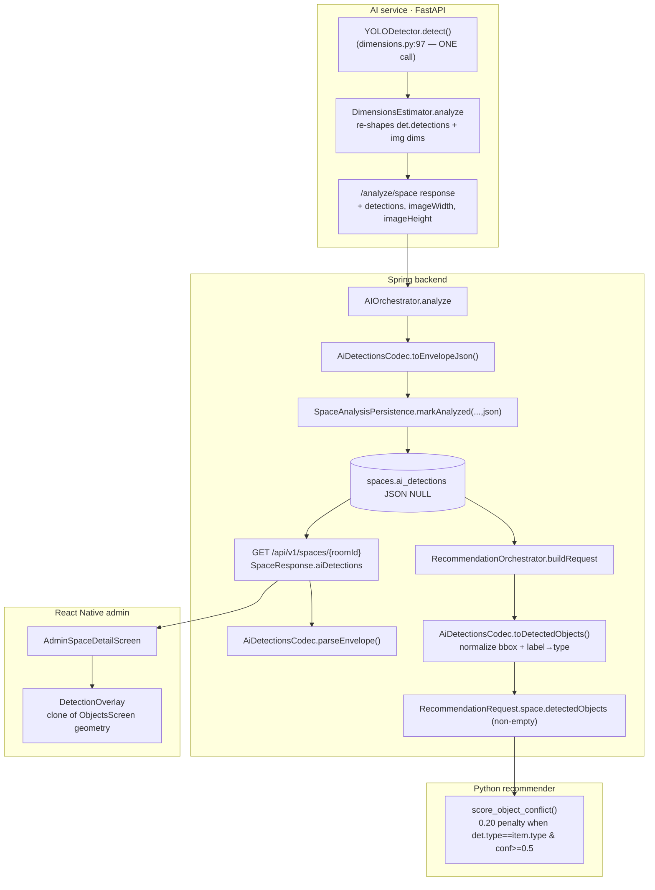

# Design Note: UC-ML-PERSIST

Persist the YOLO furniture detections that `/analyze/space` already computes
(but discarded), feed them into the recommender in place of the hardcoded
empty list, and render them as a bounding-box overlay in an admin Space-detail
debug view. Wiring + persistence across 4 layers. **No new ML; zero extra YOLO
inference.**

## 1. Key architectural decisions

1. **Reuse the single existing YOLO call (hard constraint).** YOLO runs exactly
   once per analyze, at `dimensions.py:97` (`det = self._yolo.detect(...)`). FR-2
   only re-shapes that existing `det.detections` into the response schema and
   carries `det.image_width/height` along — no second `detect()`, no call to
   `/analyze/objects`, no change to `_pick_reference` or the scale math. The
   AC-4 unit test installs a counting fake YOLO and asserts `detect()` is called
   exactly once.

2. **Two detection contracts + one transform.** The AI / persisted side uses the
   absolute-pixel shape `{label, bbox:[x1,y1,x2,y2] px, confidence}` plus an
   envelope `{imageWidth, imageHeight}`. The recommender side uses
   `{type, bboxNorm:[0..1], confidence}`. The transform lives in one place —
   `AiDetectionsCodec` (Spring) — and does (a) bbox normalization by the
   persisted image dims, clamped to [0,1], and (b) COCO `label`→catalog `type`
   mapping. Persisting the **envelope with image dims** makes normalization
   reproducible without re-reading the image.

3. **Self-describing persisted envelope.** `spaces.ai_detections` stores
   `{imageWidth, imageHeight, detections:[...]}` (not a bare array) so any later
   consumer can normalize coordinates from the column alone.

4. **NULL is a first-class state.** Pre-migration rows, FAILED analyses,
   transport-failure (PENDING) rows, and zero-object analyses all map to
   `ai_detections = NULL` (or an empty detection list). Every downstream reader
   degrades to an empty list / empty-state — identical to today's hardcoded `[]`.

5. **No new endpoints.** The admin overlay reads the persisted envelope through
   the **existing** `GET /api/v1/spaces/{roomId}` (now carrying a nullable
   `aiDetections` field). This avoids a new controller/service/authorizer
   surface that the spec did not scope. The endpoint is already owner-scoped, so
   a user only ever sees their own room's detections (no cross-user leak).

6. **RN overlay is a clone, not a reinvention.** `DetectionOverlay` reuses the
   proven `ObjectsScreen.tsx:60-117` geometry (absolute-px bbox scaled by
   displayed image size relative to imageWidth/Height) verbatim.

### Documented out-of-scope gap (intentional, NOT fixed with new ML)
`desk` and `lighting` catalog types have **no COCO class**, so no YOLO detection
ever maps to them. The label→type map (`AiDetectionsCodec.LABEL_TO_TYPE`)
therefore only covers `chair→chair` and `bed→bed`; other COCO labels (`tv`,
`couch`, `potted plant`, …) pass through with their raw label as `type`
(harmless — they never equal a catalog `item.type`). Adding desk/lighting
detection would require new ML and is explicitly out of scope (spec §8).

## 2. Data flow (Mermaid-ready)



## 3. FR → file / function mapping

| FR | Where satisfied |
|----|-----------------|
| FR-1 (detections field on result) | `src/ai/app/analyzers/base.py` — `SpaceAnalysisResult.detections/imageWidth/imageHeight` |
| FR-2 (populate from existing det, no 2nd inference) | `src/ai/app/analyzers/dimensions.py` — `analyze()` return site (~line 137); reuses `det` from line 97 |
| FR-3 (surface in response) | `src/ai/app/schemas.py` — `SpaceAnalysisResponse` + `model_rebuild()`; `src/ai/app/main.py` — response composition (~line 280) |
| FR-4 (migration) | `src/backend/.../db/migration/V12__add_spaces_ai_detections.sql` |
| FR-5 (entity column) | `src/backend/.../domain/Space.java` — `aiDetections` field + accessors |
| FR-6 (DTO deserialize) | `src/backend/.../ai/dto/SpaceAnalysisResponse.java` — `detections/imageWidth/imageHeight` + nested `Detection` |
| FR-7 (persist on callback) | `src/backend/.../ai/SpaceAnalysisPersistence.java` — 5-arg `markAnalyzed`; `src/backend/.../ai/AIOrchestrator.java` — builds envelope via `AiDetectionsCodec.toEnvelopeJson` |
| FR-8 (FAILED/transport untouched) | `AIOrchestrator.analyze` — `markFailed` and transport-rethrow branches never call `markAnalyzed` (unchanged) |
| FR-9 (recommender transform) | `src/backend/.../ai/RecommendationOrchestrator.java` — `buildRequest` now takes `aiDetectionsJson` and calls `AiDetectionsCodec.toDetectedObjects` (replaces `Collections.emptyList()`) |
| FR-10 (cache key unchanged) | `RecommendationOrchestrator` — `CacheKey(roomId, preferredStyle)` untouched |
| FR-11 (admin overlay) | `src/mobile/src/components/DetectionOverlay.tsx`, `src/mobile/src/screens/AdminSpaceDetailScreen.tsx`, `src/mobile/src/api/admin.ts` (`getAdminSpaceDetail`); backend surface: `SpaceResponse.aiDetections` + `SpaceController.toResponse` |
| FR-12 (NULL/empty → no crash) | `DetectionOverlay` empty-state + zero-dim guard; `AdminSpaceDetailScreen` null-coalescing |
| FR-13 (malformed JSON degrades) | `AiDetectionsCodec.toDetectedObjects` / `parseEnvelope` — try/catch → empty list/null + WARN log |

The label→type mapping table is `AiDetectionsCodec.LABEL_TO_TYPE` (data, not a
model).

## 4. Test strategy (AC → test)

| AC | Test |
|----|------|
| AC-1, AC-2 (migration applies, existing rows NULL) | `V12__add_spaces_ai_detections.sql` (additive nullable column); verified by Flyway run + Hibernate `ddl-auto=validate` against MySQL. Integration — verifier applies V12 on a V11 DB. |
| AC-3 (AI surfaces detections) | `src/ai/tests/test_analyze_space.py::test_analyze_happy_path` — asserts `imageWidth/imageHeight` ints + `detections[]` shape |
| AC-4 (exactly one detect() call) | `src/ai/tests/test_dimensions_detections.py::test_ac4_detect_called_exactly_once` — counting fake YOLO |
| AC-5 (empty detection path) | `test_dimensions_detections.py::test_ac5_empty_detections_still_carries_dims` + happy-path shape assertion |
| AC-6 (backend persists envelope) | `src/backend/.../ai/AIOrchestratorTest.java::persistsDetectionsEnvelope` — captures the JSON passed to `markAnalyzed` |
| AC-7 (FAILED/transport untouched) | `AIOrchestratorTest::spaceAnalyzerFailureFlipsToFailed`, `spaceTransportFailureLeavesPending` — verify no `markAnalyzed` (any arity) |
| AC-8 (recommender receives real detections) | `RecommendationOrchestratorTest::ac8_persistedDetectionsReachPython` |
| AC-9 (transform correctness) | `RecommendationOrchestratorTest::ac9_transformCorrectness` + `AiDetectionsCodecTest::transform_normalizesAndMapsChair` (0.1,0.1,0.2,0.2 within 1e-3) |
| AC-10 (conflict signal wired) | `src/ai/tests/test_recommend_route.py::test_chair_detection_drives_object_conflict_ac10` — real `score_object_conflict` returns 0.20 |
| AC-11 (admin overlay renders) | `src/mobile/__tests__/AdminSpaceDetailScreen.test.tsx` — one box/detection, label + confidence% |
| AC-12 (backward-compatible) | `RecommendationOrchestratorTest::ac12_nullDetectionsAreEmptyList` (recommender) + `AdminSpaceDetailScreen.test.tsx` AC-12 cases (overlay empty-state) |
| AC-13 (malformed JSON degrades) | `RecommendationOrchestratorTest::ac13_malformedJsonDegrades` + `AiDetectionsCodecTest::transform_malformedDegradesToEmpty` |

## 5. How to run the tests

```powershell
# AI (Python) — from src/ai
.\.venv\Scripts\python.exe -m pytest tests/test_dimensions_detections.py tests/test_analyze_space.py tests/test_recommend_route.py -q

# Backend (Spring) — from src/backend
.\gradlew.bat test --tests "com.authenticself.ai.*"

# Mobile (RN) — from src/mobile
node node_modules/jest/bin/jest.js AdminSpaceDetailScreen
node node_modules/typescript/bin/tsc --noEmit
```

## 6. Backward compatibility & non-functional

- **Performance**: zero extra inference; one extra column write in the existing
  `markAnalyzed` UPDATE (no new round-trip).
- **Contract stability**: AI additions are additive; Spring `SpaceAnalysisResponse`
  keeps `@JsonIgnoreProperties(ignoreUnknown=true)`, so an AI deploy ahead of a
  backend deploy stays safe. New Spring fields are nullable.
- **Security**: detections are server-generated from typed objects (no
  user-supplied JSON is written). The overlay is reached only from the admin
  stack; the read endpoint is owner-scoped.
- **Error handling**: malformed/legacy `ai_detections` JSON → empty list (WARN
  log), never a failed recommendation or a crashed overlay.

## 7. Pre-existing unrelated test failure (not in scope)

`src/ai/tests/test_analyze_style.py::test_style_classifier_has_placeholder_docstring`
fails on the current tree because it asserts a `TODO(ml)` marker that no longer
exists in `app/analyzers/style.py`. `style.py` is **not touched** by this task
(`git diff` empty); this is a pre-existing failure flagged here for visibility.
