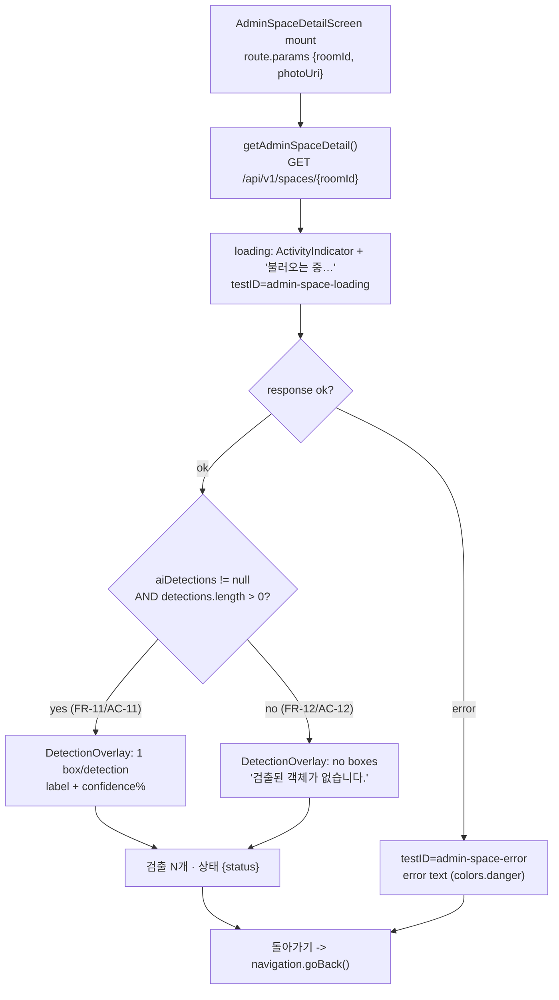

# UC-ML-PERSIST — Admin Space-detail overlay mockup

Low-fidelity mockup of `AdminSpaceDetailScreen.tsx` rendering `DetectionOverlay.tsx`.
Mirrors the proven geometry in `ObjectsScreen.tsx:60-117` (absolute-px bbox scaled
by displayed image width relative to `imageWidth`/`imageHeight`).

**Legend (traceability to spec.md)**

| Marker | FR / AC | Meaning |
|--------|---------|---------|
| Boxes drawn from `aiDetections` | FR-11 / AC-11 | one box per detection, `label` + `confidence%` |
| Empty-state hint | FR-12 / AC-12 | `aiDetections == null` or `detections == []` → no boxes, no crash |
| Photo placeholder | FR-12 | `photoUri` missing → "사진 미리보기를 사용할 수 없습니다 (좌표만 표시)." |
| Reads `GET /api/v1/spaces/{roomId}` | design §1.5 | no new endpoint; owner-scoped |

Box color is deterministic per label (`colorFor()` hash → `BOX_COLORS[7]`).
Confidence rendered as `Math.round(d.confidence * 100)`%.

---

## Variant A — space WITH persisted detections (FR-11 / AC-11)

`aiDetections = { imageWidth: 1280, imageHeight: 960, detections: [chair 0.91, bed 0.74] }`

```
┌──────────────────────────────────────────────────────────┐
│  ADMIN · DEBUG                                             │  <- ScreenHeader eyebrow
│  검출 디버그 뷰                                            │  <- title
│  roomId: 01HZ8K…                                          │  <- subtitle
├──────────────────────────────────────────────────────────┤
│  testID="detection-overlay"   (width = container, onLayout)│
│  ┌────────────────────────────────────────────────────┐  │
│  │ [chair 91%]──────────┐            room photo         │  │
│  │ │                    │   (Image resizeMode="cover",  │  │
│  │ │   bbox idx 0       │    width=displayWidth,        │  │
│  │ │   #e6194B          │    height=displayWidth*aspect)│  │
│  │ └────────────────────┘                               │  │
│  │            [bed 74%]────────────────────────┐        │  │
│  │            │                                 │        │  │
│  │            │        bbox idx 1  #3cb44b      │        │  │
│  │            │   left = x1*scaleX, top = y1*scaleY      │  │
│  │            │   w = (x2-x1)*scaleX, h = (y2-y1)*scaleY │  │
│  │            └─────────────────────────────────┘        │  │
│  └────────────────────────────────────────────────────┘  │
│  검출 2개 · 상태 ANALYZED         testID="admin-space-count"│
│                                                            │
│  ┌────────────────────────────────────────────────────┐  │
│  │                    돌아가기                          │  │  <- Button (secondary)
│  └────────────────────────────────────────────────────┘  │
└──────────────────────────────────────────────────────────┘
```

Label chip sits at `top:-18, left:-2` of each box (`styles.bboxLabel`), filled with the
box color and `colors.textInverse` text.

---

## Variant B — space WITH NO detections / NULL envelope (FR-12 / AC-12)

`aiDetections = null` (pre-migration row, FAILED, transport-fail, or zero objects).
`AdminSpaceDetailScreen` null-coalesces → `imageWidth=0, imageHeight=0, detections=[]`.
`DetectionOverlay` guards zero dims (`safeW/safeH = 1`) so it never divides by zero.

```
┌──────────────────────────────────────────────────────────┐
│  ADMIN · DEBUG                                             │
│  검출 디버그 뷰                                            │
│  roomId: 01HZ9Q…                                          │
├──────────────────────────────────────────────────────────┤
│  testID="detection-overlay"                                │
│  ┌────────────────────────────────────────────────────┐  │
│  │                                                      │  │
│  │           room photo (no boxes overlaid)             │  │
│  │           — or placeholder if photoUri missing:      │  │
│  │           "사진 미리보기를 사용할 수 없습니다           │  │
│  │            (좌표만 표시)."   testID=detection-photo… │  │
│  │                                                      │  │
│  └────────────────────────────────────────────────────┘  │
│  검출된 객체가 없습니다.            testID="detection-empty"│  <- empty-state hint
│  검출 0개 · 상태 ANALYZED                                  │
│                                                            │
│  ┌────────────────────────────────────────────────────┐  │
│  │                    돌아가기                          │  │
│  └────────────────────────────────────────────────────┘  │
└──────────────────────────────────────────────────────────┘
```

---

## Screen state flow


