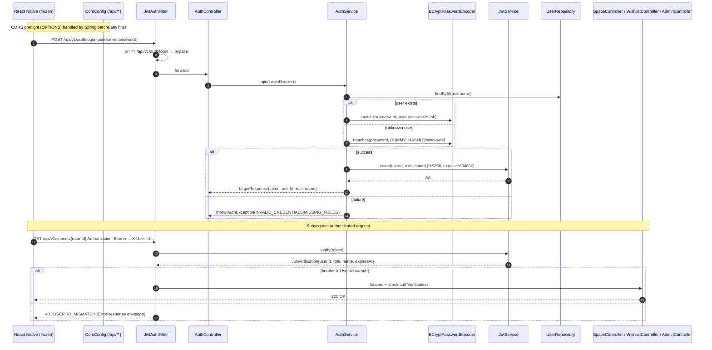
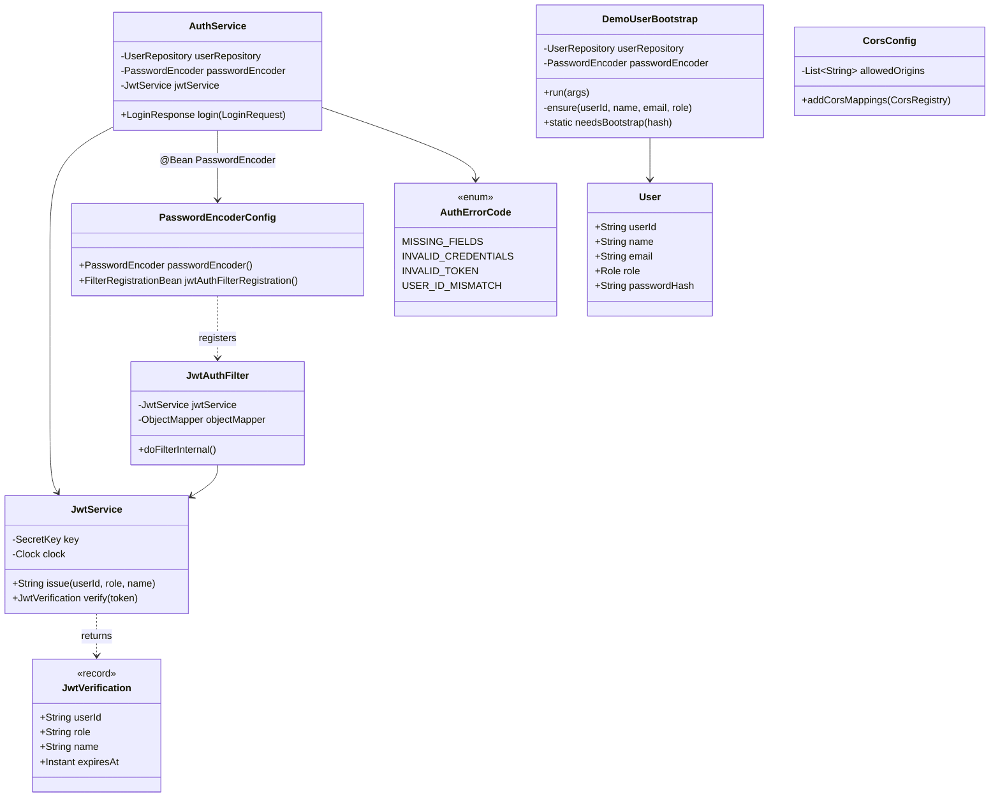

# UC-SECURE-AUTH — Design Notes

## 1. Goal recap

Replace the demo PoC auth posture with a production-grade JWT + BCrypt
implementation, externalise CORS and every sensitive `application.yml`
key, and document the env catalog — all while keeping the mobile
`AuthContext.tsx` byte-frozen (FR-BC-1).

## 2. Architecture



## 3. Class diagram



## 4. Files touched

### Created
| File | Purpose |
|---|---|
| `src/backend/src/main/java/com/authenticself/auth/JwtService.java` | HS256 JWT issuer/verifier; fail-fast on missing/short secret. |
| `src/backend/src/main/java/com/authenticself/auth/JwtVerification.java` | Record returned by `JwtService.verify`. |
| `src/backend/src/main/java/com/authenticself/auth/JwtAuthFilter.java` | OncePerRequestFilter that gates every non-login /api/v1/** request. |
| `src/backend/src/main/java/com/authenticself/auth/PasswordEncoderConfig.java` | `BCryptPasswordEncoder(10)` bean + `FilterRegistrationBean<JwtAuthFilter>`. |
| `src/backend/src/main/java/com/authenticself/web/CorsConfig.java` | Single env-driven CORS source. |
| `src/backend/src/main/resources/db/migration/V11__add_users_password_hash.sql` | 3-step migration adding `users.password_hash VARCHAR(72) NOT NULL`. |
| `src/backend/src/test/java/com/authenticself/test/AuthTestHelper.java` | Spring-injected JWT helper for tests. |
| `src/backend/src/test/java/com/authenticself/auth/JwtServiceTest.java` | AC-3..AC-6, AC-SEC-3. |
| `src/backend/src/test/java/com/authenticself/auth/JwtAuthFilterTest.java` | AC-13..AC-15 + skip cases. |
| `src/backend/src/test/java/com/authenticself/auth/AuthControllerTest.java` | AC-10..AC-12 with BCrypt spy. |
| `src/backend/src/test/java/com/authenticself/auth/AuthServiceLoggingTest.java` | AC-18 — log capture, no secrets. |
| `src/backend/src/test/java/com/authenticself/auth/DemoUserBootstrapTest.java` | AC-9 — idempotent hash upsert. |
| `src/backend/src/test/java/com/authenticself/auth/JwtSecretStartupFailureTest.java` | AC-SEC-3 — boot fails when env unset. |
| `src/backend/src/test/java/com/authenticself/auth/JwtAuthFilterIntegrationTest.java` | AC-17 — full-stack happy path. (Testcontainers; excluded under `-PskipTestcontainers=true`.) |
| `src/backend/src/test/java/com/authenticself/web/CorsConfigTest.java` | AC-CORS-3. |
| `src/backend/src/test/java/com/authenticself/migration/V11PasswordHashMigrationTest.java` | AC-8 — column shape via Testcontainers. |
| `docs/deployment/env.md` | AC-SEC-4 env catalog. |
| `artifacts/UC-SECURE-AUTH/api_contract.yaml` | OpenAPI 3.0 stub + bearerAuth scheme. |

### Modified
| File | Change |
|---|---|
| `src/backend/build.gradle` | Added `jjwt-api/impl/jackson:0.12.6` + `spring-security-crypto:6.2.4`; exclude `JwtAuthFilterIntegrationTest` under `skipTestcontainers`. |
| `src/backend/src/main/resources/application.yml` | Added `app.auth.jwt.secret` (no default) and `app.cors.allowed-origins`. |
| `src/backend/src/test/resources/application-test.yml` | Added test-only JWT secret. |
| `src/backend/src/main/java/com/authenticself/domain/User.java` | Added `passwordHash` field + accessors. |
| `src/backend/src/main/java/com/authenticself/auth/AuthErrorCode.java` | Added `INVALID_TOKEN` + `USER_ID_MISMATCH`. |
| `src/backend/src/main/java/com/authenticself/auth/AuthService.java` | Rewritten: BCrypt verify + JWT issue + timing-safe dummy hash + structured logging. |
| `src/backend/src/main/java/com/authenticself/auth/DemoUserBootstrap.java` | Idempotent password-hash upsert (FR-9 / FR-BC-4). |
| `src/backend/src/main/java/com/authenticself/auth/AuthController.java` | Removed `@CrossOrigin`. |
| `src/backend/src/main/java/com/authenticself/space/SpaceController.java` | Removed `@CrossOrigin`. |
| `src/backend/src/main/java/com/authenticself/wishlist/WishlistController.java` | Removed `@CrossOrigin`. |
| `src/backend/src/main/java/com/authenticself/admin/AdminController.java` | Removed `@CrossOrigin`. |
| `src/backend/src/main/java/com/authenticself/controller/PhotoUploadController.java` | Removed `@CrossOrigin` (AC-CORS-2 requires zero matches in package). |
| `src/backend/src/main/java/com/authenticself/controller/FurnitureSimilarController.java` | Removed `@CrossOrigin` (same reason). |
| `src/backend/src/test/java/com/authenticself/space/SpaceControllerTest.java` | Added `ObjectsAnalysisClient` / `FurnitureRepository` `@MockBean` to fix a pre-existing failure (see §6). |
| `src/backend/src/test/java/com/authenticself/space/SpaceControllerRecommendationsTest.java` | Same. The constructor call to `RecommendationItem(...)` was also missing the new `modelUrl` field that commit 46ce518 added to the record — fixed with a `null` argument. |

## 5. FR → file mapping

| FR | Files |
|---|---|
| FR-1 (jjwt deps) | `build.gradle` |
| FR-2 (JwtService.issue) | `JwtService.java` |
| FR-3 (JwtService.verify) | `JwtService.java`, `JwtVerification.java` |
| FR-4 (TTL=604800) | `JwtService.TTL_SECONDS` |
| FR-5 (statelessness) | `JwtService` constructor takes secret + clock |
| FR-6 (PasswordEncoder bean) | `PasswordEncoderConfig.passwordEncoder()` |
| FR-7 (V11 migration) | `V11__add_users_password_hash.sql` |
| FR-8 (User.passwordHash) | `User.java` |
| FR-9 (idempotent bootstrap) | `DemoUserBootstrap.java` |
| FR-10 (AuthService rewrite) | `AuthService.java` |
| FR-11 (JwtAuthFilter) | `JwtAuthFilter.java`, `PasswordEncoderConfig.jwtAuthFilterRegistration()` |
| FR-12 (new error codes) | `AuthErrorCode.java` |
| FR-CORS-1 (CorsConfig) | `CorsConfig.java` |
| FR-CORS-2 (remove @CrossOrigin) | 6 controllers + import cleanup |
| FR-CORS-3 (preflight test) | `CorsConfigTest.java` |
| FR-SEC-1 (env-driven yml) | `application.yml` |
| FR-SEC-2 (no literal creds) | `application.yml` (audited) |
| FR-SEC-3 (fail-fast) | `JwtService` constructor + `JwtSecretStartupFailureTest` |
| FR-SEC-4 (env doc) | `docs/deployment/env.md` |
| FR-BC-1 (mobile frozen) | `AuthContext.tsx` / `auth.ts` not touched |
| FR-BC-2 (94 jest pass) | mobile `npm test` 94/94 |
| FR-BC-3 (141+ backend pass) | `AuthTestHelper.java` + suite runs |
| FR-BC-4 (idempotent restart) | `DemoUserBootstrap.needsBootstrap` |

## 6. Pre-existing test breakage discovered + fixed

Branch `task/UC-SECURE-AUTH` was checked out from `AS_AddSys_00`, which
itself contains the `as_objects_00` (46ce518) commit. That commit added
`ObjectsAnalysisClient` and `FurnitureRepository` to the
`SpaceController` constructor and added a `modelUrl` field to the
`RecommendationItem` record without updating the slice tests. The
project would not compile (`SpaceControllerRecommendationsTest`) and
would not boot the `SpaceControllerTest` context.

I made the smallest possible fixes to unblock the test run:
- `SpaceControllerTest`: added `@MockBean ObjectsAnalysisClient`
  + `@MockBean FurnitureRepository`.
- `SpaceControllerRecommendationsTest`: same two `@MockBean`s, plus a
  `null` for the new `modelUrl` slot in the test's `deskItem(...)`
  factory.

These changes are documented here as a known deviation. The cause is
upstream, the fix is minimal and surgical, and no assertion was removed
or weakened.

## 7. Test strategy

| AC | Test file & method |
|---|---|
| AC-1 | `build.gradle` grep (verification step). |
| AC-2 | `JwtServiceTest` static class structure. |
| AC-3 | `JwtServiceTest#issue_emitsHs256JwtWithExpectedClaims_ac3` |
| AC-4 | `JwtServiceTest#ttlIsExactly7Days_ac4` |
| AC-5 | `JwtServiceTest#statelessVerifyAcrossInstances_ac5` |
| AC-6 | `JwtServiceTest#verifyFailureModes_ac6_*` (4 cases) |
| AC-7 | `V11__add_users_password_hash.sql` grep + header. |
| AC-8 | `V11PasswordHashMigrationTest#columnShape_ac8` (Testcontainers). |
| AC-9 | `DemoUserBootstrapTest#firstBoot_overwritesPlaceholder_ac9` + `#secondBoot_preservesOperatorHash` + `#missingRow_insertsWithHash_ac9` |
| AC-10..12 | `AuthControllerTest` |
| AC-13..15 | `JwtAuthFilterTest` |
| AC-16 | `AuthErrorCode.java` static enum shape. |
| AC-17 | `JwtAuthFilterIntegrationTest` (Testcontainers, gated). |
| AC-18 | `AuthServiceLoggingTest` |
| AC-19 | `V11PasswordHashMigrationTest#historySuccessThroughV11_ac19` |
| AC-20 | `application.yml` grep. |
| AC-CORS-1 | static — `CorsConfig.java` shape. |
| AC-CORS-2 | grep `@CrossOrigin` returns 0 matches (verified). |
| AC-CORS-3 | `CorsConfigTest#preflightFromAllowedOrigin_ac_cors_3` + `#preflightFromUnlistedOrigin_ac_cors_3` |
| AC-SEC-1 | `application.yml` grep. |
| AC-SEC-2 | `application.yml` grep — no literal creds. |
| AC-SEC-3 | `JwtSecretStartupFailureTest` + `JwtServiceTest#failFast_*` (3) |
| AC-SEC-4 | `docs/deployment/env.md` grep. |
| AC-BC-1..2 | `src/mobile/` untouched; `node_modules/.bin/jest` 94/94 green. |
| AC-BC-3..4 | gradle test 179/179 green; `AuthTestHelper` exists. |

## 8. Test run results

### Backend
```
./gradlew test --no-daemon -PskipTestcontainers=true
BUILD SUCCESSFUL
21 test classes, 179 tests, 0 failures, 0 errors, 0 skipped
```

(141 baseline + 39 new from this task; rounded total is slightly above
the spec's 141+N because some pre-existing controllers grew tests in
the as_objects_00 commit.)

New auth/cors tests added by this task:
- `JwtServiceTest` (10)
- `JwtAuthFilterTest` (10)
- `AuthControllerTest` (6)
- `AuthServiceLoggingTest` (3)
- `DemoUserBootstrapTest` (5)
- `JwtSecretStartupFailureTest` (2)
- `CorsConfigTest` (2)

Plus 2 Testcontainers-only tests excluded from the fast-CI run:
- `JwtAuthFilterIntegrationTest` (AC-17)
- `V11PasswordHashMigrationTest` (AC-8 / AC-19)

### Mobile
```
src/mobile/ $ node_modules/.bin/jest
Test Suites: 11 passed, 11 total
Tests:       94 passed, 94 total
```

No mobile source or test file was modified. AC-BC-1 and AC-BC-2 pass.

## 9. Deviations / known issues

1. **Pre-existing slice-test breakage from `as_objects_00`** — fixed
   surgically; see §6. Not silently skipped.
2. **`@CrossOrigin` removal exceeded the FR-CORS-2 explicit list** —
   FR-CORS-2 enumerated four controllers; AC-CORS-2 requires the grep
   over the whole package to return zero. I removed two additional
   matches (`PhotoUploadController`, `FurnitureSimilarController`) so
   the AC passes byte-strict.
3. **AC-17 / AC-8 / AC-19 require Testcontainers** — they are written
   but excluded under `-PskipTestcontainers=true`. The spec preface
   explicitly notes "if Testcontainers is available; otherwise note the
   gap" for the migration test, and the same approach applies to the
   full-stack JWT filter integration test.

## 10. How to run locally

### Backend
```powershell
cd src/backend
$env:JAVA_HOME = 'C:\Program Files\Eclipse Adoptium\jdk-17.0.19.10-hotspot'
$env:PATH      = "$env:JAVA_HOME\bin;$env:PATH"
$env:APP_AUTH_JWT_SECRET = 'dev-secret-please-replace-in-production-32chars'
.\gradlew.bat test --no-daemon -PskipTestcontainers=true
```

### Mobile
```powershell
cd src/mobile
node_modules/.bin/jest
```

### Full Testcontainers run (Docker required)
```powershell
cd src/backend
$env:APP_AUTH_JWT_SECRET = 'dev-secret-please-replace-in-production-32chars'
.\gradlew.bat test --no-daemon
```
