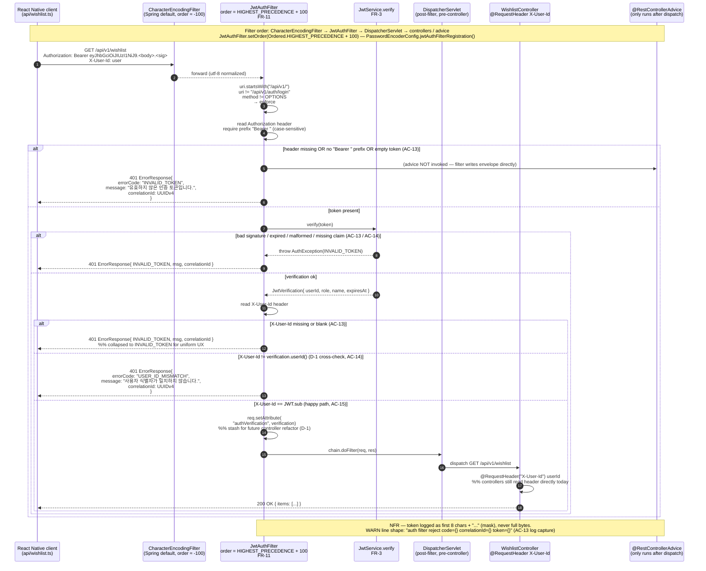

%% AuthenticSelf - UC-SECURE-AUTH: JwtAuthFilter on a subsequent authenticated request
%% Anchors: FR-3 / FR-11 / FR-12 / D-1 / AC-13 / AC-14 / AC-15
%% Source of truth:
%%   src/backend/src/main/java/com/authenticself/auth/JwtAuthFilter.java
%%   src/backend/src/main/java/com/authenticself/auth/JwtService.java
%%   src/backend/src/main/java/com/authenticself/auth/PasswordEncoderConfig.java  (filter registration + order)
%%   src/backend/src/main/java/com/authenticself/controller/dto/ErrorResponse.java

# Authenticated request sequence — `GET /api/v1/wishlist`

This diagram visualizes how `JwtAuthFilter` gates every non-login
`/api/v1/**` request (FR-11). It covers the happy path (signature OK +
`X-User-Id == JWT.sub` cross-check per D-1) and the three rejection
branches: missing/malformed Bearer, signature/expiry/parse failure, and
`X-User-Id` mismatch. The filter sits at
`Ordered.HIGHEST_PRECEDENCE + 100` — after Spring's
`CharacterEncodingFilter` but before any business filter, the
`DispatcherServlet`, and every `@RestControllerAdvice` (which are
post-dispatch by definition).

