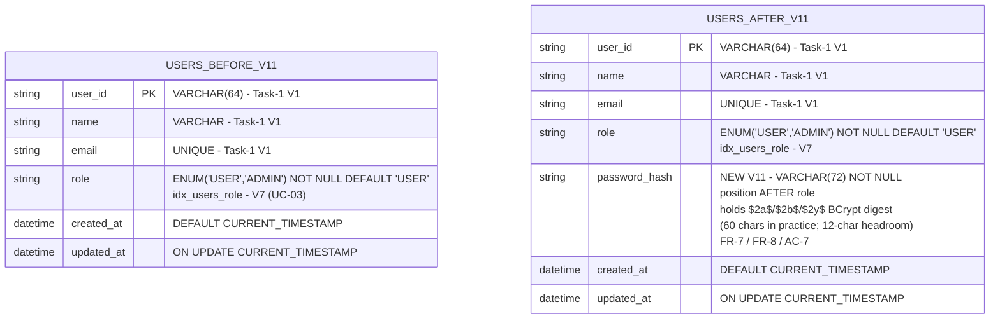
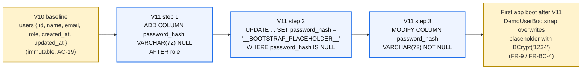

%% AuthenticSelf - UC-SECURE-AUTH: users table V10 → V11 ER diff
%% Anchors: FR-7 / FR-8 / AC-7 / AC-8 / AC-19
%% Source of truth:
%%   src/backend/src/main/resources/db/migration/V11__add_users_password_hash.sql
%%   src/backend/src/main/java/com/authenticself/domain/User.java
%%   V1..V10 migrations are byte-frozen (AC-19 regression guard).

# `users` table — V10 → V11 ER diff

This diagram shows the `users` table shape **before** V11 (post-V7 role
column from UC-03; columns through V10 are unchanged on this table)
and **after** V11 adds `password_hash` (FR-7 / FR-8 / AC-7). The
column is `VARCHAR(72) NOT NULL` so the DB itself enforces the
invariant that every authenticatable row carries a BCrypt digest;
length 72 leaves forward-compat headroom over BCrypt's 60-char output
for the `$2b$` / `$2y$` variants and any future strength-bump prefix.

## V11 migration plan — 3 steps inside one file

This is the in-file sequence that `V11__add_users_password_hash.sql`
runs (FR-7 / AC-8). The intermediate placeholder is intentionally NOT
a valid BCrypt digest so `BCryptPasswordEncoder.matches(<anything>,
"__BOOTSTRAP_PLACEHOLDER__")` always returns `false` — closing the
security gap even if `DemoUserBootstrap` is somehow skipped on next
boot.

1. **`ALTER TABLE users ADD COLUMN password_hash VARCHAR(72) NULL AFTER role;`**
   — additive, allows pre-existing rows to survive the ALTER without an
   immediate NOT NULL violation. Position `AFTER role` keeps the column
   adjacent to the other auth metadata for readability.

2. **`UPDATE users SET password_hash = '__BOOTSTRAP_PLACEHOLDER__' WHERE password_hash IS NULL;`**
   — backfills existing rows with the sentinel. `DemoUserBootstrap.needsBootstrap(...)`
   recognises this placeholder (and `null`, blank, or anything not starting
   with `$2a$/$2b$/$2y$`) and overwrites it with `passwordEncoder.encode("1234")`
   on the next application boot. Operator-set BCrypt hashes are preserved
   (FR-BC-4 / AC-9).

3. **`ALTER TABLE users MODIFY COLUMN password_hash VARCHAR(72) NOT NULL;`**
   — promotes the column to NOT NULL at the DB level so any future
   `INSERT` that omits the field fails fast. The invariant is now
   enforced by the storage engine, not just the application layer
   (FR-7 NFR / AC-7).

> V1..V10 are byte-frozen — no other migration file is touched. AC-19
> regression-guards this by checksumming the migration history through
> V11 with Testcontainers (`V11PasswordHashMigrationTest#historySuccessThroughV11_ac19`).

## FR / AC traceability

| Anchor | What it pins |
|--------|--------------|
| FR-7 | The three-step in-file migration plan + placeholder sentinel rationale. |
| FR-8 | `User.passwordHash` Java field (`@Column(name="password_hash", nullable=false, length=72)`). |
| FR-9 | `DemoUserBootstrap.needsBootstrap(hash)` overwrites placeholder/blank/null on boot. |
| FR-BC-4 | `needsBootstrap` returns `false` for any `$2[aby]$`-prefixed hash so operator-set passwords survive restarts. |
| AC-7 | Column shape (`VARCHAR(72) NOT NULL`) + header-comment language. |
| AC-8 | Testcontainers verifies column shape after V11 applies. |
| AC-19 | V1..V10 checksum unchanged. |
