%% AuthenticSelf - UC-SECURE-AUTH: Spring filter chain order
%% Anchors: FR-11 / D-1 / AC-15
%% Source of truth:
%%   src/backend/src/main/java/com/authenticself/auth/PasswordEncoderConfig.java   (FilterRegistrationBean.setOrder)
%%   src/backend/src/main/java/com/authenticself/auth/JwtAuthFilter.java           (skip cases + ATTR stash)

# Filter chain & request lifecycle

This flowchart shows how a request traverses the Spring filter chain
after UC-SECURE-AUTH lands. The only new entry is `JwtAuthFilter`,
pinned by `Ordered.HIGHEST_PRECEDENCE + 100` so it sits below Spring's
`CharacterEncodingFilter` (precedence range -100..0) and above any
business filter / `DispatcherServlet` (FR-11). `/api/v1/auth/login` is
the single path the filter lets through unauthenticated — and the
verified identity is stashed in the `AUTH_VERIFICATION` request
attribute for the future `AUTH-CONTROLLER-REFACTOR` task (D-1).

```mermaid
flowchart LR
    classDef framework fill:#f2f2f2,stroke:#999,stroke-width:1px,color:#333
    classDef new       fill:#eef4ff,stroke:#1f6feb,stroke-width:2px,color:#111
    classDef bypass    fill:#d4edda,stroke:#2e7d32,stroke-width:1.5px,color:#1b4332
    classDef reject    fill:#f8d7da,stroke:#b02a37,stroke-width:1.5px,color:#4c1d1d
    classDef advice    fill:#fff3cd,stroke:#b58a00,stroke-width:1.5px,color:#333

    Req["HTTP request<br/>/api/v1/**"]:::framework

    CE["CharacterEncodingFilter<br/>(Spring default)<br/>order ≈ -100"]:::framework

    JF["JwtAuthFilter (NEW)<br/>order = HIGHEST_PRECEDENCE + 100<br/>extends OncePerRequestFilter<br/>FR-11 / AC-15"]:::new

    SkipLogin{"uri ==<br/>/api/v1/auth/login ?"}
    SkipOptions{"method == OPTIONS ?<br/>(CORS preflight)"}
    SkipPrefix{"uri NOT under<br/>/api/v1/ ?"}
    HasBearer{"Authorization starts<br/>with 'Bearer ' ?"}
    Verify["jwtService.verify(token)<br/>FR-3"]
    HasUser{"X-User-Id present<br/>AND equals JWT.sub ?<br/>(D-1 cross-check)"}
    Stash["req.setAttribute(<br/>  'authVerification', JwtVerification)<br/>(reserved for future refactor — D-1)"]:::new

    Bypass["chain.doFilter()<br/>filter is no-op"]:::bypass

    DS["DispatcherServlet<br/>(handler mapping + invocation)"]:::framework

    Ctrl["@RestController handler<br/>(Space / Wishlist / Admin / Auth)<br/>reads @RequestHeader X-User-Id today"]:::framework

    Adv["@RestControllerAdvice chain<br/>SpaceExceptionAdvice<br/>WishlistExceptionAdvice<br/>AdminExceptionAdvice<br/>AuthExceptionAdvice<br/>(post-dispatch by definition)"]:::advice

    Reject["401 ErrorResponse{<br/>  errorCode: INVALID_TOKEN or<br/>            USER_ID_MISMATCH,<br/>  message, correlationId: UUIDv4<br/>}<br/>%% written by JwtAuthFilter directly —<br/>%% bypasses the advice chain"]:::reject

    Req --> CE --> JF
    JF --> SkipPrefix
    SkipPrefix -- "yes (actuator / static)" --> Bypass
    SkipPrefix -- "no" --> SkipLogin
    SkipLogin  -- "yes (the only path that bypasses<br/>the JWT filter)" --> Bypass
    SkipLogin  -- "no" --> SkipOptions
    SkipOptions-- "yes (preflight handled by CORS)" --> Bypass
    SkipOptions-- "no" --> HasBearer
    HasBearer  -- "no" --> Reject
    HasBearer  -- "yes" --> Verify
    Verify     -- "AuthException(INVALID_TOKEN)" --> Reject
    Verify     -- "JwtVerification" --> HasUser
    HasUser    -- "missing → INVALID_TOKEN" --> Reject
    HasUser    -- "mismatch → USER_ID_MISMATCH" --> Reject
    HasUser    -- "yes" --> Stash --> Bypass
    Bypass     --> DS --> Ctrl
    Ctrl       -. "throws (any controller exception)" .-> Adv

    %% --------------------------------------------------------------
    %% Legend
    %% --------------------------------------------------------------
    subgraph Legend [Legend]
        direction LR
        L1["Framework filter"]:::framework
        L2["NEW in UC-SECURE-AUTH"]:::new
        L3["Allowed bypass / forward"]:::bypass
        L4["Rejected (401, no advice)"]:::reject
        L5["@RestControllerAdvice (post-dispatch)"]:::advice
    end

    %% --------------------------------------------------------------
    %% Notes:
    %%   - /api/v1/auth/login is the ONLY policed-path that bypasses
    %%     JwtAuthFilter (FR-11 / AC-15).
    %%   - OPTIONS preflight is also let through so the browser sees
    %%     the Access-Control-* headers from CorsConfig before the
    %%     real request goes out — see cors_preflight.md.
    %%   - The ATTR_AUTH_VERIFICATION request attribute is set on
    %%     success but NOT read by any controller today (D-1: the
    %%     X-User-Id header remains the source of identity until
    %%     AUTH-CONTROLLER-REFACTOR lands).
    %%   - @RestControllerAdvice handlers only run when a request
    %%     reached the controller, so JwtAuthFilter rejections write
    %%     the ErrorResponse envelope inline — same wire shape as
    %%     advice-emitted envelopes (FR-11).
```

